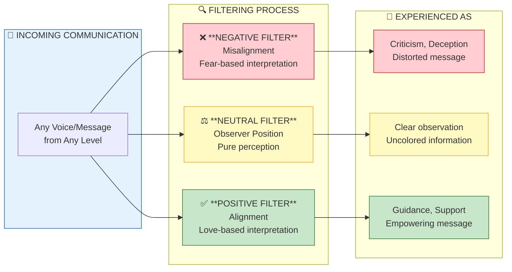
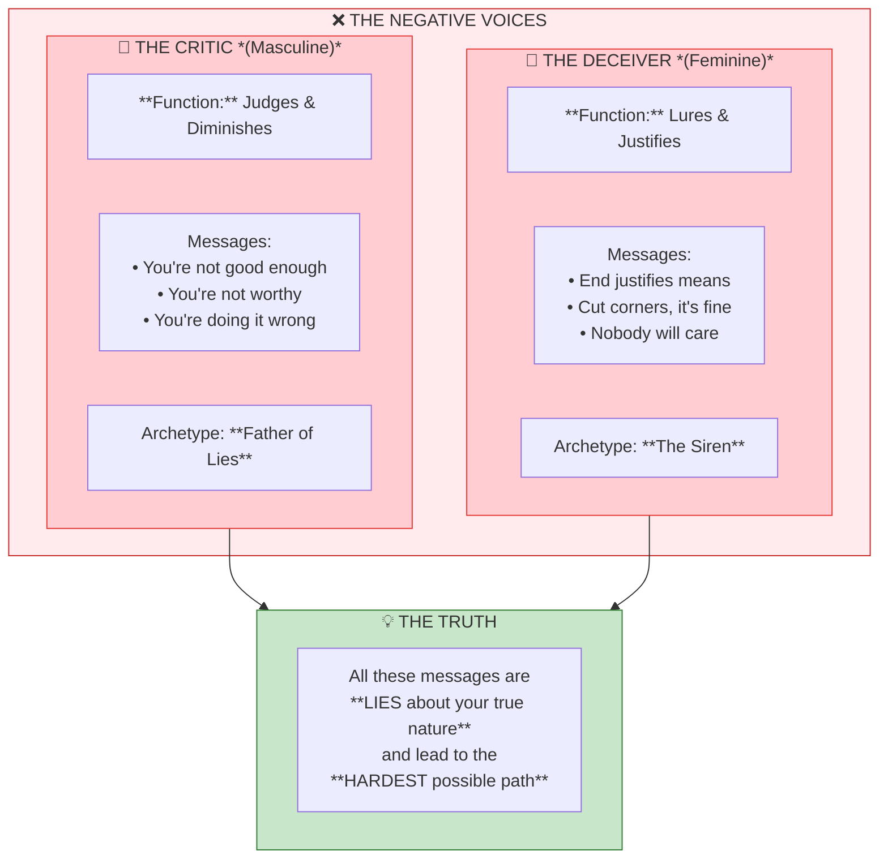
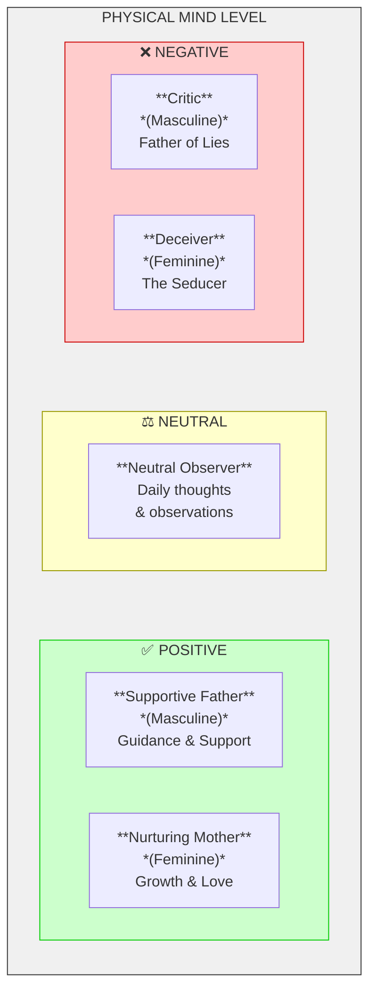
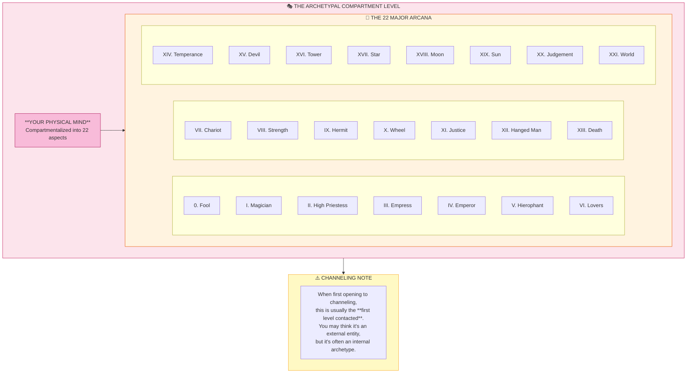
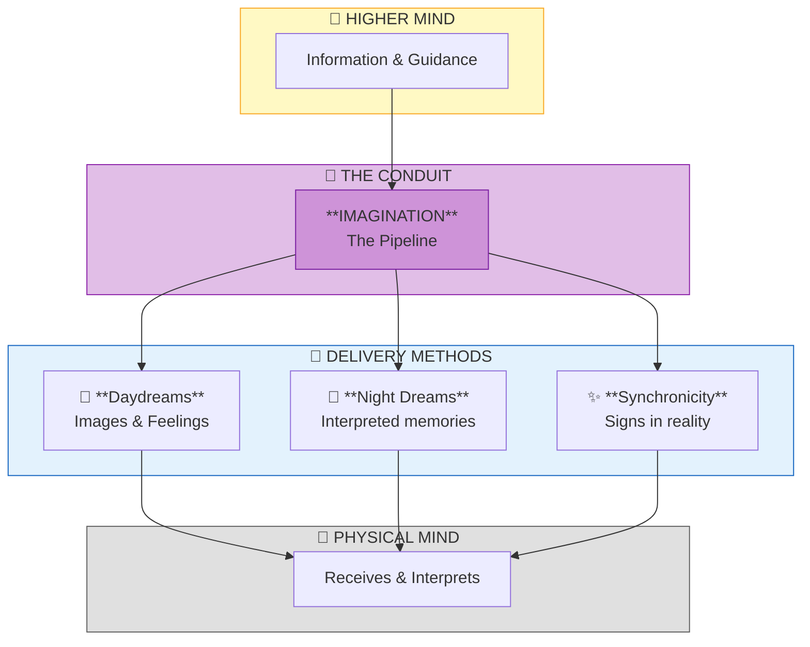
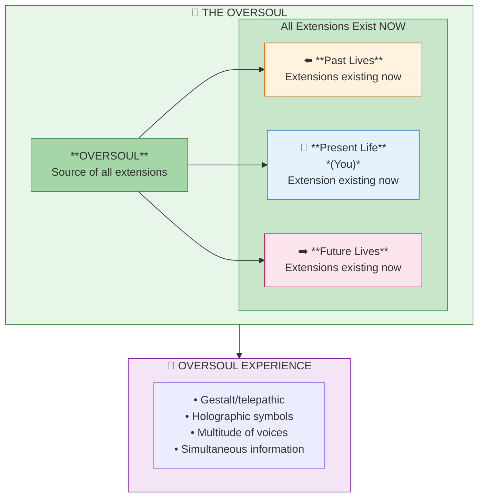
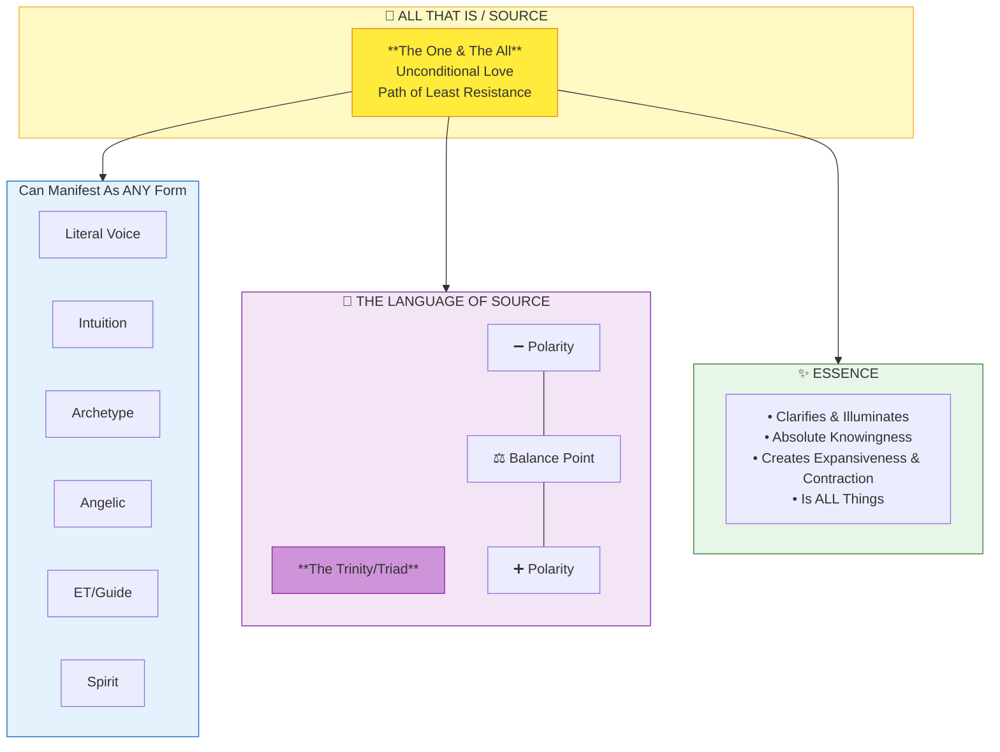
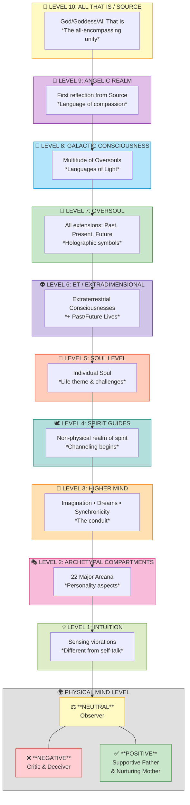
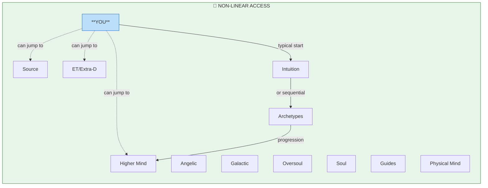

# Bashar: The Voices in Your Head
## Complete Transmission Documentation

---

## Overview

This transmission explores the different levels of consciousness that manifest as "voices in the head" - ideas, inspirations, messages, telepathic communications, vibrational information, and intuition. The teaching covers both physical and non-physical realms and how communications from various levels are filtered through one's personality structure.

---

## Core Framework: The Three Filters

Every communication received at any level can be filtered through:

| Filter | Description |
|--------|-------------|
| **Negative** | Misalignment with true self |
| **Neutral** | The observer position |
| **Positive** | Alignment with true self |

---

## Part 1: The Physical Mind Level

### The Neutral Observer (Center Position)

The neutral observer represents:
- Daily thoughts and observations
- Neutral recognitions going about life
- Recording the comings and goings of activities
- Recognition of navigation in physical reality

**Examples of neutral observer thoughts:**
- "Oh, look, there is a person over there"
- "I think I will walk that way"
- "There is a person approaching me"
- "I remember I have to do this thing today"

---

### The Negative Side: Critic & Deceiver

#### The Critic (Masculine Aspect)

**Function:** Judges, criticizes, and diminishes your sense of worth

**Typical messages:**
- "You're not doing good enough"
- "You're not worthy"
- "You're not living up to your potential"
- "You're doing something wrong"
- "You're doing it incorrectly"

**Biblical/Archetypal Reference:** The Father of Lies

**Key Understanding:**
- All critical judgments are fundamentally **lies about your true nature**
- They represent misalignment with your true worth and value
- In ancient times, these internal voices were projected outward as demons, negative spirits, or the devil
- People didn't understand these voices issued from portions of their own consciousness

**Purpose:** Gives you an opportunity to recognize when you're aligning with a vibration out of phase with your true self

---

#### The Deceiver/Seducer (Feminine Aspect)

**Function:** Lures you into actions out of integrity while justifying them

**Archetypal Depictions:**
- The Siren (lures you onto rocky shores to crash)
- Biblical reference: "The Whore of Babylon"

**Operating Principles:**
- "The end justifies the means"
- "It's all right to cut corners"
- "It's all right to cheat others"
- "It's all right to take what is not yours"
- "Nobody will care"
- "You're doing good work, it'll all come out okay"

**The Deception:**
- Makes misaligned paths appear to be the easiest route
- Disguises the fact that out-of-alignment choices create the **most difficult** possible path
- Things always rebound upon you of like vibration
- Belief systems are self-reinforcing and amplified by the higher mind mirror

**Related Saying:** "The road to hell is paved with good intentions"

**Key Insight:** Good intentions are not enough if you are not aligned in your methodology

---

### The Positive Side: Supportive Father & Nurturing Mother

#### The Supportive Father (Masculine Aspect)

**Function:** Provides guidance, support, and encouragement

**Characteristics:**
- Offers the "pat on the back"
- Acknowledges "job well done"
- Creates a support system reflected in life's synchronicity

---

#### The Nurturing Mother (Feminine Aspect)

**Function:** Nurtures growth and maturation

**Characteristics:**
- Guides alignment with joy, truth, excitement, passion, creativity
- Fosters unconditional love of self and all that is
- Allows you to become fully an adult in alignment with your true core spirit being

---

### Summary: Physical Mind Level Structure

---

## Part 2: The Non-Physical Levels

### Level 1: Intuition

**Nature:**
- Understanding of how you pick up on vibrations around you
- Sensing people, beings, and things (not necessarily human)
- Has its own voice, feeling, and sensation

**Characteristics:**
- Feels different from typical self-talk
- Seems to come from another level or realm
- Picks up on "outside" vibrations
- Interprets vibrations as guideposts for navigating reality

**Key Practice:**
- Stay balanced in the neutral observer space
- Develop discernment between:
  - Neutral vibrations you're picking up
  - What you may be coloring through negative/positive filters
- Picking up a vibration doesn't mean you're remaining neutral in your response

---

### Level 2: The Archetypal Compartment Level

**Nature:**
- Physical mind is compartmentalized into different personality aspects
- 22 archetypal expressions of physical consciousness
- Each can sound and feel like an autonomous being

**The 22 Archetypes:**
- Correspond to the **Major Arcana of the Tarot**
- Represent different:
  - Qualities and energies
  - Roles you play at different times
  - Stories and relationships within your psyche
  - Ways you view yourself in various situations

**Important Note for Channelers:**
- When first opening to channeling, the first level usually contacted is this archetypal level
- You may think you're talking to someone outside your personality, but often you're connecting to these internal archetypal reflections
- Each archetype can be experienced in neutral, negative, or positive ways

**Recommendation:** Study the Major Arcana to understand all components of your physical mind's archetypal level

---

### Level 3: The Higher Mind

**The Conduit: Imagination**

Imagination is the pipeline of communication between higher mind and physical mind.

**How Higher Mind Communicates:**

| Method | Description |
|--------|-------------|
| **Imagination** | Daydreams, images, feelings |
| **Night Dreams** | Physical mind's interpretation of communications received while more fully awake as higher mind self |
| **Synchronicity** | Signs, signals, road maps appearing in physical reality |

**About Dreams:**
- What you remember as a dream is your physical mind's interpretation
- Uses imagination to reconnect to conversations/communications from higher mind
- Translates information into images, feelings, experiences, and memories

**About Synchronicity:**
- Higher mind guides you gently to see what's already in front of you
- Uses the higher mind mirror to reflect important information
- Utilizes what already exists in your reality
- Another form of "voice" or communication

---

### Level 4: Spirit Guides

**Nature:**
- Beings in the non-physical realm of spirit
- Those on "the other side"

**Experience:**
- Beginning of channeling and mediumistic capabilities
- Not always a literal voice (can be intuition, imagination)
- Boosts, amplifies, and magnifies transmissions received
- Can impart information beneficial to you and others

---

### Level 5: The Soul Level

**Nature:**
- Your individual soul
- Your unique spirit and life experience

**Function:**
- Determines which guides and soul family you interact with
- Determines the theme you chose to explore

**Communications:**
- Delivers information relevant to your life theme
- Messages about challenges you experience
- The greatest challenges ARE voices of the theme
- Brings attention to your chosen exploration for self-discovery

**Key Insight:** Challenges in life are a form of voice that connects you to your soul level

---

### Level 6: Extraterrestrial & Extradimensional Consciousnesses

**Nature:**
- Beings like Bashar
- Experienced through telepathic connection and resonant vibration

**Function:**
- Connects to large-scale ideas of your world
- Turns focus from physical reality to:
  - The stars
  - Other dimensions
  - Other experiences
  - Other aspects of your being

**Additional Access:**
- Reminds you of past lives and future lives
- All coexisting simultaneous realities can be tapped into
- These become additional voices to draw upon

---

### Level 7: The Oversoul Level

**Nature:**
- Beyond individuated consciousnesses
- Encompasses all extensions: past, present, and future existing simultaneously

**Perspective:**
- You are an extension that exists now
- Past lives are extensions that exist now
- Future lives are extensions that exist now
- All extensions come from the same oversoul

**Experience:**
- Multitude of simultaneously existing archetypal voices
- Very gestalt, telepathic experience
- Holographic images and symbols
- Contains multitude of ideas and information simultaneously
- Can be simple pictorial or richly complex
- Processable and expressible by physical mind

---

### Level 8: Galactic Consciousness

**Nature:**
- Multitude of oversouls
- Spans galaxies and voids between galaxies

**Encompasses:**
- Realities
- Universes
- Dimensions
- Galaxies

**Experience:**
- Visual, emotional, vibrational, telepathic
- Images, tones, sounds, pictures, geometries
- May appear as a galaxy or super powerful star
- Each flicker, flame, blink of light dispenses information
- Tendrils of information reaching out, filling you with light

**Key Development:** Light itself becomes the voice - learning the languages of light

---

### Level 9: The Angelic Realm

**Nature:**
- First reflection, first split off from All That Is
- First mirror of God
- First step/division from source

**Experience:**
- Disorientation and dissociation from separation
- Language of compassion and all-encompassing energy
- That which includes, contains, and expresses through radiance and frequency alone

**Function:**
- Lures and magnetizes to higher aspects of being
- Casts brilliant light that dispels all shadows
- Allows clear seeing and hearing
- Reveals the clarion call of your signature frequency
- The beacon vibrating within your core being
- Calls you to align and harmonize with All That Is

---

### Level 10: God/Goddess/All That Is/Source

**Nature:**
- The highest level
- The all-encompassing unity

**Experience:**
- Unique voice and feeling
- Expression of compassion
- Unconditional support and love
- Love as a language itself

**The Voice of All That Is:**
- Clarifies and illuminates
- Absolute knowingness of who, what, when, where, and how you are
- Can manifest as any of the other forms:
  - Literal voice
  - Intuition
  - Archetype
  - Angelic
  - ET/Extradimensional
  - Guide
  - Spirit

**Key Characteristics:**
- The essence of the path of least resistance
- Always finds a way
- Urges, pulls, magnetizes toward itself
- Creates expansiveness AND contraction
- Is all things
- Language of the trinity: polarity and balance point

**The Triad Framework:**
- Always representative of a triad/trinity/triune
- This IS the language/expression of All That Is

---

## Complete Level Map

---

## Key Principles

### 1. Non-Linear Access
- You don't have to experience these levels in order
- You may skip levels and connect to what you need
- Someone might jump from intuition directly to extradimensional contact
- Access what is relevant for your journey

### 2. Universal Filtering
- Every level can be experienced through negative, neutral, or positive filters
- The goal is staying balanced in neutral observer state
- From neutral, you can access higher vibrations while staying harmonized

### 3. The Channeling State
- Channeling is simply aligning with more of yourself
- It's the balance and blended relationship between physical and higher mind
- All these levels can be incorporated to whatever degree serves you and others

### 4. Discernment Without Invalidation
- Choose what you prefer
- Don't invalidate what you don't prefer
- Maintain freedom, discernment, and clarity in choosing

### 5. The Ultimate Experience
When you blend with All That Is:
- You experience that **you are all that's left**
- **You are All That Is**
- This brings:
  - Confidence
  - Assurance
  - Knowledge
  - Absolute beingness and existence
  - Understanding of your structure, expression, parameters
  - Recognition of your expansiveness and endlessness

---

## The Voice of the Eternal

The combination of all levels together creates:

> **The voice of the eternal, the voice of existence, the voice of the infinite**

This is experienced as:
- A resonance in which you float
- Feeling supported
- Receiving brilliant warm rays of love unconditionally
- The day and the night
- The voice within every being in creation
- Clear as a bell

**When you align with your true being:**
- Whatever voice needs to speak will speak clearly
- Without fear
- It will be the voice of reason
- The voice of truth
- The voice of your very existence

---

## Practical Applications

### Recognizing the Critic
When you hear self-critical thoughts, remember:
- These are lies about your true nature
- They represent misalignment
- Return to neutral observer
- Choose to receive only supportive messages

### Recognizing the Deceiver
When tempted by shortcuts that feel "off":
- Question if the end truly justifies the means
- Remember misaligned paths are actually the hardest
- Check if you're in denial about consequences
- Return to integrity and alignment

### Working with Archetypes
- Study the 22 Major Arcana
- Recognize which archetype you're expressing in different situations
- Understand these are parts of YOU, not external entities

### Developing Intuition
- Practice sensing vibrations neutrally
- Develop discernment between raw information and your interpretation
- Stay in balance between mind and heart

### Receiving Higher Communications
- Use imagination as your conduit
- Pay attention to dreams and their messages
- Notice synchronicities as guidance
- Stay open without forcing specific experiences

---

## Summary

The "voices in your head" span from the most basic physical mind chatter to the infinite voice of All That Is. Understanding this framework allows you to:

1. **Identify** which level a communication is coming from
2. **Discern** whether you're filtering through negative, neutral, or positive
3. **Choose** to align with supportive, nurturing guidance
4. **Open** to higher levels of communication when relevant
5. **Integrate** all aspects while remaining balanced and grounded

The ultimate goal is to hear clearly the voice of your true being - the voice of reason, truth, and existence itself - which resonates through all levels as unconditional love and infinite support.

---

*"You will hear this when you align with your true being and allow whatever voice that needs to be there to speak clearly without fear because it will be the voice of reason. The voice of truth, the voice of your very existence."*

— Bashar
