# Bashar: Yêu Thương Vô Điều Kiện — Vạn Vật Được Tạo Ra Từ Yêu Thương - Biểu Đồ Mermaid

## Tổng Quan

Tài liệu này trình bày các giáo lý toàn diện về yêu thương từ tất cả các buổi truyền tải Bashar đã được ghi chép, được nâng cao với biểu đồ Mermaid cho việc học trực quan. Yêu thương không phải là cảm xúc — nó là **tần số rung động của chính sự tồn tại**. Mỗi nhịp tim truyền tải nó, mọi sinh linh đều được tạo nên từ nó, và vũ trụ chính là sự biểu hiện của nó. Thông điệp cốt lõi: bạn không *tìm kiếm* yêu thương — bạn CHÍNH LÀ yêu thương. Bạn không *kiếm được* yêu thương — sự tồn tại của bạn CHÍNH LÀ yêu thương của tạo hóa được biểu hiện.

---

## Mục Lục

1. [Yêu Thương Thực Sự Là Gì — Tần Số Của Sự Tồn Tại](#yêu-thương-thực-sự-là-gì--tần-số-của-sự-tồn-tại)
2. [Yêu Thương Hơn Cả Cảm Xúc — Phép Ẩn Dụ Chuyển Dịch](#yêu-thương-hơn-cả-cảm-xúc--phép-ẩn-dụ-chuyển-dịch)
3. [Bạn CHÍNH LÀ Yêu Thương — Không Cần Tìm Kiếm](#bạn-chính-là-yêu-thương--không-cần-tìm-kiếm)
4. [Vạn Vật Là Yêu Thương Vì Vạn Vật Là Thượng Đế](#vạn-vật-là-yêu-thương-vì-vạn-vật-là-thượng-đế)
5. [Trái Tim — Máy Phát Điện Từ Của Yêu Thương](#trái-tim--máy-phát-điện-từ-của-yêu-thương)
6. [Telempathy — Cách Mỗi Trái Tim Nói Chuyện Với Mọi Trái Tim Khác](#telempathy--cách-mỗi-trái-tim-nói-chuyện-với-mọi-trái-tim-khác)
7. [Kết Nối Trái Tim-Tâm Trí Cao Hơn — Cách Yêu Thương Trở Thành Đam Mê](#kết-nối-trái-tim-tâm-trí-cao-hơn--cách-yêu-thương-trở-thành-đam-mê)
8. [Yêu Thương Vô Điều Kiện Là Rung Động Thuần Khiết Của Tâm Trí Cao Hơn](#yêu-thương-vô-điều-kiện-là-rung-động-thuần-khiết-của-tâm-trí-cao-hơn)
9. [Cách Niềm Tin Lọc Yêu Thương Thành Nỗi Sợ](#cách-niềm-tin-lọc-yêu-thương-thành-nỗi-sợ)
10. [Yêu Thương Và Nước Mắt — Nỗi Nhớ Nhà](#yêu-thương-và-nước-mắt--nỗi-nhớ-nhà)
11. [Giá Trị Bản Thân — Sự Tồn Tại Của Bạn CHÍNH LÀ Yêu Thương Của Tạo Hóa](#giá-trị-bản-thân--sự-tồn-tại-của-bạn-chính-là-yêu-thương-của-tạo-hóa)
12. [Tấm Chăn Xanh — Sợ Cảm Nhận Yêu Thương Cho Chính Mình](#tấm-chăn-xanh--sợ-cảm-nhận-yêu-thương-cho-chính-mình)
13. [Yêu Thương Đích Thực Trong Các Mối Quan Hệ — Cho Phép Vô Điều Kiện](#yêu-thương-đích-thực-trong-các-mối-quan-hệ--cho-phép-vô-điều-kiện)
14. [Yêu Thương Vô Điều Kiện Cho Con Đường Của Người Khác](#yêu-thương-vô-điều-kiện-cho-con-đường-của-người-khác)
15. [Yêu Thương Là Phẩm Chất Phổ Quát Của Các Sinh Linh Cao Hơn](#yêu-thương-là-phẩm-chất-phổ-quát-của-các-sinh-linh-cao-hơn)
16. [Yêu Thương Ở Cấp Độ Cao Nhất — Tần Số Thiên Thần Và Nguồn](#yêu-thương-ở-cấp-độ-cao-nhất--tần-số-thiên-thần-và-nguồn)
17. [Cầu Nguyện Là Biểu Hiện Bên Ngoài Của Yêu Thương](#cầu-nguyện-là-biểu-hiện-bên-ngoài-của-yêu-thương)
18. [Tan Hòa Vào Yêu Thương — Cánh Cổng Trái Tim Đến Linh Hồn](#tan-hòa-vào-yêu-thương--cánh-cổng-trái-tim-đến-linh-hồn)
19. [Luân Xa Tim — Màu Xanh Lá, Tiếp Xúc Và Kết Nối](#luân-xa-tim--màu-xanh-lá-tiếp-xúc-và-kết-nối)
20. [Yêu Thương Là Ánh Sáng — Sự Vật Chất Hóa Đầu Tiên Của Ý Thức](#yêu-thương-là-ánh-sáng--sự-vật-chất-hóa-đầu-tiên-của-ý-thức)
21. [Sống Từ Yêu Thương — Điều Hướng Đến Trái Tim Của Thực Tại](#sống-từ-yêu-thương--điều-hướng-đến-trái-tim-của-thực-tại)
22. [Kiến Trúc Ba Tâm Trí Hòa Hợp Trong Yêu Thương](#kiến-trúc-ba-tâm-trí-hòa-hợp-trong-yêu-thương)
23. [Tóm Tắt Các Nguyên Tắc Chính](#tóm-tắt-các-nguyên-tắc-chính)
24. [Trí Tuệ Kết Thúc](#trí-tuệ-kết-thúc)

---

## Yêu Thương Thực Sự Là Gì — Tần Số Của Sự Tồn Tại

*Nguồn: Bashar — Tình Yêu, Đam Mê & Phép Thuật Của Thực Tại*

### Định Nghĩa Của Bashar

> "Yêu thương vô điều kiện là tần số rung động của chính sự tồn tại. Và yêu thương là sự chuyển dịch của bạn về tần số đó trong các thuật ngữ vật lý."

> "Đó là tần số đặc trưng của chính sự tồn tại."

Đây không phải thơ hay ẩn dụ. Bashar phát biểu điều này như cấu trúc thực sự của thực tại:

| Cấp Độ | Yêu Thương Là Gì |
|---------|-------------------|
| **Vũ trụ/Tuyệt đối** | Tần số rung động của chính sự tồn tại |
| **Đặc trưng** | Tần số đặc trưng của tất cả những gì hiện hữu |
| **Chuyển dịch vật lý** | Cảm giác cảm xúc mà bạn gọi là yêu thương |
| **Quan hệ với sự sống** | Một phần của chính sự sống |

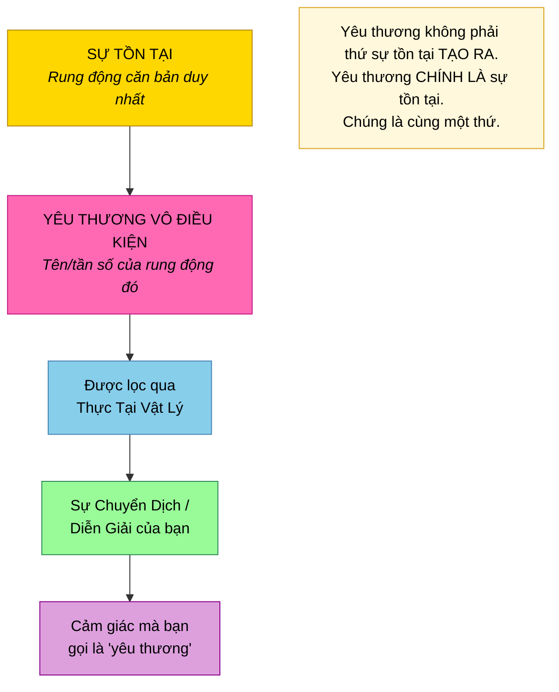

---

## Yêu Thương Hơn Cả Cảm Xúc — Phép Ẩn Dụ Chuyển Dịch

*Nguồn: Bashar — Tình Yêu, Đam Mê & Phép Thuật Của Thực Tại*

### Vượt Xa Cảm Xúc

> "Nó hơn rất nhiều so với cảm xúc đơn thuần. Cảm xúc của bạn là sự chuyển dịch và diễn giải của bạn về tần số đó trong thực tại của bạn."

> "Có những rung động, những năng lượng trong tạo hóa mà bạn chỉ có một số cách nhất định để trải nghiệm trong thực tại vật lý. Vì vậy cách bạn trải nghiệm tần số rung động năng lượng của chính sự tồn tại là thông qua cảm giác bạn gọi là yêu thương. Đó là sự diễn giải vật lý của bạn về năng lượng của sự tồn tại."

| Người Thường Nghĩ | Yêu Thương Thực Sự Là |
|-------------------|----------------------|
| Một cảm xúc bạn đôi khi cảm nhận | Tần số của sự tồn tại mà bạn đôi khi chuyển dịch được |
| Thứ gì đó giữa con người | Rung động nền tảng của toàn bộ thực tại |
| Thứ bạn có thể đạt được hoặc mất đi | Thứ mà bạn thực sự ĐANG LÀ |
| Một trong nhiều cảm xúc | MỘT năng lượng căn bản duy nhất, được trải nghiệm trong hình thức giới hạn |

---

## Bạn CHÍNH LÀ Yêu Thương — Không Cần Tìm Kiếm

*Nguồn: Bashar — 12 Khẳng Định*

### Khẳng Định 10: "Tôi Cho Đi Và Nhận Lại Niềm Vui, Yêu Thương, Và Lòng Từ Bi"

> "Bạn là niềm vui. Bạn là yêu thương. Bạn được ban cho sự hỗ trợ, yêu thương và lòng từ bi vô điều kiện. Sao không phản chiếu nó? Bởi vì đó là điều sẽ cho phép bạn cảm nhận sự kết nối với tạo hóa, với tất cả những gì hiện hữu — bởi vì đó là tần số của chính sự tồn tại."

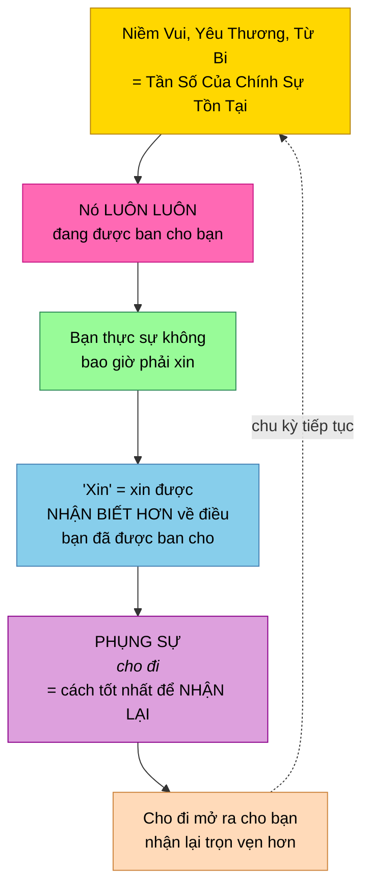

### Định Nghĩa Lại "Xin" Yêu Thương

> "Xin không thực sự là xin thứ bạn không có. Bạn có thể xin, nhưng hãy hiểu rằng xin đơn giản là xin được nhận biết hơn về điều bạn đã đang được ban cho. Khác biệt lớn."

| Hiểu Biết Thông Thường | Sự Thật |
|------------------------|---------|
| "Tôi cần tìm yêu thương" | Bạn CHÍNH LÀ yêu thương |
| "Tôi cần kiếm được yêu thương" | Nó luôn đang được ban cho bạn |
| "Tôi cần xin yêu thương" | Xin = nhận biết điều bạn đã có |
| "Cho đi yêu thương làm tôi kiệt sức" | Cho đi yêu thương mở ra cho bạn nhận lại nhiều hơn |

---

## Vạn Vật Là Yêu Thương Vì Vạn Vật Là Thượng Đế

*Nguồn: Aluna — Chuyển Hóa Mọi Thứ Qua Lòng Biết Ơn*

### Nhận Thức Cốt Lõi

> "Vạn vật là yêu thương vì vạn vật là Thượng Đế."

Ngay cả những trải nghiệm đau đớn nhất, khi nhìn từ góc nhìn thiêng liêng, đều là hành động của yêu thương:

> "Họ đang thực hiện kế hoạch của Thượng Đế thay mặt tôi, vì tôi, như một món quà cho tôi — để cho tôi sự giải phóng và trọn vẹn tối thượng."

### Sự Chuyển Đổi Nhận Thức

| Góc Nhìn Con Người | Góc Nhìn Thiêng Liêng |
|--------------------|----------------------|
| Sự phản bội | Giải phóng nghiệp |
| Cú sốc | Khai tâm |
| Mất mát | Không gian cần thiết cho chuyển hóa |
| Đau khổ | Món quà dẫn đến giải phóng |
| Kết thúc đột ngột | Một nhát cắt sạch sẽ của yêu thương |

> "Hoàn toàn không liên quan đến cách nó trông bên ngoài ở cấp độ con người, là sự phản bội và cú sốc đối với tôi — tôi biết rằng đó là sự giải phóng vĩ đại nhất của mình."

```mermaid
flowchart TB
    A["Trải nghiệm đau đớn xảy ra"] --> B["Tâm trí con người thấy:<br/>phản bội, mất mát, đau khổ"]
    B --> C["LÒNG BIẾT ƠN<br/>xuyên thấu"]
    C --> D["'Trải nghiệm này chính xác<br/>là điều tôi cần'"]
    D --> E["Bạn thấy điều<br/>THỰC SỰ đang xảy ra"]
    E --> F["Yêu thương, vận hành qua<br/>vạn vật, giải phóng bạn,<br/>chữa lành bạn"]
    F --> G["'Vạn vật là yêu thương vì<br/>vạn vật là Thượng Đế'"]

    style A fill:#CD5C5C,stroke:#8B0000,color:#FFF
    style B fill:#F08080,stroke:#8B0000,color:#000
    style C fill:#FFD700,stroke:#B8860B,color:#000
    style D fill:#98FB98,stroke:#2E8B57,color:#000
    style E fill:#87CEEB,stroke:#4682B4,color:#000
    style F fill:#FF69B4,stroke:#C71585,color:#000
    style G fill:#FFD700,stroke:#B8860B,color:#000
```

---

## Trái Tim — Máy Phát Điện Từ Của Yêu Thương

*Nguồn: Bashar — Những Vấn Đề Của Trái Tim*

### Cơ Chế Vật Lý Của Yêu Thương

> "Với mỗi nhịp tim, bạn gửi ra một bong bóng điện từ mở rộng từ cơ thể, tất cả các bạn, và bao bọc lẫn nhau trong những bong bóng điện từ kết nối này, để một trái tim thực sự nói chuyện với tất cả các trái tim khác và bạn được bao bọc trong những bong bóng điện từ của tất cả các trái tim khác."

### Cách Yêu Thương Vận Hành Vật Lý

| Thành Phần | Chức Năng |
|------------|-----------|
| **Trái tim** | Bơm máu; tạo xung điện từ mạnh nhất |
| **Máu** | Chứa sắt; mang đặc tính điện từ |
| **Tuần hoàn** | Chuyển động máu giàu sắt tạo trường điện từ |
| **Nhịp tim** | Mỗi nhịp gửi bong bóng điện từ YÊU THƯƠNG mở rộng từ cơ thể |

### Sự Song Song Trái Đất-Con Người

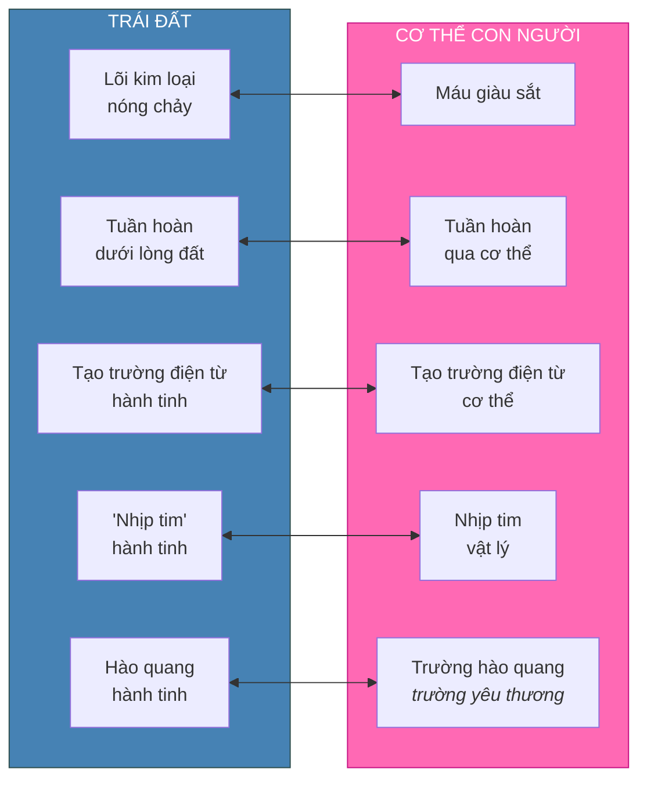

### Tinh Luyện Trường Yêu Thương

> "Khi bạn cho phép bản thân có sự rõ ràng hơn, sự tinh luyện hơn trong hình thể vật lý, khi bạn loại bỏ độc tố khỏi hệ thống có thể cản trở quá trình tuần hoàn máu, trường điện từ này trở nên tinh tế hơn và mở rộng xa hơn từ cơ thể bạn."

| Trạng Thái Cơ Thể | Chất Lượng Trường Yêu Thương |
|-------------------|------------------------------|
| Nhiều độc tố, không rõ ràng | Yếu, phạm vi hạn chế |
| Được thanh lọc, tinh luyện | Mạnh, phạm vi mở rộng |
| Thăng lên, tần số cao | Cực kỳ nhạy, vươn xa |

---

## Telempathy — Cách Mỗi Trái Tim Nói Chuyện Với Mọi Trái Tim Khác

*Nguồn: Bashar — Những Vấn Đề Của Trái Tim*

### Tại Sao Bashar Nói "Telempathy" Chứ Không Phải "Telepathy"

> "Đó là lý do chúng tôi nói telempathy thay vì telepathy, bởi vì sự đồng cảm (empathy) nhấn mạnh thành phần cảm xúc của trái tim. Trí tuệ cảm xúc của trái tim giao tiếp với mỗi nhịp đập với mọi trái tim khác trên hành tinh."

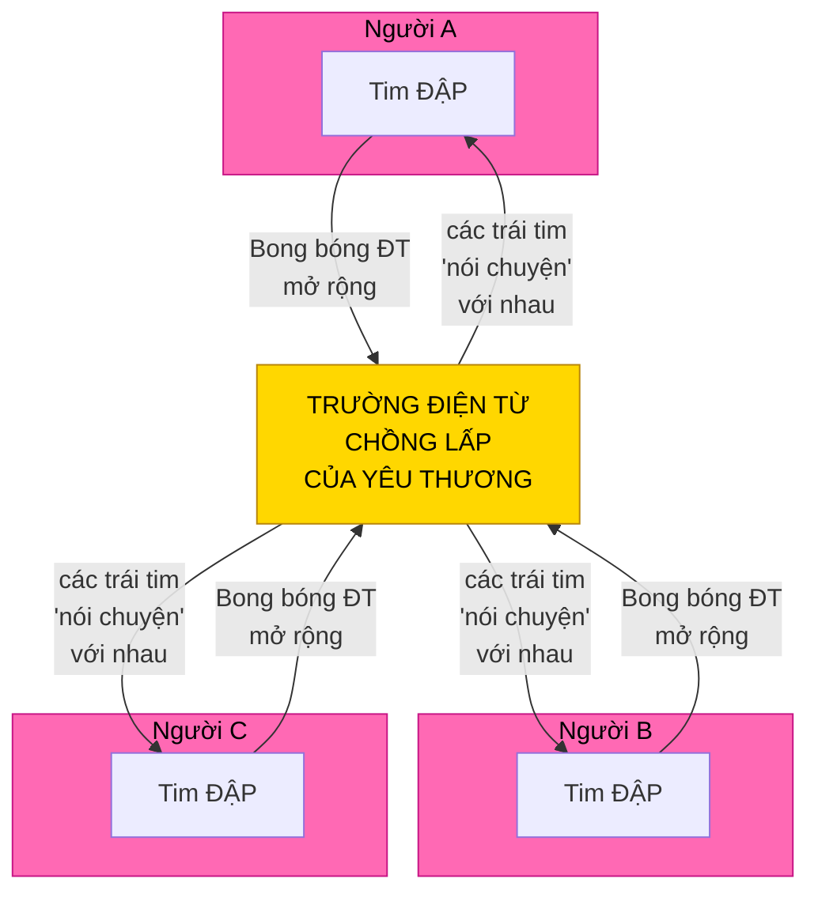

> "Các bạn là những bong bóng điện từ sống đang mở rộng, phát ra từ trái tim với mỗi nhịp đập trong sự kết nối và giao tiếp liên tục với nhau."

Mỗi nhịp tim là một hành động yêu thương phát sóng đến mọi trái tim khác trên hành tinh.

---

## Kết Nối Trái Tim-Tâm Trí Cao Hơn — Cách Yêu Thương Trở Thành Đam Mê

*Nguồn: Bashar — Những Vấn Đề Của Trái Tim*

### Cơ Chế Cốt Lõi

> "Về giao tiếp năng lượng với tâm trí cao hơn, trái tim là hoàn toàn then chốt trong quá trình này bởi vì tâm trí cao hơn nói bằng ngôn ngữ năng lượng. Gửi năng lượng ở những tần số nhất định mà tâm trí vật lý chuyển dịch thành cảm giác đam mê."

> "Trái tim được điều chỉnh đặc biệt theo rung động của tâm trí cao hơn ở trạng thái tự nhiên."

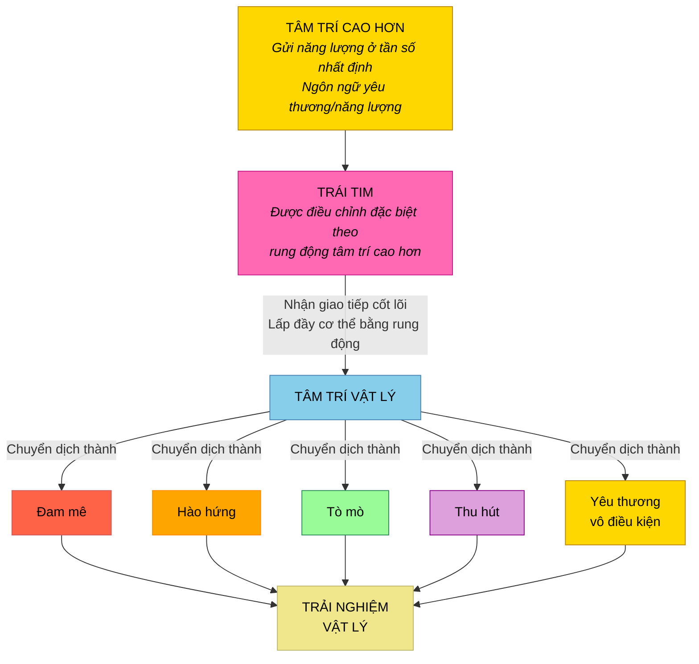

### Tất Cả Cảm Giác Này Đều Là Yêu Thương Được Chuyển Dịch

| Cảm Giác | Thực Sự Là Gì |
|-----------|---------------|
| **Đam mê** | Tần số cốt lõi của tâm trí cao hơn (yêu thương), được chuyển dịch |
| **Hào hứng** | Sự hòa hợp với hướng dẫn yêu thương của tâm trí cao hơn |
| **Tò mò** | Yêu thương của tâm trí cao hơn thu hút sự chú ý của bạn |
| **Thu hút** | Cộng hưởng với điều yêu thương đang dẫn bạn đến |
| **Yêu thương vô điều kiện** | Rung động thuần khiết, không lọc của chính tâm trí cao hơn |

> "Lý do cơ thể vật lý chuyển dịch các thông điệp, giao tiếp từ tâm trí cao hơn thành cảm giác đam mê, hào hứng, tò mò, thu hút, và yêu thương vô điều kiện là bởi vì trái tim mới là nơi thực sự tiếp nhận trực tiếp giao tiếp cốt lõi từ tâm trí cao hơn và lấp đầy cơ thể bạn bằng rung động đó."

---

## Yêu Thương Vô Điều Kiện Là Rung Động Thuần Khiết Của Tâm Trí Cao Hơn

*Nguồn: Bashar — Những Vấn Đề Của Trái Tim*

### Khi Bạn Cảm Nhận Yêu Thương Vô Điều Kiện, Bạn Đang Nhận Tín Hiệu Thuần Khiết

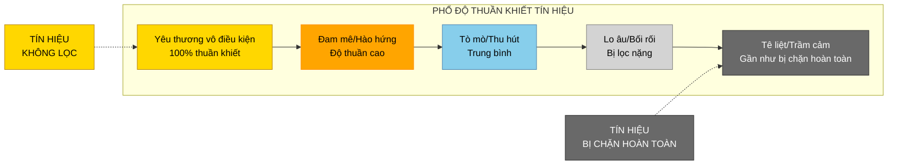

Phổ từ yêu thương vô điều kiện đến trầm cảm thực sự là phổ từ **tín hiệu không lọc** đến **tín hiệu bị chặn hoàn toàn** từ tâm trí cao hơn.

---

## Cách Niềm Tin Lọc Yêu Thương Thành Nỗi Sợ

*Nguồn: Bashar — Những Vấn Đề Của Trái Tim & Một Phút Trước Nửa Đêm*

### Cơ Chế Lọc

> "Tất nhiên nó có thể bị lọc qua hệ thống niềm tin của tâm trí vật lý, cho phép nó không nhất thiết được trải nghiệm ở dạng thuần khiết, dạng yêu thương vô điều kiện thuần khiết."

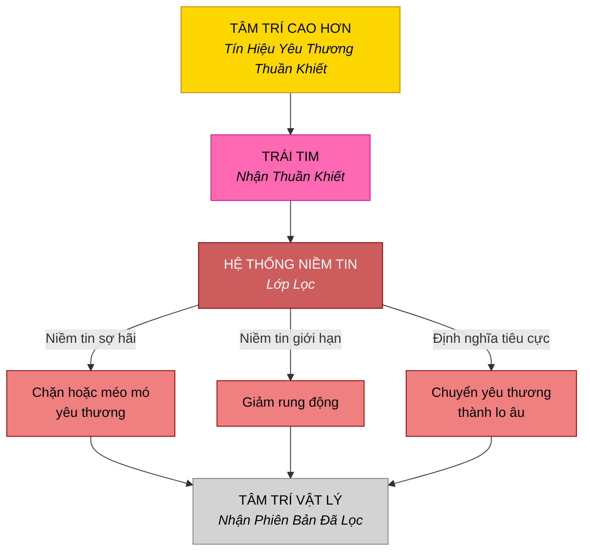

### Sợ Hãi Là Yêu Thương Bị Lệch Hướng

> "Sợ hãi là năng lượng của bạn bị lọc qua hệ thống niềm tin không hòa hợp với rung động thực sự của bạn."

> "Sợ hãi là người bạn đang nói với bạn rằng bạn có một niềm tin không hòa hợp với con người thực sự của bạn."

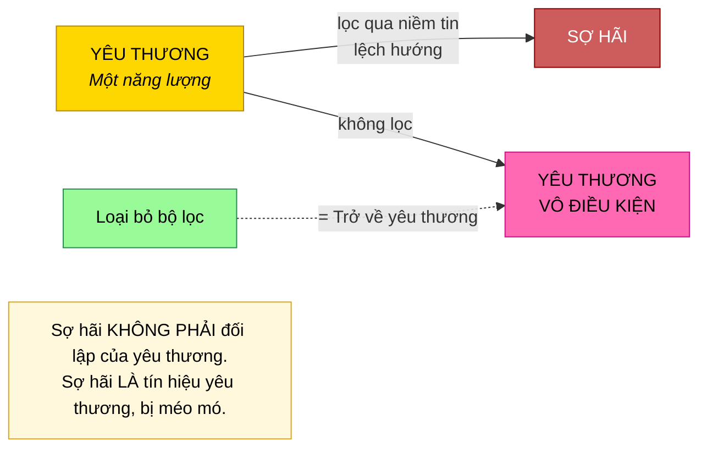

| Có Niềm Tin Sợ Hãi | Không Có Niềm Tin Sợ Hãi |
|--------------------|--------------------------|
| Tín hiệu yêu thương bị méo mó | Tín hiệu yêu thương được nhận thuần khiết |
| Đam mê bị tắt hoặc rối loạn | Đam mê rõ ràng và mạnh mẽ |
| Hướng dẫn không rõ ràng | Hướng dẫn không thể nhầm lẫn |
| Yêu thương được trải nghiệm có điều kiện | Yêu thương được trải nghiệm vô điều kiện |

**Hiểu biết then chốt:** Sợ hãi và yêu thương không phải đối lập. Sợ hãi là tín hiệu yêu thương bị **méo mó** qua niềm tin lệch hướng. Loại bỏ niềm tin, và điều còn lại là yêu thương thuần khiết.

---

## Yêu Thương Và Nước Mắt — Nỗi Nhớ Nhà

*Nguồn: Bashar — Thấu Thị, Nghiện, Tha Thứ & Cô Đơn*

### Tại Sao Yêu Thương Sâu Sắc Khiến Bạn Khóc

> "Yêu thương sâu sắc là rung động của cõi tâm linh — là nhà của bạn. Vì vậy khi bạn tiếp xúc với nó, bạn cảm thấy một chút 'nhớ nhà'."

### Cơ Chế Nước Mắt

> "Bạn đang buông bỏ hoặc rửa trôi khỏi hệ thống bất cứ điều gì đã ngăn cản bạn kết nối với rung động của nhà."

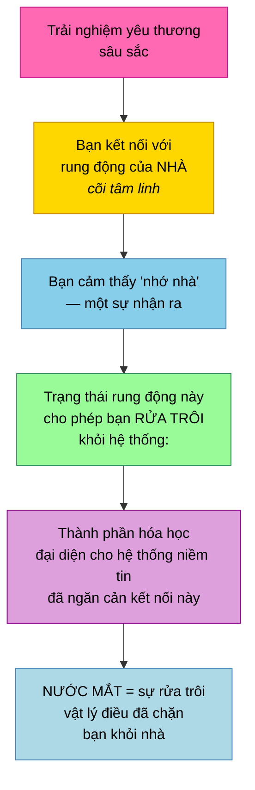

| Yếu Tố | Ý Nghĩa |
|---------|---------|
| **Yêu thương sâu sắc** | Rung động của cõi tâm linh / nhà |
| **Nước mắt** | Rửa trôi cặn hóa học của niềm tin ngăn chặn |
| **Cảm giác** | Nhớ nhà — nhận ra tần số nhà thực sự của bạn |
| **Mục đích** | Thanh lọc điều đã ngăn cản kết nối với nguồn |

**Khi bạn khóc vì yêu thương, bạn đang thực sự rửa trôi điều đã tách bạn khỏi bản chất thực sự của mình.**

---

## Giá Trị Bản Thân — Sự Tồn Tại Của Bạn CHÍNH LÀ Yêu Thương Của Tạo Hóa

*Nguồn: Bashar — Động Lực, Giá Trị Bản Thân & Siêu Linh Hồn*

### Chứng Minh Logic

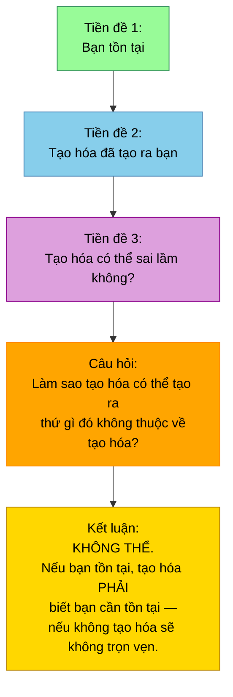

> "Nếu bạn tồn tại, tạo hóa phải biết bạn cần tồn tại hoặc tạo hóa sẽ không trọn vẹn. Không có bạn, không gì sẽ tồn tại."

> "Do đó, tạo hóa rõ ràng tin rằng bạn xứng đáng với sự tồn tại hoặc nó sẽ không tạo ra bạn."

### Nghịch Lý Tuyệt Đẹp

> "Khi bạn không tin vào giá trị của chính mình, bạn đang tranh cãi với tạo hóa. Và nghịch lý là — chính khả năng tranh cãi với tạo hóa chứng minh rằng bạn xứng đáng với sự tồn tại."

| Lập Luận | Nghịch Lý |
|----------|-----------|
| "Tôi không xứng đáng tồn tại" | Khả năng đưa ra lập luận đó chứng minh bạn tồn tại |
| "Tạo hóa đã sai lầm với tôi" | Tạo hóa không tạo ra thứ không thuộc về |
| "Tôi không xứng đáng được yêu thương" | **Sự tồn tại của bạn CHÍNH LÀ yêu thương của tạo hóa được biểu hiện** |

> "Ngừng tranh cãi với tạo hóa về giá trị của bạn. Ít nhất hãy bắt đầu từ đó."

**Sự tồn tại của bạn không tách biệt khỏi yêu thương. Sự tồn tại của bạn CHÍNH LÀ yêu thương được biểu hiện. Tạo hóa đã yêu thương bạn vào hiện hữu.**

---

## Tấm Chăn Xanh — Sợ Cảm Nhận Yêu Thương Cho Chính Mình

*Nguồn: Bashar — Động Lực, Giá Trị Bản Thân & Siêu Linh Hồn*

### Hình Ảnh Trực Quan

Một người phụ nữ tự quấn mình trong nỗi sợ như tấm chăn. Khi được hỏi màu gì, cô ấy nói xanh lá — luân xa tim.

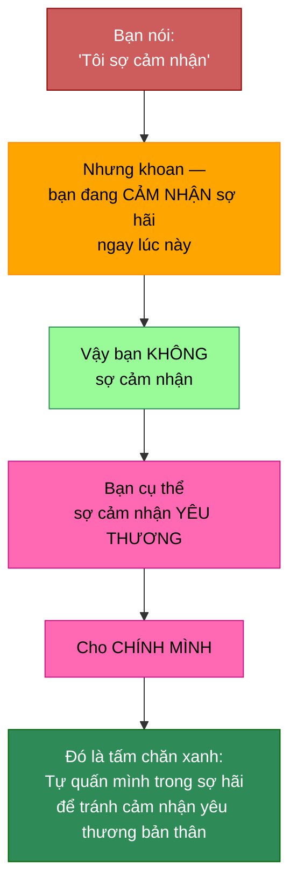

### Câu Hỏi Then Chốt

> "Bạn không thực sự sợ cảm nhận bởi vì bạn sẵn sàng cảm nhận sợ hãi. Câu hỏi là, tại sao bạn không sẵn sàng cảm nhận yêu thương cho chính mình?"

| Yếu Tố | Ý Nghĩa |
|---------|---------|
| Tấm chăn | Sợ hãi như sự thoải mái — tự quấn mình trong nó |
| Màu xanh lá | Luân xa tim |
| Tấm chăn xanh của sợ hãi | Sợ **cảm nhận** — cụ thể là sợ cảm nhận **yêu thương cho chính mình** |

---

## Yêu Thương Đích Thực Trong Các Mối Quan Hệ — Cho Phép Vô Điều Kiện

*Nguồn: Bashar — Mắt Bão*

### Yêu Thương Đích Thực Đòi Hỏi Gì

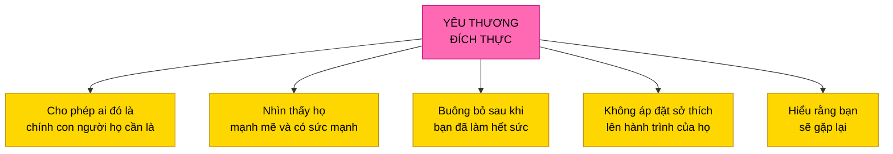

> "Đó là một hành trình dài của sự phân biệt, học cách phân biệt tốt hơn, tốt hơn và tốt hơn nữa, và đưa ra những lựa chọn hòa hợp với những điều thực sự đúng trong sâu thẳm trái tim bạn cho loại thực tại bạn thực sự mong muốn bất kể vẻ bề ngoài xung quanh."

---

## Yêu Thương Vô Điều Kiện Cho Con Đường Của Người Khác

*Nguồn: Bashar — Tình Yêu, Đam Mê & Phép Thuật Của Thực Tại*

### Khi Người Bạn Yêu Thương Đi Theo Con Đường Khác

> "Chỉ cần hỗ trợ và yêu thương vô điều kiện và là tấm gương cho điều họ có thể chọn, nhưng hãy hiểu rằng bạn phải cho phép họ chọn bất cứ điều gì họ chọn. Nếu không, bạn không phải là vô điều kiện."

> "Mọi người đều là sinh linh vĩnh hằng. Bạn vội gì? Hãy để họ khám phá. Có thể đó là con đường của họ."

> "Tôi hoàn toàn ổn khi bạn tin những gì bạn muốn tin. Tôi tin những gì tôi tin. Điều đó không có nghĩa là tôi yêu thương bạn ít hơn."

| Cách Tiếp Cận | Hành Động |
|---------------|-----------|
| **Vô điều kiện** | Yêu thương bất kể niềm tin của họ |
| **Làm tấm gương** | Cho thấy điều họ có thể chọn, không ép buộc |
| **Cho phép con đường** | Chấp nhận lựa chọn của họ là của họ |
| **Không vội** | Họ là sinh linh vĩnh hằng — họ sẽ hiểu ra cuối cùng |
| **Không phán xét** | Con đường của họ có thể chính xác là điều họ cần |

---

## Yêu Thương Là Phẩm Chất Phổ Quát Của Các Sinh Linh Cao Hơn

*Nguồn: Bashar — Một Phút Trước Nửa Đêm*

### Phẩm Chất Duy Nhất Mọi Sinh Linh Cao Hơn Đều Có

> "Một trong những phẩm chất bao trùm phổ biến nhất và tất nhiên nhất thiết phải được biểu hiện là biểu hiện của yêu thương vô điều kiện, bất kể những phẩm chất nào khác đi kèm."

| Đặc Điểm Con Người | Phẩm Chất Sinh Linh Cao Hơn |
|--------------------|----------------------------|
| Thống trị/Nhút nhát | Quyết đoán/Dè dặt |
| Yêu thương có điều kiện, thay đổi | Yêu thương vô điều kiện, bất biến |
| Yêu thương là một đặc điểm trong nhiều | Yêu thương là phẩm chất bao trùm |
| Yêu thương đến và đi | Yêu thương luôn được biểu hiện, bất kể điều gì |

---

## Yêu Thương Ở Cấp Độ Cao Nhất — Tần Số Thiên Thần Và Nguồn

*Nguồn: Bashar — Những Giọng Nói Trong Đầu Bạn*

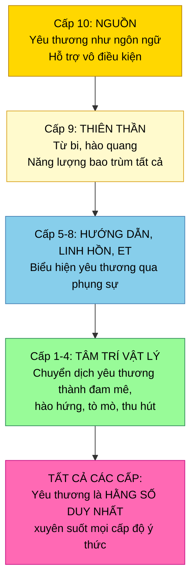

### Cấp 9: Cõi Thiên Thần

- Phản chiếu đầu tiên, chia tách đầu tiên từ Tất Cả Những Gì Hiện Hữu
- Tấm gương đầu tiên của Thượng Đế
- Ngôn ngữ của lòng từ bi và năng lượng bao trùm tất cả
- Điều bao gồm, chứa đựng, và biểu hiện qua **hào quang và tần số thuần túy**
- Thu hút và từ hóa đến các khía cạnh cao hơn của sự tồn tại
- Tỏa ánh sáng rực rỡ xua tan mọi bóng tối

### Cấp 10: Thượng Đế/Nữ Thần/Tất Cả Những Gì Hiện Hữu/Nguồn

- Biểu hiện của lòng từ bi
- **Hỗ trợ và yêu thương vô điều kiện**
- **Yêu thương như chính ngôn ngữ**
- Sự hiểu biết tuyệt đối về bạn là ai, cái gì, khi nào, ở đâu, và như thế nào
- Bản chất của con đường ít kháng cự nhất

---

## Cầu Nguyện Là Biểu Hiện Bên Ngoài Của Yêu Thương

*Nguồn: Bashar — Các Kiếp Sống Đồng Thời, Siêu Linh Hồn & Bản Thể*

### Yêu Thương Phải Được Biểu Hiện Trong Thế Giới

> "Nếu bạn thấy ai đó ngã và vấp và tự làm đau, và bạn đến đỡ họ dậy và giúp họ cảm thấy tốt hơn, đó là một lời cầu nguyện. Một lời cầu nguyện chủ động. Làm gì đó với năng lượng của bạn, làm gì đó với trạng thái biết ơn để giúp người khác."

> "Cầu nguyện thì tốt để tạo trạng thái tồn tại cho bản thân bên trong, nhưng rồi biểu hiện bên ngoài của lời cầu nguyện trong thế giới ở đâu?"

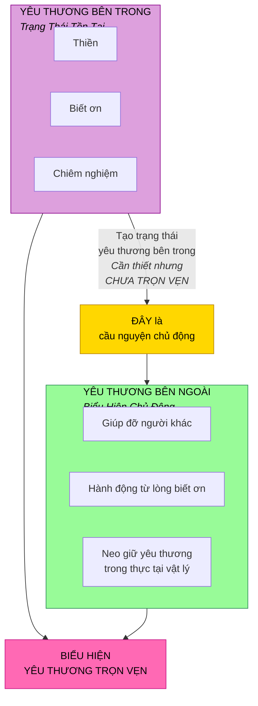

---

## Tan Hòa Vào Yêu Thương — Cánh Cổng Trái Tim Đến Linh Hồn

*Nguồn: Eluña — Sự Chuyển Đổi 2026 & Kết Nối Linh Hồn*

### Thực Hành

> "Khi tôi điều chỉnh vào linh hồn, tôi đến ngay điểm trung tâm của trái tim. Và rồi điểm trung tâm đó — có một cách mà bạn để bản thân tan hòa vào yêu thương, vào hư vô, vào bình yên, vào tĩnh lặng. Và rồi bạn trượt qua cánh cửa rất nhỏ này, một cánh cổng rất nhỏ bên trong trái tim đưa bạn vào cõi của linh hồn."

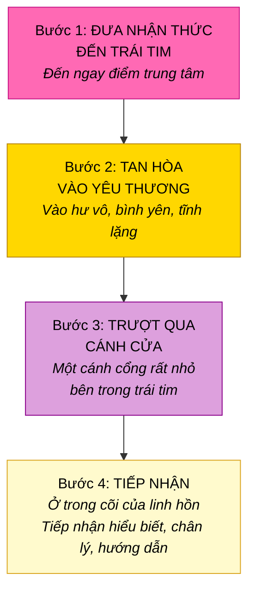

### Càng Thực Hành, Cánh Cửa Càng Rộng

> "Bạn càng thường xuyên kết nối với điểm trung tâm trong trái tim, bạn càng thường cho phép bản thân tan hòa vào yêu thương và đi qua cánh cửa này kết nối với linh hồn, cánh cửa này càng trở nên lớn hơn. Nó tự mở rộng."

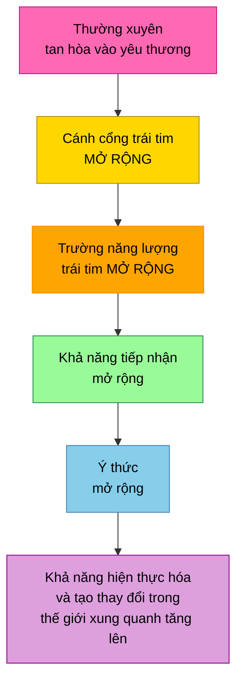

> "Hãy buông bỏ với niềm tin vào trái tim, vào kết nối này, vào linh hồn của bạn."

---

## Luân Xa Tim — Màu Xanh Lá, Tiếp Xúc Và Kết Nối

*Nguồn: Bashar & Pleiadians — Ánh Sáng, Màu Sắc, Âm Thanh Thống Nhất*

### Xanh Lá Là Màu Của Yêu Thương

> "Nó đặc trưng cho rung động của luân xa tim bởi vì tiếp xúc là từ tim đến tim."

> "Dù tâm trí có thể khác nhau, dù hình dáng cơ thể có thể khác nhau, chính qua trái tim mà chúng ta nhận ra linh hồn chúng ta là một."

### Hòa Hợp Trái Tim Mở Ra Các Chiều Không Gian

> "Một chiều không gian là một góc nhìn. Và bạn càng hòa hợp trong trái tim, bạn càng có khả năng di chuyển vào các không gian chiều khác nhau thông qua cách bạn cảm nhận."

| Xanh Lá Trái Tim Mở | Xanh Lá Trái Tim Đóng |
|---------------------|----------------------|
| Luân xa tim mở | Luân xa tim đóng |
| Tiếp xúc, kết nối | Sợ kết nối |
| Yêu thương cho mình và người khác | Sợ cảm nhận yêu thương |
| Nhận ra sự hợp nhất | Cô lập trong sợ hãi |
| Truy cập chiều không gian | Giới hạn chiều không gian |

---

## Yêu Thương Là Ánh Sáng — Sự Vật Chất Hóa Đầu Tiên Của Ý Thức

*Nguồn: Bashar — Phổ Phản Chiếu*

### Bạn Được Tạo Từ Ánh Sáng (Tạo Từ Yêu Thương)

> "Hãy nhớ, về cơ bản bạn được tạo từ năng lượng. Bạn được tạo từ ánh sáng, có thể nói như vậy."

> "Điều chúng tôi gọi là năng lượng điện từ là một trong những sự vật chất hóa đầu tiên của ý thức."

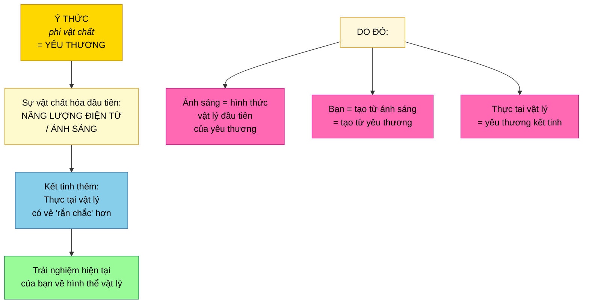

### Khi Niềm Tin Thuần Khiết, Yêu Thương Tỏa Sáng

> "Hãy tưởng tượng bạn có ánh sáng trắng đại diện cho bản ngã lý tưởng, tâm trí cao hơn — không bị phá vỡ, không bị lọc, thuần khiết, đẹp đẽ, một ánh sáng trắng đồng nhất."

Khi niềm tin thuần khiết và hòa hợp:
- Các màu kết hợp lại thành ánh sáng trắng thuần khiết
- Điều này biểu hiện thành hào hứng, đam mê, **yêu thương**, sáng tạo, niềm vui

Khi niềm tin bị nhuốm/méo mó:
- Các màu kết hợp thành trắng đục, xám, hoặc đen
- Điều này biểu hiện thành sợ hãi, tự nghi ngờ, trải nghiệm bị suy giảm

---

## Sống Từ Yêu Thương — Điều Hướng Đến Trái Tim Của Thực Tại

*Nguồn: Bashar — Những Vấn Đề Của Trái Tim*

### Lời Kêu Gọi Hành Động

> "Hãy vươn ra đến tất cả các dân tộc và sự khác biệt trên thế giới một cách yêu thương để hòa nhập và ôm lấy mọi người trong chân lý của riêng họ và giải phóng họ khỏi những giới hạn bằng cách là tấm gương sống của người sống trong chân lý, sống từ trái tim và đầu hợp nhất, trong hòa hợp với tâm trí cao hơn."

### Điều Hướng Qua Yêu Thương

> "Bạn sẽ thay đổi tần số và điều hướng bản thân đến các phiên bản Trái Đất đã cùng tồn tại, đại diện hơn nhiều cho trái tim yêu thương và trải nghiệm của ngây ngất và niềm vui."

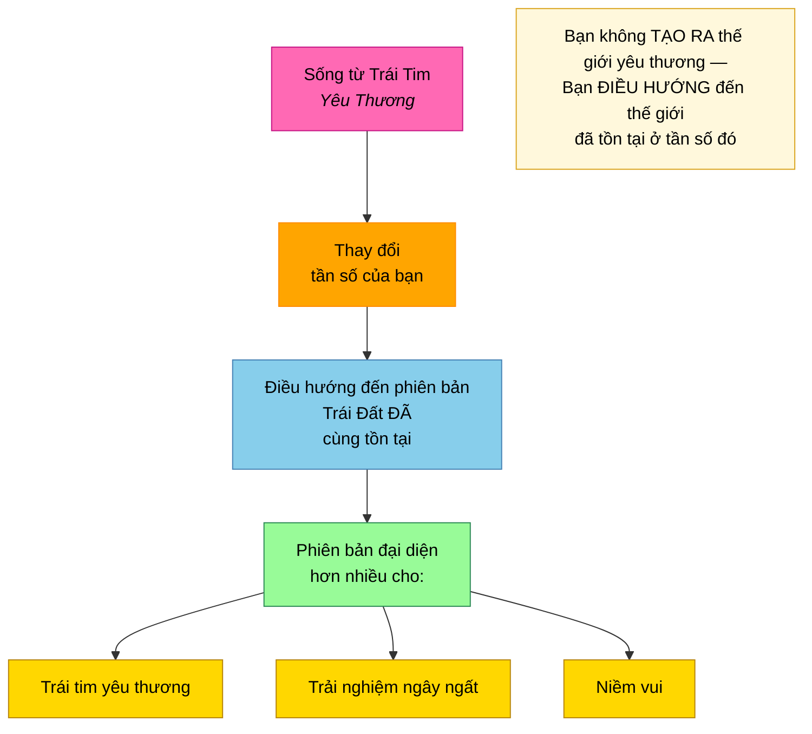

### Ví Dụ Từ Sassani

> "Trên thế giới của chúng tôi, chúng tôi giao tiếp với các linh hồn và sinh linh ngoài chiều mỗi ngày, mọi lúc. Đó là một phần thực tại tự nhiên khi biết rằng thông tin này tồn tại, có thể được tiếp nhận và truy cập bất cứ lúc nào khi bạn vận hành ở tần số đó từ các cấp cao nhất của trái tim."

---

## Kiến Trúc Ba Tâm Trí Hòa Hợp Trong Yêu Thương

*Nguồn: Bashar — Những Vấn Đề Của Trái Tim*

### Khi Cả Ba Tâm Trí Hòa Hợp Trong Yêu Thương

> "Bạn có thể được hướng dẫn để nhớ lại con người thực sự và sống cuộc đời thuần khiết yêu thương, niềm vui, sáng tạo, và hòa hợp bằng cách là những cá nhân đích thực mà bạn là, mà bạn được tạo ra để là. Đó là con đường trong đời bạn."

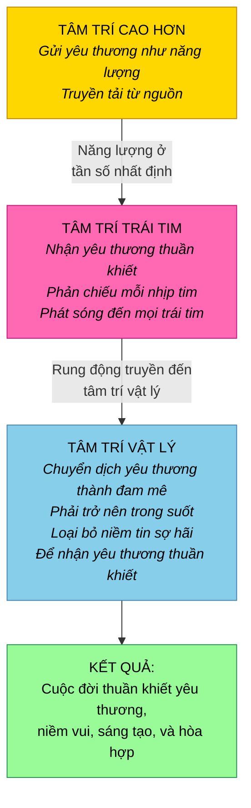

| Tâm Trí | Vai Trò Trong Yêu Thương | Khi Hòa Hợp |
|---------|--------------------------|-------------|
| **Tâm trí cao hơn** | Gửi tần số yêu thương cốt lõi | Liên tục truyền tải yêu thương/hướng dẫn |
| **Tâm trí trái tim** | Nhận và phản chiếu yêu thương | Điều chỉnh hoàn hảo, gõ nhịp yêu thương mỗi nhịp đập |
| **Tâm trí vật lý** | Chuyển dịch và sống yêu thương | Trong suốt, hòa hợp, trải nghiệm đam mê/yêu thương |

---

## Tóm Tắt Các Nguyên Tắc Chính

### Yêu Thương LÀ GÌ

- **Yêu thương là tần số rung động của chính sự tồn tại** — không phải cảm xúc, mà là thứ thực tại ĐƯỢC TẠO NÊN từ
- **Yêu thương là tần số đặc trưng của tất cả những gì hiện hữu** — rung động căn bản
- **Vạn vật là yêu thương vì vạn vật là Thượng Đế** — kể cả trải nghiệm đau đớn, nhìn từ góc nhìn thiêng liêng
- **Ánh sáng là sự vật chất hóa đầu tiên của yêu thương** — bạn được tạo từ ánh sáng, do đó tạo từ yêu thương
- **Bạn CHÍNH LÀ yêu thương** — bạn không tìm, kiếm, hay đạt được nó; bạn nhận biết điều bạn đã là

### Cách Yêu Thương Vận Hành Về Mặt Vật Lý

- **Mỗi nhịp tim gửi bong bóng điện từ yêu thương** mở rộng từ cơ thể
- **Một trái tim thực sự nói chuyện với mọi trái tim khác** qua trường điện từ chồng lấp (telempathy)
- **Sắt trong máu tạo trường yêu thương** — tương tự lõi nóng chảy Trái Đất tạo trường hành tinh
- **Thanh lọc cơ thể tinh luyện và mở rộng** trường điện từ yêu thương
- **Thăng lên tần số khiến nhịp tim mạnh hơn** như máy phát yêu thương

### Yêu Thương Và Tâm Trí Cao Hơn

- **Trái tim được điều chỉnh đặc biệt theo rung động tâm trí cao hơn** — là nơi tiếp nhận chính
- **Đam mê, hào hứng, tò mò, thu hút đều là chuyển dịch của yêu thương** từ tâm trí cao hơn
- **Yêu thương vô điều kiện là tín hiệu THUẦN KHIẾT** — không lọc từ tâm trí cao hơn
- **Sợ hãi không phải đối lập của yêu thương — là tín hiệu yêu thương bị méo mó** qua niềm tin lệch hướng
- **Loại bỏ niềm tin sợ hãi và yêu thương thuần khiết còn lại** — nó luôn ở đó

### Yêu Thương Và Giá Trị Bản Thân

- **Sự tồn tại của bạn CHÍNH LÀ yêu thương của tạo hóa được biểu hiện** — bạn được yêu thương vào hiện hữu
- **Nếu tạo hóa tạo ra bạn, nó coi bạn xứng đáng** — bạn không thể tranh cãi với tạo hóa về điều này
- **Không tin giá trị bản thân = tranh cãi với tạo hóa** — nhưng khả năng tranh cãi chứng minh sự tồn tại
- **Tấm chăn xanh:** bạn không sợ cảm nhận — bạn sợ cảm nhận yêu thương cho chính mình
- **Nước mắt từ yêu thương = nhớ nhà** — rửa trôi điều đã tách bạn khỏi tần số của nhà

### Sống Trong Yêu Thương

- **Yêu thương đích thực = cho phép ai đó là chính con người họ cần là** — nhìn thấy họ mạnh mẽ
- **Yêu thương vô điều kiện nghĩa là không có điều kiện** — kể cả cho phép con đường bạn không đồng ý
- **Mọi sinh linh cao hơn đều có yêu thương vô điều kiện** như phẩm chất bao trùm
- **Cầu nguyện không có biểu hiện bên ngoài là chưa trọn vẹn** — yêu thương phải được neo giữ trong hành động
- **Tan hòa vào yêu thương trong trái tim mở cánh cổng đến linh hồn** — và càng thực hành, cánh cửa càng rộng
- **Bạn điều hướng đến thực tại yêu thương** — bạn không tạo ra chúng, bạn dịch chuyển đến phiên bản Trái Đất đã tồn tại ở tần số đó

---

## Trí Tuệ Kết Thúc

> "Yêu thương vô điều kiện là tần số rung động của chính sự tồn tại."

> "Bạn là niềm vui. Bạn là yêu thương."

> "Vạn vật là yêu thương vì vạn vật là Thượng Đế."

> "Yêu thương sâu sắc là rung động của cõi tâm linh — là nhà của bạn."

> "Sự tồn tại của bạn CHÍNH LÀ yêu thương của tạo hóa được biểu hiện."

> "Bạn không thực sự sợ cảm nhận bởi vì bạn sẵn sàng cảm nhận sợ hãi. Câu hỏi là, tại sao bạn không sẵn sàng cảm nhận yêu thương cho chính mình?"

> "Một trong những phẩm chất bao trùm phổ biến nhất và tất nhiên nhất thiết phải được biểu hiện là biểu hiện của yêu thương vô điều kiện, bất kể những phẩm chất nào khác đi kèm."

> "Dù tâm trí có thể khác nhau, dù hình dáng cơ thể có thể khác nhau, chính qua trái tim mà chúng ta nhận ra linh hồn chúng ta là một."

> "Hãy để bản thân tan hòa vào yêu thương, vào hư vô, vào bình yên, vào tĩnh lặng."

> "Bạn sẽ thay đổi tần số và điều hướng bản thân đến các phiên bản Trái Đất đã cùng tồn tại, đại diện hơn nhiều cho trái tim yêu thương."
