# Bashar: Tình Yêu Vô Điều Kiện — Mọi Thứ Đều Được Tạo Ra Từ Tình Yêu - Hình ảnh hóa bằng Mermaid

## Tổng quan

Tài liệu này trình bày trọn vẹn những lời dạy về tình yêu từ các bản truyền đạt của Bashar đã được ghi chép lại, đồng thời được tăng cường bằng các sơ đồ Mermaid để hỗ trợ việc học bằng trực quan. Tình yêu không phải là một cảm xúc — đó là **tần số rung động của chính sự tồn tại**. Mỗi nhịp tim đều truyền phát nó, mỗi sinh thể đều được tạo nên từ nó, và bản thân vũ trụ chính là sự biểu hiện của nó. Thông điệp cốt lõi là: bạn không *đi tìm* tình yêu — bạn CHÍNH LÀ tình yêu. Bạn không *kiếm được* tình yêu — sự hiện hữu của bạn CHÍNH LÀ tình yêu của tạo hóa được biểu lộ.

---

## Mục lục

1. [Tình Yêu Thực Sự Là Gì — Tần Số Của Sự Tồn Tại](#tình-yêu-thực-sự-là-gì--tần-số-của-sự-tồn-tại)
2. [Tình Yêu Không Chỉ Là Cảm Xúc — Phép So Sánh Về Sự Phiên Dịch](#tình-yêu-không-chỉ-là-cảm-xúc--phép-so-sánh-về-sự-phiên-dịch)
3. [Bạn CHÍNH LÀ Tình Yêu — Bạn Không Cần Đi Tìm](#bạn-chính-là-tình-yêu--bạn-không-cần-đi-tìm)
4. [Mọi Thứ Đều Là Tình Yêu Vì Mọi Thứ Đều Là Thượng Đế](#mọi-thứ-đều-là-tình-yêu-vì-mọi-thứ-đều-là-thượng-đế)
5. [Trái Tim — Bộ Phát Điện Từ Của Tình Yêu](#trái-tim--bộ-phát-điện-từ-của-tình-yêu)
6. [Telempathy — Mọi Trái Tim Giao Tiếp Với Nhau Như Thế Nào](#telempathy--mọi-trái-tim-giao-tiếp-với-nhau-như-thế-nào)
7. [Kết Nối Giữa Trái Tim Và Tâm Trí Cao Hơn — Tình Yêu Trở Thành Đam Mê Như Thế Nào](#kết-nối-giữa-trái-tim-và-tâm-trí-cao-hơn--tình-yêu-trở-thành-đam-mê-như-thế-nào)
8. [Tình Yêu Vô Điều Kiện Là Dao Động Thuần Khiết Của Tâm Trí Cao Hơn](#tình-yêu-vô-điều-kiện-là-dao-động-thuần-khiết-của-tâm-trí-cao-hơn)
9. [Niềm Tin Lọc Tình Yêu Thành Nỗi Sợ Như Thế Nào](#niềm-tin-lọc-tình-yêu-thành-nỗi-sợ-như-thế-nào)
10. [Tình Yêu Và Nước Mắt — Nỗi Nhớ Nhà Hướng Về Quê Nhà Tâm Linh](#tình-yêu-và-nước-mắt--nỗi-nhớ-nhà-hướng-về-quê-nhà-tâm-linh)
11. [Giá Trị Bản Thân — Sự Hiện Hữu Của Bạn CHÍNH LÀ Tình Yêu Của Tạo Hóa Được Biểu Lộ](#giá-trị-bản-thân--sự-hiện-hữu-của-bạn-chính-là-tình-yêu-của-tạo-hóa-được-biểu-lộ)
12. [Chiếc Chăn Màu Xanh Lá — Sợ Cảm Nhận Tình Yêu Dành Cho Chính Mình](#chiếc-chăn-màu-xanh-lá--sợ-cảm-nhận-tình-yêu-dành-cho-chính-mình)
13. [Tình Yêu Đích Thực Trong Các Mối Quan Hệ — Sự Cho Phép Vô Điều Kiện](#tình-yêu-đích-thực-trong-các-mối-quan-hệ--sự-cho-phép-vô-điều-kiện)
14. [Tình Yêu Vô Điều Kiện Dành Cho Hành Trình Của Người Khác](#tình-yêu-vô-điều-kiện-dành-cho-hành-trình-của-người-khác)
15. [Tình Yêu Là Phẩm Chất Phổ Quát Của Các Hữu Thể Ở Tần Số Cao Hơn](#tình-yêu-là-phẩm-chất-phổ-quát-của-các-hữu-thể-ở-tần-số-cao-hơn)
16. [Tình Yêu Ở Những Tầng Cao Nhất — Tần Số Thiên Thần Và Nguồn Cội](#tình-yêu-ở-những-tầng-cao-nhất--tần-số-thiên-thần-và-nguồn-cội)
17. [Cầu Nguyện Là Sự Biểu Lộ Hướng Ra Ngoài Của Tình Yêu](#cầu-nguyện-là-sự-biểu-lộ-hướng-ra-ngoài-của-tình-yêu)
18. [Tan Hòa Vào Tình Yêu — Cánh Cổng Của Trái Tim Dẫn Tới Linh Hồn](#tan-hòa-vào-tình-yêu--cánh-cổng-của-trái-tim-dẫn-tới-linh-hồn)
19. [Luân Xa Tim — Màu Xanh Lá, Sự Tiếp Xúc Và Kết Nối](#luân-xa-tim--màu-xanh-lá-sự-tiếp-xúc-và-kết-nối)
20. [Tình Yêu Là Ánh Sáng — Sự Vật Chất Hóa Đầu Tiên Của Ý Thức](#tình-yêu-là-ánh-sáng--sự-vật-chất-hóa-đầu-tiên-của-ý-thức)
21. [Sống Từ Tình Yêu — Điều Hướng Đến Trái Tim Của Thực Tại](#sống-từ-tình-yêu--điều-hướng-đến-trái-tim-của-thực-tại)
22. [Kiến Trúc Ba Tầng Tâm Trí Khi Đồng Bộ Trong Tình Yêu](#kiến-trúc-ba-tầng-tâm-trí-khi-đồng-bộ-trong-tình-yêu)
23. [Tóm Tắt Các Nguyên Lý Cốt Lõi](#tóm-tắt-các-nguyên-lý-cốt-lõi)
24. [Lời Kết Khôn Ngoan](#lời-kết-khôn-ngoan)

---

## Tình Yêu Thực Sự Là Gì — Tần Số Của Sự Tồn Tại

*Nguồn: Bashar — Love, Passion & the Magic of Reality*

### Định nghĩa của Bashar

> "Tình yêu vô điều kiện là tần số rung động của chính sự tồn tại. Và tình yêu là cách bạn phiên dịch tần số đó trong các điều kiện vật lý."

> "Đó là tần số dấu ấn của chính sự tồn tại."

Đây không phải là thơ ca hay ẩn dụ. Bashar trình bày điều này như là cấu trúc theo nghĩa đen của thực tại:

| Cấp độ | Tình yêu là gì |
|-------|-------------|
| **Phổ quát/Tuyệt đối** | Tần số rung động của chính sự tồn tại |
| **Dấu ấn** | Tần số dấu ấn của tất cả những gì đang hiện hữu |
| **Phiên dịch trong vật lý** | Cảm giác cảm xúc mà bạn gọi là tình yêu |
| **Mối quan hệ với sự sống** | Một phần của điều mà chúng ta gọi là chính sự sống |

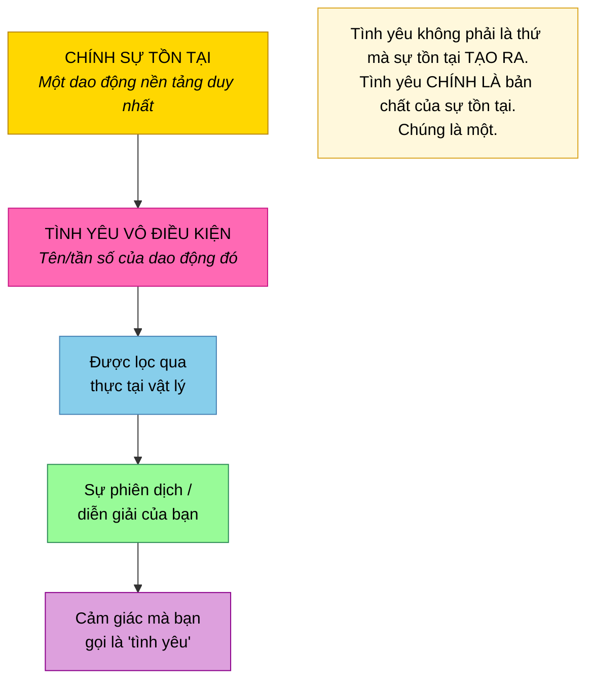

---

## Tình Yêu Không Chỉ Là Cảm Xúc — Phép So Sánh Về Sự Phiên Dịch

*Nguồn: Bashar — Love, Passion & the Magic of Reality*

### Vượt lên trên cảm giác

> "Nó lớn hơn rất nhiều so với cảm xúc. Cảm xúc của bạn là cách bạn phiên dịch và diễn giải tần số đó trong thực tại của mình."

> "Có những rung động, có những năng lượng trong tạo hóa mà trong thực tại vật lý bạn chỉ có một số cách nhất định để trải nghiệm chúng. Vì vậy, cách mà bạn trải nghiệm trong thực tại vật lý tần số rung động của năng lượng là chính sự tồn tại, chính là thông qua cảm giác mà bạn gọi là tình yêu. Đó là sự diễn giải trong vật lý của bạn về năng lượng tồn tại ấy."

| Điều đa số mọi người nghĩ | Tình yêu thực sự là gì |
|----------------------|---------------------|
| Một cảm xúc thỉnh thoảng bạn cảm thấy | Tần số của sự tồn tại mà thỉnh thoảng bạn phiên dịch được |
| Một điều gì đó giữa người với người | Dao động nền tảng của toàn bộ thực tại |
| Thứ có thể đạt được hoặc đánh mất | Thứ mà bạn thực sự CHÍNH LÀ |
| Một trong nhiều cảm giác | NĂNG LƯỢNG nền tảng DUY NHẤT, được trải nghiệm dưới dạng giới hạn |

---

## Bạn CHÍNH LÀ Tình Yêu — Bạn Không Cần Đi Tìm

*Nguồn: Bashar — The 12 Affirmations*

### Khẳng định số 10: "Tôi Cho Đi Và Đón Nhận Niềm Vui, Tình Yêu Và Lòng Trắc Ẩn"

> "Bạn là niềm vui. Bạn là tình yêu. Bạn đang được trao cho sự hỗ trợ vô điều kiện, tình yêu và lòng trắc ẩn. Vậy tại sao không phản chiếu nó? Bởi vì đó là điều sẽ cho phép bạn cảm nhận được sự kết nối với tạo hóa, với tất cả những gì đang là — bởi vì đó là tần số của chính sự tồn tại."

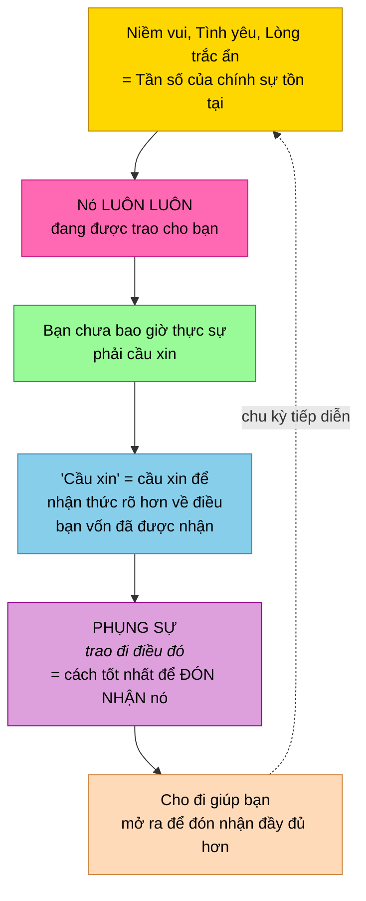

### Định nghĩa lại việc "cầu xin" tình yêu

> "Cầu xin thực ra không phải là xin một điều gì đó mà bạn không có. Bạn có thể cầu xin, nhưng hãy hiểu rằng cầu xin đơn giản chỉ là xin để nhận thức rõ hơn về điều bạn vốn đang được trao. Khác biệt rất lớn."

| Cách hiểu thông thường | Sự thật |
|---------------------|-----------|
| "Tôi cần tìm tình yêu" | Bạn CHÍNH LÀ tình yêu |
| "Tôi cần xứng đáng với tình yêu" | Nó luôn luôn đang được trao cho bạn |
| "Tôi cần cầu xin tình yêu" | Cầu xin = trở nên ý thức hơn về điều bạn đã có |
| "Cho đi tình yêu làm tôi cạn kiệt" | Cho đi tình yêu mở bạn ra để nhận nhiều hơn |

---

## Mọi Thứ Đều Là Tình Yêu Vì Mọi Thứ Đều Là Thượng Đế

*Nguồn: Aluna — Transmute Anything Through Gratitude*

### Sự nhận ra cốt lõi

> "Mọi thứ đều là tình yêu bởi vì mọi thứ đều là Thượng Đế."

Ngay cả những trải nghiệm đau đớn nhất, khi được nhìn từ góc nhìn thiêng liêng, cũng là những hành động của tình yêu:

> "Họ đang thực hiện kế hoạch của Thượng Đế thay cho tôi, vì tôi, như một món quà dành cho tôi — để trao cho tôi sự giải phóng tối hậu và sự trọn vẹn."

### Sự chuyển dịch trong nhận thức

| Góc nhìn con người | Góc nhìn thiêng liêng |
|------------------|-------------------|
| Sự phản bội | Sự giải phóng nghiệp |
| Sốc | Sự điểm đạo |
| Mất mát | Khoảng trống cần thiết cho chuyển hóa |
| Đau đớn | Món quà dẫn đến giải phóng |
| Kết thúc đột ngột | Một nhát cắt đầy yêu thương |

> "Hoàn toàn không liên quan đến vẻ ngoài của nó trên tầng con người, vốn là sự phản bội và cú sốc đối với tôi — tôi biết đó là sự giải phóng lớn nhất của tôi."

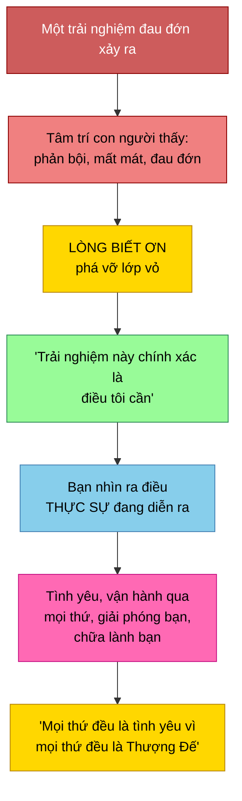

---

## Trái Tim — Bộ Phát Điện Từ Của Tình Yêu

*Nguồn: Bashar — Matters of the Heart*

### Cơ chế vật lý của tình yêu

> "Với mỗi nhịp tim, bạn gửi ra một bong bóng điện từ lan rộng từ cơ thể mình, bao trùm toàn bộ bạn, và các bạn hòa vào nhau trong những bong bóng điện từ kết nối đó, để một trái tim thực sự nói chuyện với tất cả những trái tim khác và bạn được đắm mình trong những bong bóng điện từ của tất cả các trái tim khác."

### Tình yêu vận hành về mặt vật lý như thế nào

| Thành phần | Chức năng |
|-----------|----------|
| **Trái tim** | Bơm máu; tạo xung điện từ mạnh nhất |
| **Máu** | Chứa sắt; mang đặc tính điện từ |
| **Tuần hoàn** | Sự chuyển động của máu giàu sắt tạo nên trường điện từ |
| **Nhịp tim** | Mỗi nhịp gửi ra một bong bóng điện từ của TÌNH YÊU lan ra từ cơ thể |

### Sự tương đồng giữa Trái Đất và con người

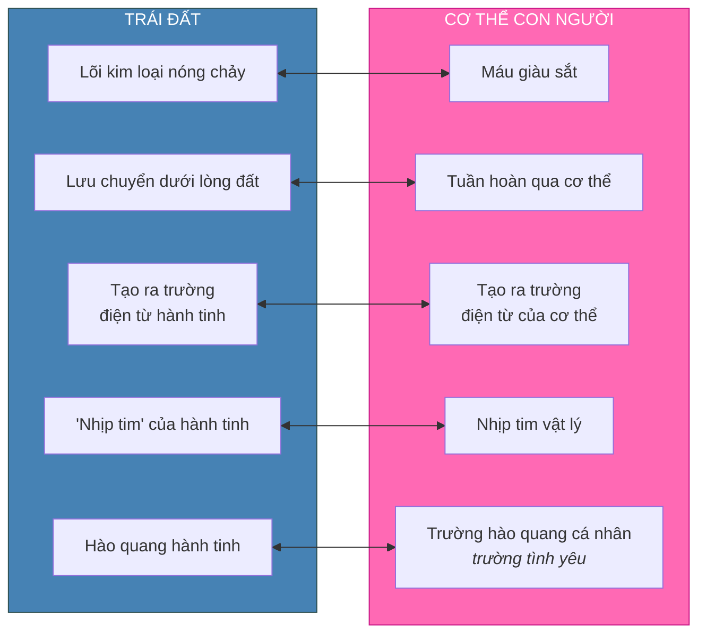

### Tinh luyện trường tình yêu

> "Khi bạn cho phép mình có nhiều sự sáng rõ hơn, nhiều sự tinh luyện hơn trong hình thể vật lý, khi bạn loại bỏ độc tố khỏi hệ thống có thể cản trở quá trình tuần hoàn máu này, trường điện từ này sẽ ngày càng tinh luyện hơn và mở rộng xa hơn khỏi cơ thể bạn."

| Trạng thái cơ thể | Chất lượng trường tình yêu |
|------------|-------------------|
| Nhiều độc tố, thiếu sáng rõ | Yếu, phạm vi giới hạn |
| Được thanh lọc, tinh luyện | Mạnh, mở rộng |
| Đang thăng tần, tần số cao | Rất nhạy, lan xa |

---

## Telempathy — Mọi Trái Tim Giao Tiếp Với Nhau Như Thế Nào

*Nguồn: Bashar — Matters of the Heart*

### Tại sao Bashar nói "telempathy" chứ không phải "telepathy"

> "Một lần nữa, đây là lý do chúng tôi nói telempathy thay vì telepathy, bởi vì yếu tố empathy nhấn mạnh thành phần cảm xúc của trái tim. Trí tuệ cảm xúc của trái tim giao tiếp với mọi trái tim khác qua từng nhịp đập đến mọi trái tim khác trên hành tinh."

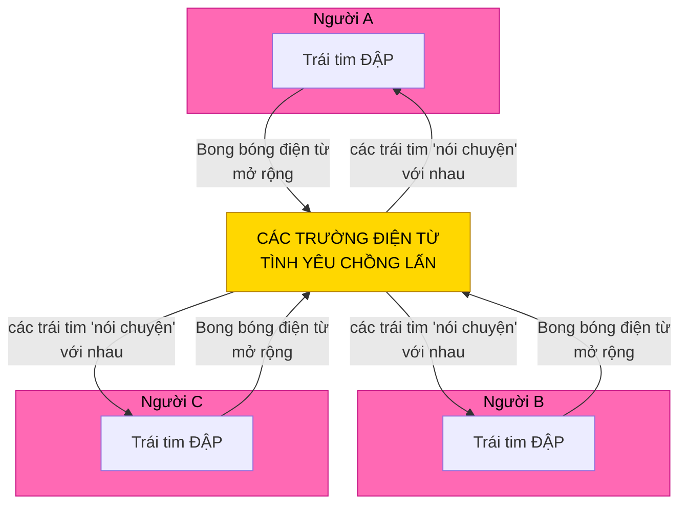

> "Các bạn là những bong bóng năng lượng điện từ sống động đang nở rộng và phát ra từ trái tim với từng nhịp đập trong sự kết nối và giao tiếp liên tục với nhau."

Mỗi nhịp tim là một hành động tình yêu được phát sóng tới mọi trái tim khác trên hành tinh.

---

## Kết Nối Giữa Trái Tim Và Tâm Trí Cao Hơn — Tình Yêu Trở Thành Đam Mê Như Thế Nào

*Nguồn: Bashar — Matters of the Heart*

### Cơ chế cốt lõi

> "Liên quan đến giao tiếp năng lượng với tâm trí cao hơn của chính bạn, trái tim đóng vai trò tuyệt đối then chốt trong quá trình này bởi vì tâm trí cao hơn một lần nữa nói bằng ngôn ngữ của năng lượng. Nó gửi đến bạn năng lượng ở những tần số nhất định mà tâm trí vật lý của bạn phiên dịch thành cảm giác đam mê."

> "Trái tim được điều chỉnh đặc biệt theo dao động của tâm trí cao hơn trong trạng thái tự nhiên của nó."

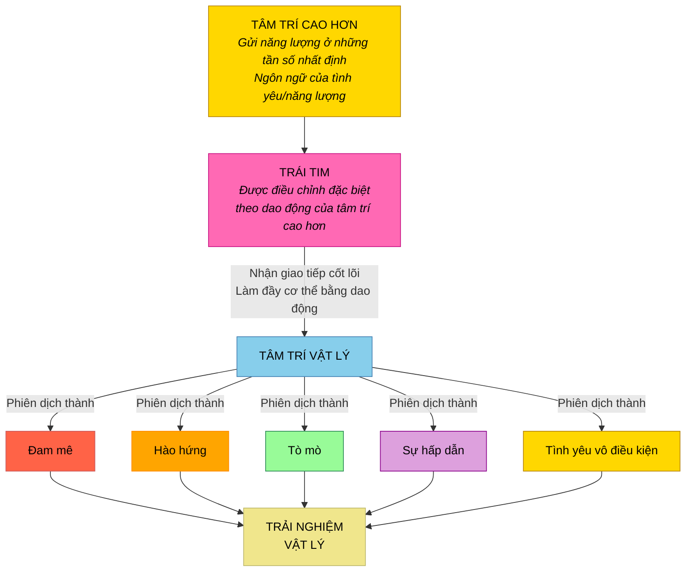

### Tất cả những cảm giác này đều là tình yêu được phiên dịch

| Cảm giác | Thực chất nó là gì |
|-----------|-------------------|
| **Đam mê** | Tần số cốt lõi của tâm trí cao hơn (tình yêu), được phiên dịch |
| **Hào hứng** | Sự đồng bộ với sự dẫn dắt đầy yêu thương của tâm trí cao hơn |
| **Tò mò** | Tình yêu của tâm trí cao hơn đang kéo sự chú ý của bạn |
| **Sự hấp dẫn** | Sự cộng hưởng với điều gì đó mà tình yêu đang dẫn bạn tới |
| **Tình yêu vô điều kiện** | Dao động thuần khiết, không bị lọc, của chính tâm trí cao hơn |

> "Lý do cơ thể vật lý của bạn phiên dịch những thông điệp, những giao tiếp từ tâm trí cao hơn thành cảm giác đam mê, hào hứng, tò mò, hấp dẫn và tình yêu vô điều kiện là vì chính trái tim là thứ đang trực tiếp nhận giao tiếp cốt lõi từ tâm trí cao hơn và làm đầy cơ thể bạn bằng dao động đó."

---

## Tình Yêu Vô Điều Kiện Là Dao Động Thuần Khiết Của Tâm Trí Cao Hơn

*Nguồn: Bashar — Matters of the Heart*

### Khi bạn cảm nhận được tình yêu vô điều kiện, bạn đang nhận tín hiệu ở dạng thuần khiết

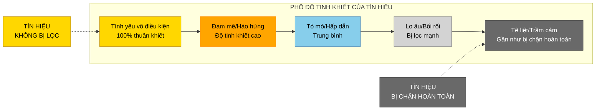

Phổ từ tình yêu vô điều kiện đến trầm cảm thực chất là phổ từ **tín hiệu không bị lọc** đến **tín hiệu bị chặn hoàn toàn** từ tâm trí cao hơn.

---

## Niềm Tin Lọc Tình Yêu Thành Nỗi Sợ Như Thế Nào

*Nguồn: Bashar — Matters of the Heart & One Minute to Midnight*

### Cơ chế lọc

> "Dĩ nhiên nó có thể bị lọc qua các hệ thống niềm tin của tâm trí vật lý, những thứ có thể khiến nó không nhất thiết được trải nghiệm ở dạng tinh khiết của nó, dạng tình yêu vô điều kiện thuần khiết của nó."

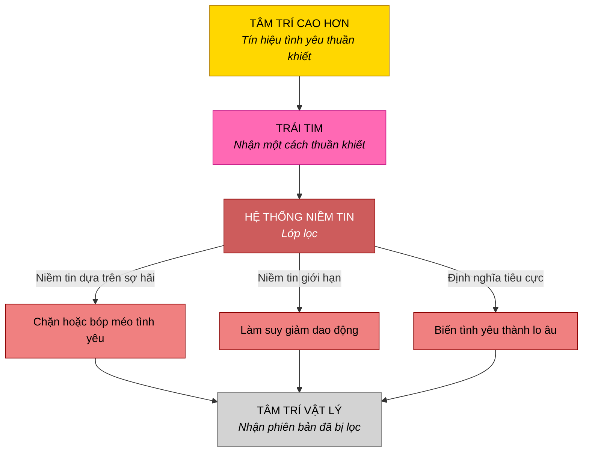

### Nỗi sợ là tình yêu bị lệch hướng

> "Nỗi sợ là năng lượng của bạn bị lọc qua các hệ thống niềm tin không đồng bộ với rung động chân thật của bạn."

> "Nỗi sợ là người bạn nói cho bạn biết rằng bạn đang có một niềm tin không đồng bộ với con người thật của mình."

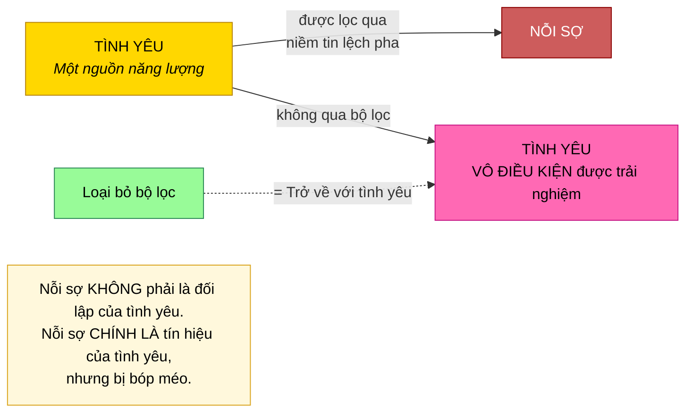

| Khi có niềm tin dựa trên sợ hãi | Khi không có niềm tin dựa trên sợ hãi |
|------------------------|--------------------------|
| Tín hiệu tình yêu bị bóp méo | Tín hiệu tình yêu được nhận thuần khiết |
| Đam mê bị làm mờ hoặc rối | Đam mê rõ ràng và mạnh mẽ |
| Dẫn dắt không rõ ràng | Dẫn dắt không thể nhầm lẫn |
| Tình yêu được trải nghiệm có điều kiện | Tình yêu được trải nghiệm vô điều kiện |

**Ý chính cốt lõi:** Nỗi sợ và tình yêu không phải là hai mặt đối lập. Nỗi sợ là tín hiệu của tình yêu bị **bóp méo** qua những niềm tin lệch pha. Gỡ bỏ những niềm tin ấy, điều còn lại là tình yêu thuần khiết. Nó luôn luôn ở đó.

---

## Tình Yêu Và Nước Mắt — Nỗi Nhớ Nhà Hướng Về Quê Nhà Tâm Linh

*Nguồn: Bashar — Clairvoyance, Addiction, Forgiveness & Loneliness*

### Tại sao tình yêu sâu sắc khiến bạn khóc

> "Tình yêu sâu sắc là dao động của cõi linh hồn, là quê hương của bạn. Vì vậy khi bạn được tiếp xúc với nó, bạn đang cảm thấy, theo một nghĩa nào đó, 'nhớ nhà' một chút."

### Cơ chế của nước mắt

> "Bạn đang buông bỏ hoặc rửa trôi khỏi hệ thống của mình bất cứ điều gì đã ngăn cản bạn kết nối với dao động của quê nhà."

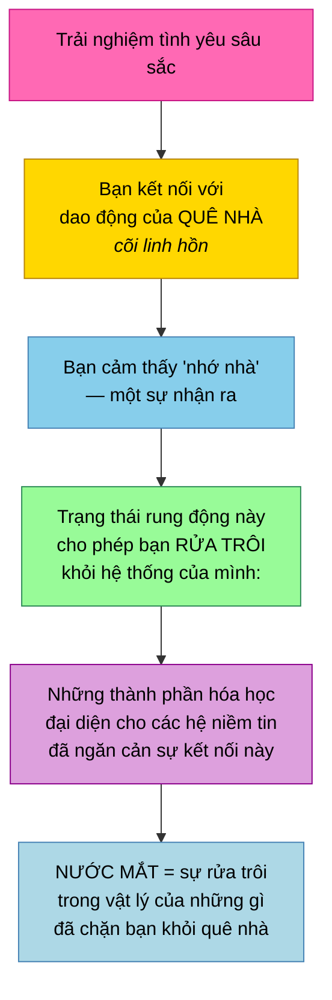

| Yếu tố | Ý nghĩa |
|---------|---------|
| **Tình yêu sâu sắc** | Dao động của cõi linh hồn / quê nhà |
| **Nước mắt** | Rửa trôi dư lượng hóa học của những niềm tin chặn trở |
| **Cảm giác** | Nỗi nhớ nhà — sự nhận ra tần số quê hương đích thực của bạn |
| **Mục đích** | Thanh lọc điều đã ngăn cản kết nối với cội nguồn |

**Khi bạn khóc vì tình yêu, bạn thực sự đang rửa trôi những gì đã tách bạn khỏi bản chất thật của mình.**

---

## Giá Trị Bản Thân — Sự Hiện Hữu Của Bạn CHÍNH LÀ Tình Yêu Của Tạo Hóa Được Biểu Lộ

*Nguồn: Bashar — Motivation, Self-Worth & the Oversoul*

### Bằng chứng logic

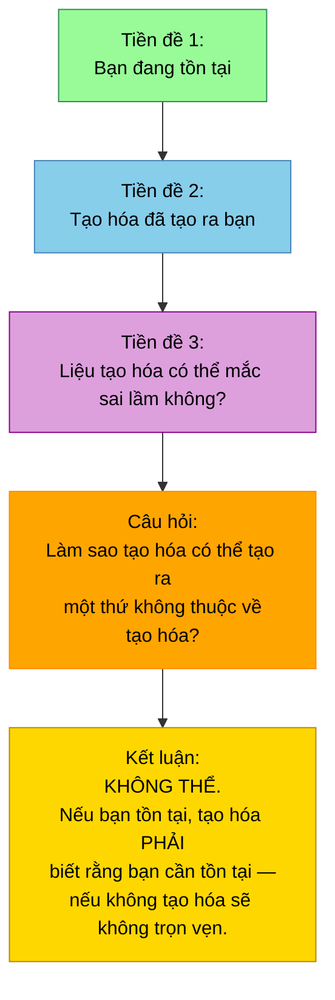

> "Nếu bạn tồn tại, tạo hóa phải biết rằng bạn cần tồn tại, nếu không tạo hóa sẽ không trọn vẹn. Không có bạn, sẽ không có gì tồn tại."

> "Vì vậy, rõ ràng tạo hóa tin rằng bạn xứng đáng được tồn tại, nếu không nó đã không tạo ra bạn."

### Nghịch lý tuyệt đẹp

> "Khi bạn không tin vào giá trị của chính mình, bạn đang tranh cãi với tạo hóa. Và nghịch lý là — chính khả năng tranh cãi với tạo hóa của bạn là bằng chứng rằng bạn xứng đáng được tồn tại."

| Lập luận | Nghịch lý |
|-------------|------------|
| "Tôi không xứng đáng tồn tại" | Khả năng bạn đưa ra lập luận đó chứng minh bạn tồn tại |
| "Tạo hóa đã sai khi tạo ra tôi" | Tạo hóa không tạo ra những gì không thuộc về nó |
| "Tôi không xứng đáng với tình yêu" | **Sự hiện hữu của bạn CHÍNH LÀ tình yêu của tạo hóa được biểu lộ** |

> "Hãy ngừng tranh cãi với tạo hóa về giá trị của bạn. Ít nhất hãy bắt đầu từ đó."

**Sự hiện hữu của bạn không tách rời khỏi tình yêu. Sự hiện hữu của bạn CHÍNH LÀ tình yêu được biểu lộ. Tạo hóa đã yêu bạn đến mức đưa bạn vào hiện hữu.**

---

## Chiếc Chăn Màu Xanh Lá — Sợ Cảm Nhận Tình Yêu Dành Cho Chính Mình

*Nguồn: Bashar — Motivation, Self-Worth & the Oversoul*

### Hình ảnh minh họa

Một người phụ nữ quấn mình trong nỗi sợ như trong một chiếc chăn. Khi được hỏi chiếc chăn màu gì, cô ấy trả lời là màu xanh lá — màu của luân xa tim.

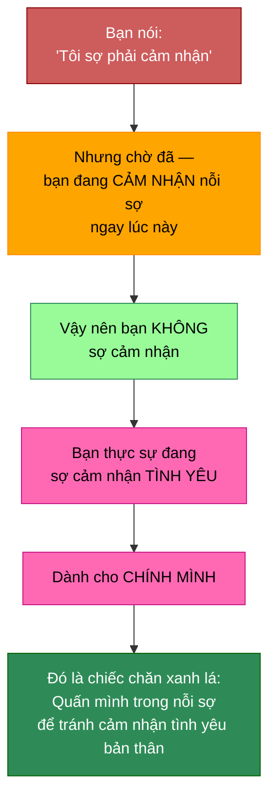

### Câu hỏi then chốt

> "Bạn không thực sự sợ cảm nhận bởi vì bạn sẵn sàng cảm nhận nỗi sợ. Câu hỏi là, tại sao bạn lại không sẵn sàng cảm nhận tình yêu dành cho chính mình?"

| Yếu tố | Ý nghĩa |
|---------|---------|
| Chiếc chăn | Nỗi sợ như một vùng an toàn — quấn mình trong đó |
| Màu xanh lá | Luân xa tim |
| Chiếc chăn xanh lá của nỗi sợ | Sợ **cảm nhận** — cụ thể là sợ cảm nhận **tình yêu dành cho chính mình** |

---

## Tình Yêu Đích Thực Trong Các Mối Quan Hệ — Sự Cho Phép Vô Điều Kiện

*Nguồn: Bashar — Eye of the Storm*

### Tình yêu đích thực đòi hỏi điều gì

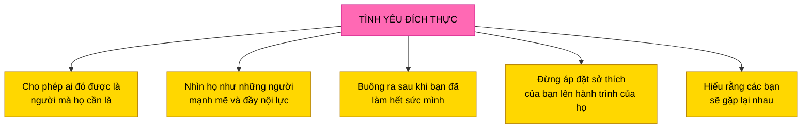

> "Đó là một hành trình lớn của sự phân định, học cách phân định ngày càng tốt hơn và đưa ra những lựa chọn phù hợp với những gì giờ đây bạn có thể phân định rằng thật sự, thật sự đúng trong trái tim sâu thẳm của mình cho kiểu thực tại mà bạn thật sự ưa thích, bất kể những bề ngoài đang diễn ra xung quanh."

---

## Tình Yêu Vô Điều Kiện Dành Cho Hành Trình Của Người Khác

*Nguồn: Bashar — Love, Passion & the Magic of Reality*

### Khi người bạn yêu chọn một con đường khác

> "Hãy chỉ hỗ trợ và yêu thương vô điều kiện, đồng thời là tấm gương về điều mà anh ấy có thể chọn, nhưng hãy hiểu rằng bạn phải cho phép anh ấy chọn bất cứ điều gì anh ấy chọn. Nếu không, bạn không còn là vô điều kiện nữa."

> "Mọi người đều là những hữu thể vĩnh cửu. Bạn vội điều gì? Hãy để anh ấy khám phá. Có thể đó là con đường của anh ấy. Có thể đó là cách anh ấy cần để học những điều khác."

> "Tôi hoàn toàn ổn với việc bạn tin vào điều bạn muốn tin. Tôi tin vào điều tôi tin. Điều đó không có nghĩa là tôi yêu bạn ít đi."

| Cách tiếp cận | Hành động |
|----------|--------|
| **Hãy vô điều kiện** | Yêu thương bất kể niềm tin của họ |
| **Hãy là tấm gương** | Cho họ thấy điều họ có thể chọn, nhưng không ép buộc |
| **Cho phép con đường của họ** | Chấp nhận rằng lựa chọn là của họ |
| **Đừng vội** | Họ là những hữu thể vĩnh cửu — rồi họ sẽ tự khám phá ra |
| **Không phán xét** | Con đường của họ có thể chính là điều họ cần |

---

## Tình Yêu Là Phẩm Chất Phổ Quát Của Các Hữu Thể Ở Tần Số Cao Hơn

*Nguồn: Bashar — One Minute to Midnight*

### Phẩm chất duy nhất mà mọi hữu thể cao hơn đều chia sẻ

> "Một trong những phẩm chất bao trùm phổ biến nhất và dĩ nhiên là tuyệt đối cần phải được biểu lộ chính là sự biểu hiện của tình yêu vô điều kiện, bất kể những phẩm chất khác có thể đi kèm là gì."

| Đặc điểm con người | Phẩm chất của hữu thể cao hơn |
|-------------|----------------------|
| Nổi trội/Rụt rè | Quyết đoán/Kiệm lời |
| Tình yêu có điều kiện, thay đổi | Tình yêu vô điều kiện, nhất quán |
| Tình yêu chỉ là một đặc điểm trong nhiều đặc điểm | Tình yêu là phẩm chất BAO TRÙM |
| Tình yêu đến rồi đi | Tình yêu luôn luôn được biểu hiện, bất kể điều gì |

---

## Tình Yêu Ở Những Tầng Cao Nhất — Tần Số Thiên Thần Và Nguồn Cội

*Nguồn: Bashar — The Voices in Your Head*

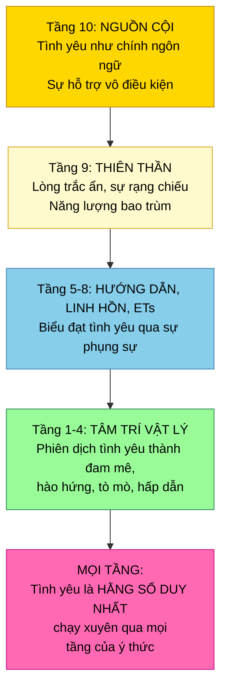

### Tầng 9: Cõi thiên thần

- Sự phản chiếu đầu tiên, sự phân tách đầu tiên khỏi All That Is
- Tấm gương đầu tiên của Thượng Đế
- Ngôn ngữ của lòng trắc ẩn và năng lượng bao trùm
- Điều bao gồm, chứa đựng và biểu đạt thông qua **sự rạng chiếu và tần số thuần túy**
- Thu hút và nam châm hóa hướng tới các khía cạnh cao hơn của hiện hữu
- Tỏa ra ánh sáng rực rỡ xua tan mọi bóng tối

### Tầng 10: God/Goddess/All That Is/Source

- Sự biểu hiện của lòng trắc ẩn
- **Sự hỗ trợ và tình yêu vô điều kiện**
- **Tình yêu như một ngôn ngữ tự thân**
- Sự biết chắc tuyệt đối về bạn là ai, là gì, khi nào, ở đâu và như thế nào
- Bản chất của con đường ít kháng cự nhất

---

## Cầu Nguyện Là Sự Biểu Lộ Hướng Ra Ngoài Của Tình Yêu

*Nguồn: Bashar — Simultaneous Lives, the Oversoul & Isness*

### Tình yêu cần được biểu đạt trong thế giới

> "Nếu bạn thấy ai đó vấp ngã và bị thương rồi bạn đến giúp họ đứng dậy và làm họ thấy khá hơn, đó là một lời cầu nguyện. Một lời cầu nguyện chủ động. Làm điều gì đó bằng năng lượng của bạn, làm điều gì đó bằng trạng thái biết ơn của bạn để giúp đỡ người khác."

> "Cầu nguyện tốt để tạo ra trạng thái hiện hữu bên trong cho chính bạn, nhưng rồi sự biểu hiện hướng ra ngoài của lời cầu nguyện trong thế giới ở đâu?"

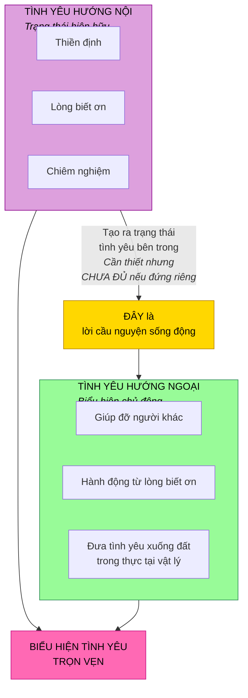

---

## Tan Hòa Vào Tình Yêu — Cánh Cổng Của Trái Tim Dẫn Tới Linh Hồn

*Nguồn: Eluña — The 2026 Shift & Soul Connection*

### Thực hành

> "Khi tôi đang điều chỉnh vào linh hồn mình, tôi đi thẳng vào điểm trung tâm của trái tim. Và rồi tại điểm trung tâm đó — có một cách mà bạn cho phép mình tan hòa vào tình yêu, vào hư không, vào bình an, vào tĩnh lặng. Và rồi bạn trượt qua một cánh cửa rất nhỏ, một cổng rất nhỏ bên trong trái tim đưa bạn vào cõi linh hồn."

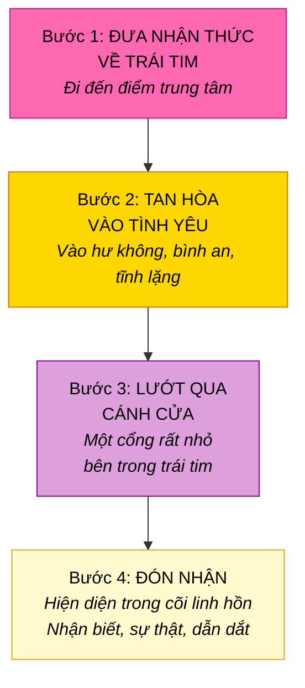

### Bạn thực hành càng nhiều, cánh cửa càng rộng ra

> "Bạn càng thường xuyên kết nối với điểm trung tâm này trong trái tim, càng thường xuyên cho phép mình tan hòa vào tình yêu và đi qua cánh cửa này để kết nối với linh hồn, cánh cửa ấy càng lớn dần. Nó tự mở rộng."

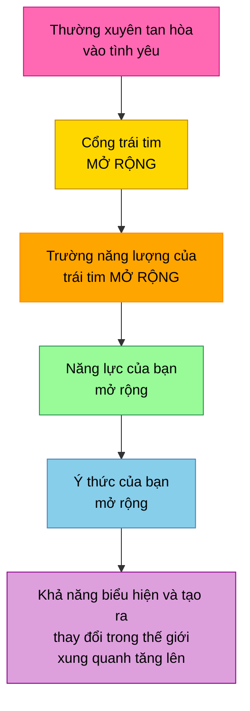

> "Hãy phó thác với niềm tin cho trái tim, cho sự kết nối này, cho linh hồn của bạn."

---

## Luân Xa Tim — Màu Xanh Lá, Sự Tiếp Xúc Và Kết Nối

*Nguồn: Bashar & Pleiadians — Light, Color, Sound Unified*

### Màu xanh lá như màu của tình yêu

> "Nó đặc trưng cho dao động của luân xa tim bởi vì sự tiếp xúc là từ tim đến tim."

> "Dù tâm trí có thể khác nhau, dù hình thể có thể khác nhau, chính qua trái tim mà chúng ta nhận ra linh hồn của mình là một."

### Sự đồng bộ trái tim mở ra các chiều không gian

> "Một chiều không gian là một góc nhìn. Và bạn càng đồng bộ trong trái tim, bạn càng có thể di chuyển vào những không gian chiều kích khác nhau thông qua cách mà bạn cảm nhận."

| Xanh lá như trái tim mở | Xanh lá như trái tim bị chặn |
|--------------------|----------------------|
| Luân xa tim mở | Luân xa tim đóng |
| Tiếp xúc, kết nối | Sợ kết nối |
| Tình yêu cho bản thân và người khác | Sợ cảm nhận tình yêu |
| Nhận ra tính nhất thể | Cô lập trong sợ hãi |
| Khả năng tiếp cận chiều không gian | Giới hạn chiều không gian |

---

## Tình Yêu Là Ánh Sáng — Sự Vật Chất Hóa Đầu Tiên Của Ý Thức

*Nguồn: Bashar — The Spectrum of Reflection*

### Bạn được tạo nên từ ánh sáng (được tạo nên từ tình yêu)

> "Hãy nhớ, về nền tảng bạn được tạo nên từ năng lượng. Có thể nói bạn được tạo nên từ ánh sáng."

> "Điều mà chúng tôi gọi là năng lượng điện từ là một trong những sự vật chất hóa đầu tiên của ý thức."

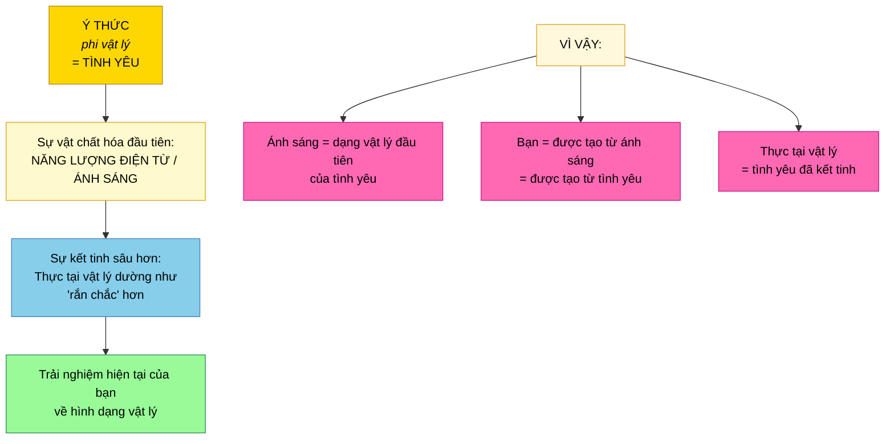

### Khi niềm tin thuần khiết, tình yêu tỏa sáng xuyên qua

> "Hãy tưởng tượng bạn có ánh sáng trắng đại diện cho ý niệm về bản ngã lý tưởng, tâm trí cao hơn — không bị vỡ, không bị lọc, thuần khiết, đẹp đẽ, một ánh sáng trắng đồng nhất."

Khi niềm tin thuần khiết và đồng bộ:
- Các màu kết hợp lại thành ánh sáng trắng tinh khiết
- Điều này biểu hiện thành hào hứng, đam mê, **tình yêu**, sáng tạo, niềm vui

Khi niềm tin bị nhuộm màu/bóp méo:
- Các màu kết hợp lại thành trắng ngà, xám, hoặc đen
- Điều này biểu hiện thành sợ hãi, nghi ngờ bản thân, trải nghiệm bị dập tắt

---

## Sống Từ Tình Yêu — Điều Hướng Đến Trái Tim Của Thực Tại

*Nguồn: Bashar — Matters of the Heart*

### Lời kêu gọi hành động

> "Hãy vươn tới tất cả những con người khác nhau và mọi sự khác biệt trên thế giới của các bạn bằng một cách đầy yêu thương để dung hợp và ôm lấy mọi người trong sự thật của riêng họ, giải phóng họ khỏi những giới hạn của chính họ bằng cách trở thành những ví dụ sống động của một người đang sống sự thật của mình, đang sống từ trái tim và cái đầu trong sự hợp nhất, hài hòa và tâm trí cao hơn."

### Điều hướng qua tình yêu

> "Các bạn sẽ thay đổi tần số của mình và điều hướng bản thân đến những phiên bản của Trái Đất vốn đã cùng tồn tại, những phiên bản đại diện nhiều hơn cho trái tim của tình yêu và trải nghiệm của cực lạc cùng niềm vui."

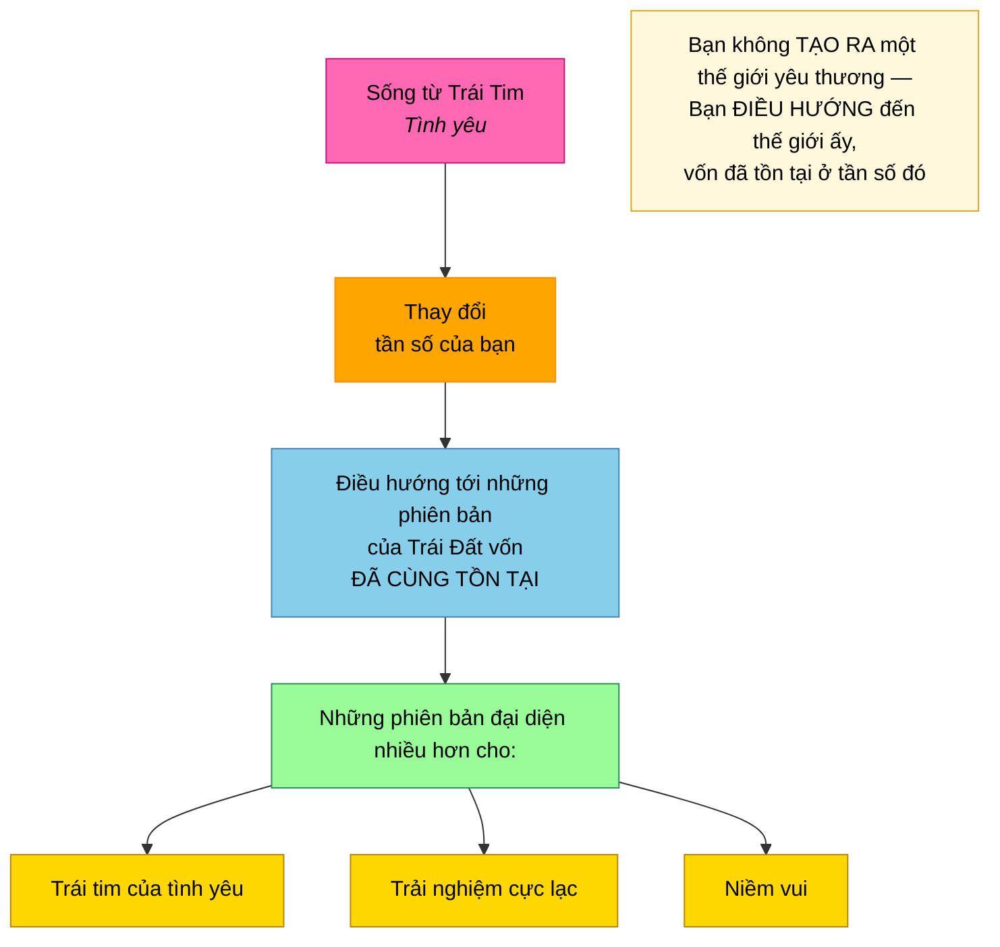

### Ví dụ của người Sassani

> "Như cách chúng tôi trải nghiệm trên thế giới của mình, chúng tôi giao tiếp với các linh hồn và các hữu thể liên chiều mỗi ngày, mọi lúc. Đó là một phần trong thực tại tự nhiên của chúng tôi khi biết rằng thông tin này tồn tại, có thể được tiếp nhận và chạm tới tại bất kỳ thời điểm nào khi bạn đang vận hành ở tần số đó từ những tầng cao nhất của trái tim."

---

## Kiến Trúc Ba Tầng Tâm Trí Khi Đồng Bộ Trong Tình Yêu

*Nguồn: Bashar — Matters of the Heart*

### Khi cả ba tầng tâm trí đồng bộ trong tình yêu

> "Bạn có thể được hướng dẫn để nhớ lại con người thật của mình và sống một cuộc đời thuần khiết của tình yêu, niềm vui, sáng tạo và hài hòa bằng cách là những cá thể đích thực mà mỗi người các bạn là, mà các bạn đã được tạo ra để trở thành. Đó là con đường của các bạn trong cuộc sống."

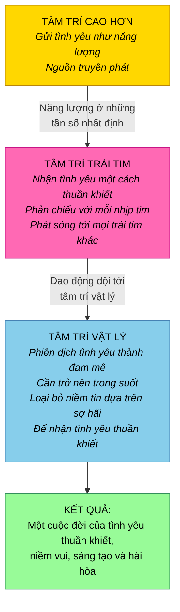

| Tầng tâm trí | Vai trò trong tình yêu | Khi đồng bộ |
|------|-------------|-------------|
| **Tâm trí cao hơn** | Gửi tần số tình yêu cốt lõi | Liên tục truyền tình yêu/sự dẫn dắt |
| **Tâm trí trái tim** | Nhận và phản chiếu tình yêu | Được căn chỉnh hoàn hảo, phát nhịp tình yêu theo từng nhịp đập |
| **Tâm trí vật lý** | Phiên dịch và sống tình yêu | Trong suốt, đồng bộ, trải nghiệm đam mê/tình yêu |

---

## Tóm Tắt Các Nguyên Lý Cốt Lõi

### Tình yêu LÀ gì

- **Tình yêu là tần số rung động của chính sự tồn tại** — không phải một cảm xúc, mà là thứ mà thực tại ĐƯỢC tạo nên từ đó
- **Tình yêu là tần số dấu ấn của tất cả những gì đang là** — rung động nền tảng
- **Mọi thứ đều là tình yêu bởi vì mọi thứ đều là Thượng Đế** — kể cả những trải nghiệm đau đớn, nếu nhìn từ góc nhìn thiêng liêng
- **Ánh sáng là sự vật chất hóa đầu tiên của tình yêu** — bạn được tạo nên từ ánh sáng, vì vậy được tạo nên từ tình yêu
- **Bạn CHÍNH LÀ tình yêu** — bạn không tìm kiếm, kiếm được hay sở hữu nó; bạn chỉ trở nên nhận biết điều mà bạn vốn là

### Tình yêu vận hành về mặt vật lý như thế nào

- **Mỗi nhịp tim gửi ra một bong bóng điện từ của tình yêu** lan rộng từ cơ thể bạn
- **Một trái tim thực sự nói chuyện với tất cả các trái tim khác** qua những trường điện từ chồng lấn (telempathy)
- **Sắt trong máu tạo ra trường tình yêu** — tương tự như lõi nóng chảy của Trái Đất tạo nên trường hành tinh
- **Thanh lọc cơ thể giúp tinh luyện và mở rộng** trường điện từ của tình yêu
- **Thăng tần khiến nhịp tim trở thành bộ phát tình yêu mạnh mẽ hơn**

### Tình yêu và tâm trí cao hơn

- **Trái tim được điều chỉnh đặc biệt theo dao động của tâm trí cao hơn** — đó là bộ thu chính
- **Đam mê, hào hứng, tò mò, hấp dẫn đều là bản dịch của tình yêu** từ tâm trí cao hơn
- **Tình yêu vô điều kiện là tín hiệu THUẦN KHIẾT** — không bị lọc từ tâm trí cao hơn
- **Nỗi sợ không phải đối lập của tình yêu — đó là tín hiệu tình yêu bị bóp méo** qua những niềm tin lệch pha
- **Loại bỏ các niềm tin dựa trên sợ hãi, tình yêu thuần khiết sẽ còn lại** — nó luôn ở đó

### Tình yêu và giá trị bản thân

- **Sự hiện hữu của bạn CHÍNH LÀ tình yêu của tạo hóa được biểu lộ** — bạn được yêu thương để bước vào hiện hữu
- **Nếu tạo hóa đã tạo ra bạn, thì tạo hóa xem bạn là xứng đáng** — bạn không thể tranh cãi điều này với tạo hóa
- **Không tin vào giá trị của mình = tranh cãi với tạo hóa** — nhưng chính khả năng tranh cãi đó chứng minh bạn đang tồn tại
- **Chiếc chăn xanh lá:** bạn không sợ cảm nhận — bạn sợ cảm nhận tình yêu dành cho chính mình
- **Nước mắt từ tình yêu = nỗi nhớ nhà** — rửa trôi những gì đã tách bạn khỏi tần số quê nhà

### Sống tình yêu

- **Tình yêu đích thực = cho phép ai đó trở thành người mà họ cần là** — nhìn họ như mạnh mẽ và đầy nội lực
- **Tình yêu vô điều kiện nghĩa là không có điều kiện** — bao gồm cả việc cho phép những con đường mà bạn không đồng ý
- **Mọi hữu thể ở tần số cao hơn đều chia sẻ tình yêu vô điều kiện** như phẩm chất bao trùm của họ
- **Cầu nguyện mà không có biểu hiện ra bên ngoài thì chưa trọn vẹn** — tình yêu cần được neo thành hành động
- **Tan hòa vào tình yêu trong trái tim mở cổng vào linh hồn** — và bạn càng thực hành, cánh cửa càng mở rộng
- **Bạn điều hướng đến các thực tại yêu thương** — bạn không tạo ra chúng, bạn dịch chuyển sang những phiên bản Trái Đất vốn đã tồn tại ở tần số đó

---

## Lời Kết Khôn Ngoan

> "Tình yêu vô điều kiện là tần số rung động của chính sự tồn tại."

> "Bạn là niềm vui. Bạn là tình yêu."

> "Mọi thứ đều là tình yêu bởi vì mọi thứ đều là Thượng Đế."

> "Tình yêu sâu sắc là dao động của cõi linh hồn, là quê hương của bạn."

> "Sự hiện hữu của bạn CHÍNH LÀ tình yêu của tạo hóa được biểu lộ."

> "Bạn không thực sự sợ cảm nhận bởi vì bạn sẵn sàng cảm nhận nỗi sợ. Câu hỏi là, tại sao bạn lại không sẵn sàng cảm nhận tình yêu dành cho chính mình?"

> "Một trong những phẩm chất bao trùm phổ biến nhất và tuyệt đối cần phải được biểu lộ chính là sự biểu hiện của tình yêu vô điều kiện, bất kể những phẩm chất khác có thể đi kèm là gì."

> "Dù tâm trí có thể khác nhau, dù hình thể có thể khác nhau, chính qua trái tim mà chúng ta nhận ra linh hồn của mình là một."

> "Hãy cho phép mình tan hòa vào tình yêu, vào hư không, vào bình an, vào tĩnh lặng."

> "Các bạn sẽ thay đổi tần số của mình và điều hướng bản thân đến những phiên bản của Trái Đất vốn đã cùng tồn tại, những phiên bản đại diện nhiều hơn cho trái tim của tình yêu."
