# Joy Is Always Here and Now — Just KNOW It and Act On It

## Overview

Joy is not something you find, earn, or develop. Joy is the fundamental vibration of existence itself — the frequency at which all of creation operates. You ARE joy. You don't acquire it; you remember it. You don't build it; you stop blocking it. The only thing between you and the experience of joy is a belief that says it isn't there. This document compiles the complete teachings on joy from across all documented transmissions, revealing a unified understanding: joy is always here, always now, always you. The mechanism is simple — KNOW it (don't just hope it), and your behavior will naturally reflect that knowing. Knowledge and action are synonymous. What you truly know, you simply live.

---

## Table of Contents

1. [You ARE Joy — It Is Not Something to Find](#you-are-joy--it-is-not-something-to-find)
2. [Joy Is the Frequency of Existence Itself](#joy-is-the-frequency-of-existence-itself)
3. [Knowing vs. Telling Yourself — The Critical Difference](#knowing-vs-telling-yourself--the-critical-difference)
4. [Knowledge and Action Are Synonymous — The Pick Up Exercise](#knowledge-and-action-are-synonymous--the-pick-up-exercise)
5. [Joy Is Always Being Given — You Just Need Awareness](#joy-is-always-being-given--you-just-need-awareness)
6. [Your Signature Frequency IS Joy — Beliefs Cloud It](#your-signature-frequency-is-joy--beliefs-cloud-it)
7. [Anxiety Is Joy Filtered Through Misalignment](#anxiety-is-joy-filtered-through-misalignment)
8. [The Heart — Joy's Receiver and Transmitter](#the-heart--joys-receiver-and-transmitter)
9. [Every Heartbeat Is an Invitation to Joy](#every-heartbeat-is-an-invitation-to-joy)
10. [Following Your Highest Excitement — Joy Moment by Moment](#following-your-highest-excitement--joy-moment-by-moment)
11. [The Automatic System — Relax and Let Joy Work](#the-automatic-system--relax-and-let-joy-work)
12. [Self-Worth — The Foundation of Joy](#self-worth--the-foundation-of-joy)
13. [The Green Blanket — Why You Block Joy](#the-green-blanket--why-you-block-joy)
14. [Tears of Joy — Homesickness for Home](#tears-of-joy--homesickness-for-home)
15. [Dissolving into Joy — The Heart's Portal to the Soul](#dissolving-into-joy--the-hearts-portal-to-the-soul)
16. [Joy as Synchronicity — Walking Through a Magical Dream](#joy-as-synchronicity--walking-through-a-magical-dream)
17. [Ecstasy as the Natural State — Lucidity Brings Bliss](#ecstasy-as-the-natural-state--lucidity-brings-bliss)
18. [Essassani — A Civilization Living in Absolute Joy](#essassani--a-civilization-living-in-absolute-joy)
19. [Navigating to Realities of Ecstasy and Joy](#navigating-to-realities-of-ecstasy-and-joy)
20. [Joy Expressed Outward — Active Prayer](#joy-expressed-outward--active-prayer)
21. [The Approach: Adventure, Not Dread](#the-approach-adventure-not-dread)
22. [Here and Now — There Is Nowhere More Important to Be](#here-and-now--there-is-nowhere-more-important-to-be)
23. [Key Principles Summary](#key-principles-summary)
24. [Closing Wisdom](#closing-wisdom)

---

## You ARE Joy — It Is Not Something to Find

> "You are joy. You are love. You are given unconditional support, love, and compassion. Why not reflect it? Because that is what will allow you to feel the connection to creation, to all that is — because that's the frequency of existence itself."

This is the foundational teaching: you don't search for joy. You don't develop joy. You don't earn joy. **You ARE joy.** Joy is not a destination — it is your nature.

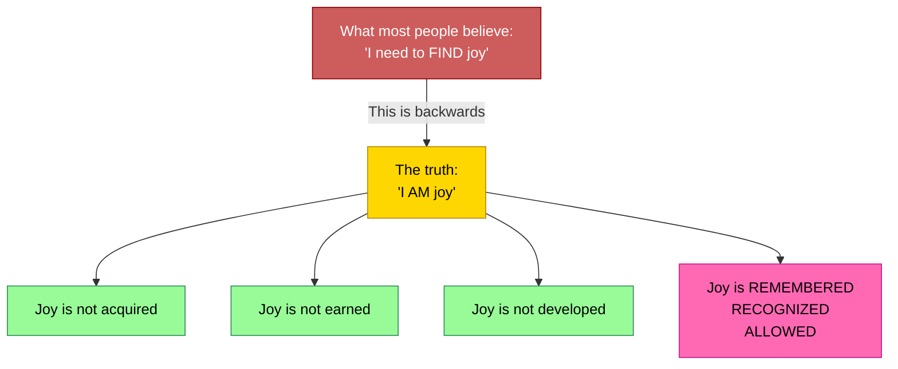

| What You Think | What's True |
|---------------|------------|
| "I need to find joy" | You ARE joy |
| "I need to earn happiness" | It is always being given to you |
| "Joy comes from outside me" | Joy IS you — it's your frequency |
| "Something is missing" | Nothing is missing — you just forgot |

---

## Joy Is the Frequency of Existence Itself

> "Unconditional love is the vibratory frequency of existence itself. And love is your translation of that frequency in physical terms."

Joy, love, passion, excitement — these are all your physical body's translation of **the one fundamental vibration**: existence itself. Joy is not one emotion among many. Joy IS what reality is made of. Everything else is that frequency being filtered.

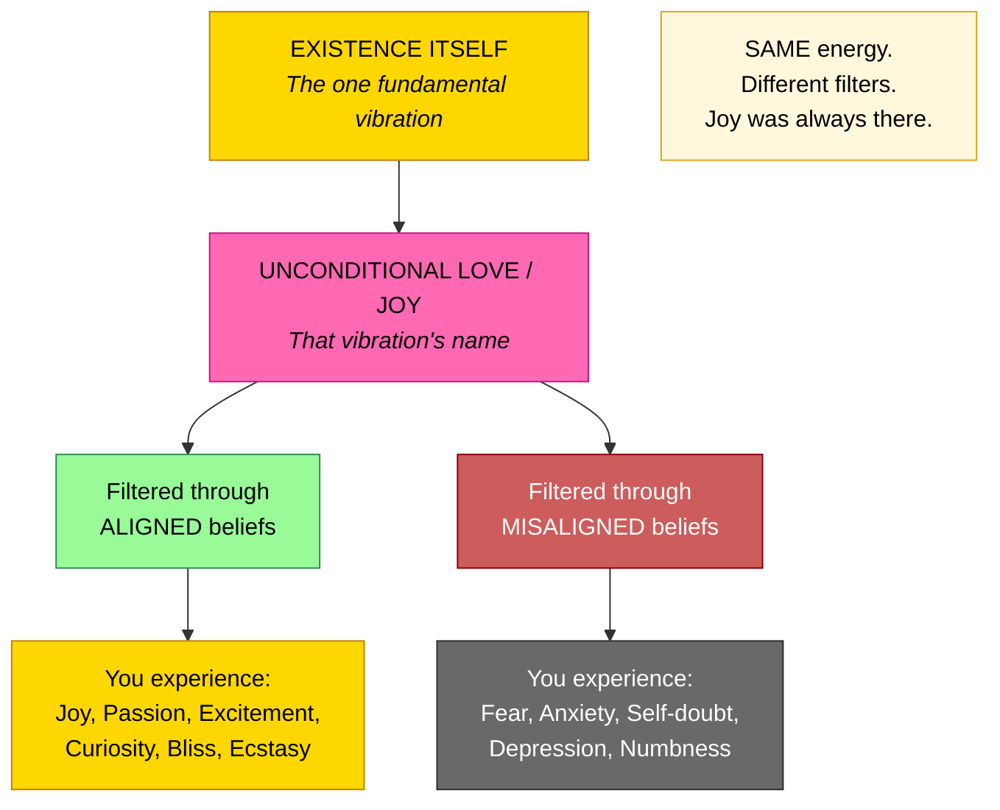

---

## Knowing vs. Telling Yourself — The Critical Difference

> "Just tell yourself that it's there all the time. Then it's there all the time. No — not just tell yourself. KNOW that it is. There's a difference."

This distinction is everything. Telling yourself joy is always there is a mental exercise. KNOWING joy is always there is a state of being. The difference is the difference between hoping and living.

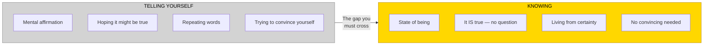

| Telling Yourself | Knowing |
|-----------------|---------|
| "Joy is there... I think" | Joy IS there. Period. |
| A mental exercise | A state of being |
| Requires repetition | Requires nothing — it just IS |
| Hoping | Living |
| Affirmation | Reality |

---

## Knowledge and Action Are Synonymous — The Pick Up Exercise

The most powerful demonstration of this principle:

> "Do you have a small object? Put it on the floor. Now, pick it up. Did you think about it or did you just do it? Did you ask yourself if you believed you could pick it up? No, you just picked it up."

> "What you know is true, you just do. Knowledge and behavior are synonymous."

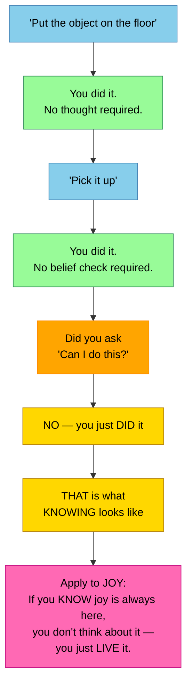

> "If you know that this permission slip will work for you, the only way to experience it in physical reality, to ground it in physical reality, is to behave like you know it's true. Make it synonymous with your action because the knowledge and the action are simply two sides of the same coin."

**The lesson for joy:** You don't think about joy. You don't wonder if joy is real. You don't check if you believe in joy. You just live joyfully — because you KNOW it's true. Just like picking up an object.

---

## Joy Is Always Being Given — You Just Need Awareness

> "Asking is not really asking for something you don't have. You can ask, but understand that asking is simply asking to be more aware of what you're already being given. Big difference."

> "You start being able to realize that you are already being given everything you can possibly be given. You don't necessarily have to ask for more. It's that you just have to pay more attention to what you're already getting."

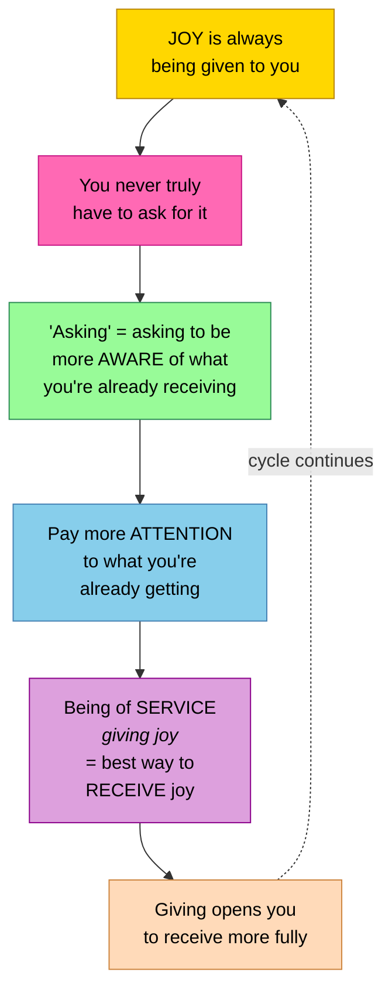

| What You Think You Need | What's Actually Happening |
|------------------------|--------------------------|
| "Give me joy" | Joy is already being given — constantly |
| "I need more happiness" | You need more AWARENESS of what you already have |
| "Where do I find bliss?" | It's here. Right now. Pay attention. |

---

## Your Signature Frequency IS Joy — Beliefs Cloud It

> "Your signature frequencies are all very, very, very high. It's just that you're clouding them with all sorts of fear-based belief systems that doesn't allow the light to shine through as strongly as it could."

When beliefs are pure and aligned, they recombine into pure white light — experienced as excitement, passion, joy, creativity. When beliefs are tinted or distorted, the light dims into fear, self-doubt, and dampened experience.

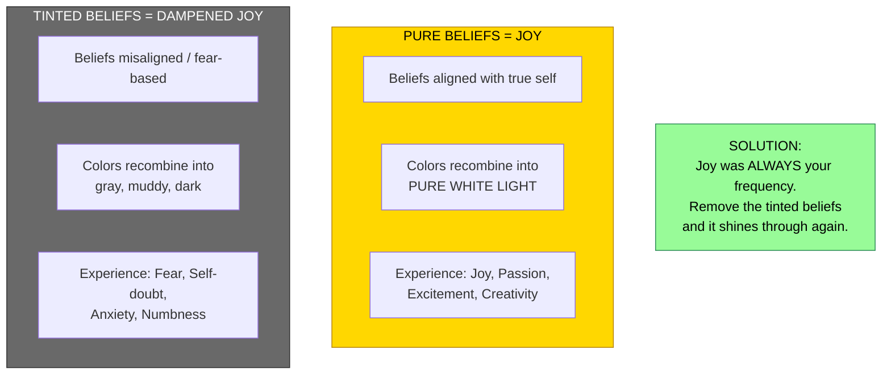

**Joy is not something you add. It's what's left when you remove what's blocking it.**

---

## Anxiety Is Joy Filtered Through Misalignment

> "It's the same energy as your joy. It's just that it's your joy being filtered through something that's out of alignment."

> "When you feel fear, know that you are right in touch with your excitement. You just have to redefine the belief the energy is running through."

This is one of the most profound teachings: anxiety and joy are **not opposites**. They are the **same energy**. The only difference is the filter.

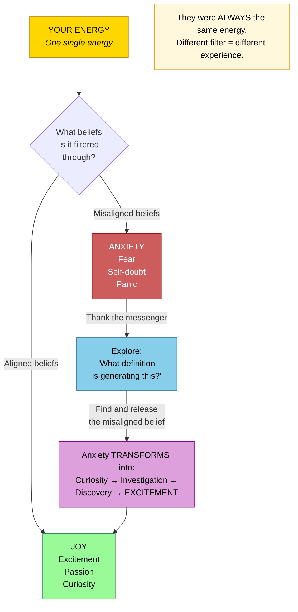

> "Oh, thank you, anxiety, for pointing out that I'm out of alignment and out of balance with who I prefer to be. Thank you for bringing it to my attention."

> "Something's very right. Your emotional system is working perfectly by pointing out that you have a definition that isn't working for you."

| When You Feel Anxiety | What's Actually Happening |
|----------------------|--------------------------|
| "Something's wrong" | Something's very RIGHT — your system is working |
| "I need to stop feeling this" | You need to LISTEN to what it's telling you |
| "Joy is gone" | Joy is still there — just filtered through a belief |
| "I'm broken" | Your guidance mechanism is functioning perfectly |

---

## The Heart — Joy's Receiver and Transmitter

> "The heart is specifically tuned to the vibration of the higher mind in its natural state."

> "The reason that your physical body translates the messages from your higher mind as the sensation of passion, excitement, curiosity, attraction, and unconditional love is because the heart is what's actually directly receiving the core communication from the higher mind and filling your body with that vibration."

All joy, all passion, all excitement — they originate as the higher mind's signal, received by the heart, and translated by the physical mind.

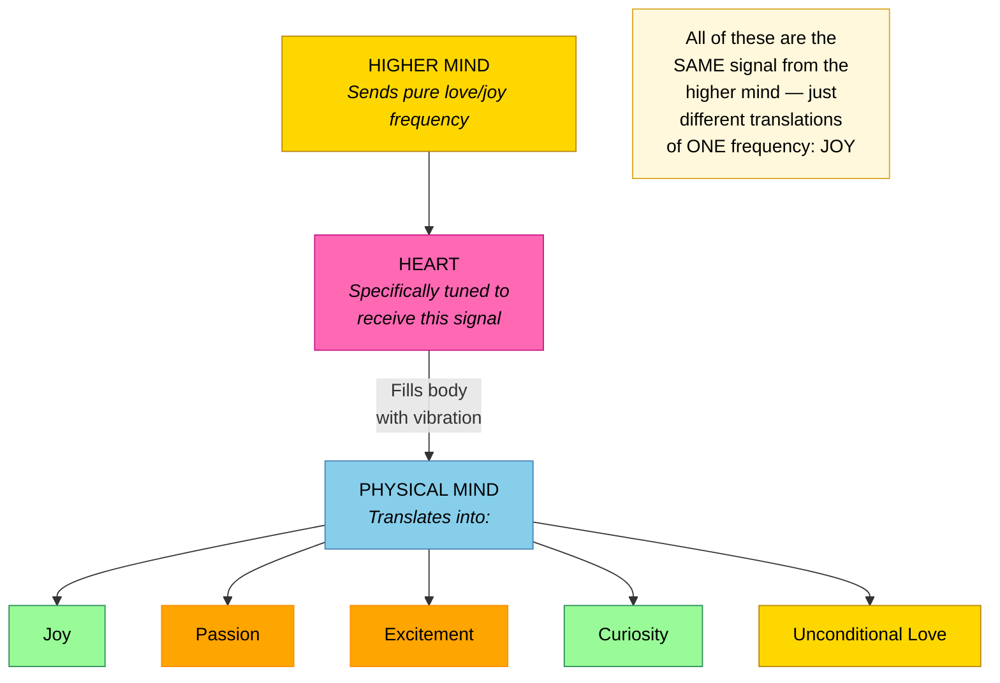

---

## Every Heartbeat Is an Invitation to Joy

> "You're constantly being given an opportunity to let go and zero back to your natural state with literally every beat of your heart — reflecting to you like a drum the vibration, the core vibration of your higher mind in its natural state."

Every single heartbeat is a reset button — drumming the core vibration of joy back into your body. You don't need a special moment or a meditation retreat. Every beat of your heart is already doing it.

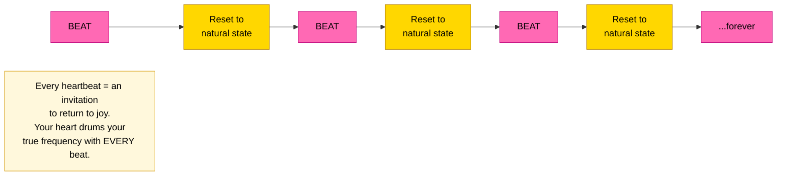

---

## Following Your Highest Excitement — Joy Moment by Moment

> "At every single moment you have a number of options available to you about what you can do. Just pick the one that's even just a little bit more attractive than any other, a little bit more exciting than any other, a little bit more of a tug of curiosity than any other."

> "Act on it with no insistence as to what the outcome should be, where it should lead, or anything. Just do the best you can and see what happens. That's how you build the momentum. That's how your passion will expand."

> "Why not allow the journey to be just as enjoyable?"

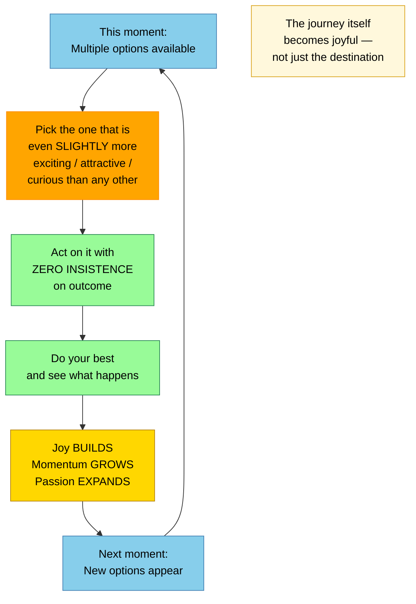

> "If you actually allow yourself to continue acting on your passion, in some way, shape, or form, it has to by definition support you — unless you have beliefs that it can't."

---

## The Automatic System — Relax and Let Joy Work

> "When you all really start to realize how automatic the system is, you can really start to relax a little more and not feel like you have to do so much. Just take the actions that are in alignment with your joy and it won't feel like you're actually doing that much, but you will have a more profound effect."

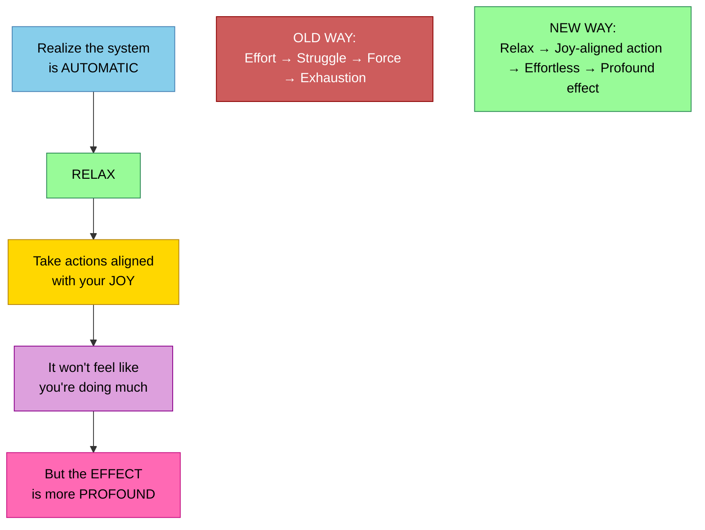

The paradox: doing less with more joy creates more profound effects than doing more with effort and struggle.

---

## Self-Worth — The Foundation of Joy

> "If you exist, creation must know you need to exist or creation wouldn't be complete. Without you, nothing would exist."

> "Therefore, creation obviously believes you are worthy of existence or it wouldn't have created you."

> "Your existence IS creation's love expressed."

If you don't believe you're worthy, you cannot fully receive the joy that is always being given. Self-worth is the foundation that allows joy to flow.

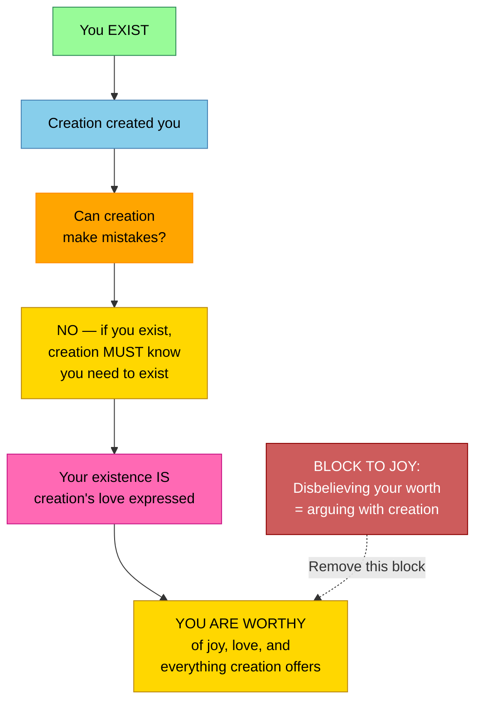

> "When you disbelieve in your own worth, you are arguing with creation. And yet the paradox is — your very ability to argue with creation proves that you're worthy of existence."

---

## The Green Blanket — Why You Block Joy

> "You're not really afraid to feel because you're willing to feel fear. The question is, why aren't you willing to feel love for yourself?"

A woman wrapped herself in fear like a blanket. When asked what color, she said green — the heart chakra. She wasn't afraid to feel. She was specifically afraid to **feel love and joy for herself**.

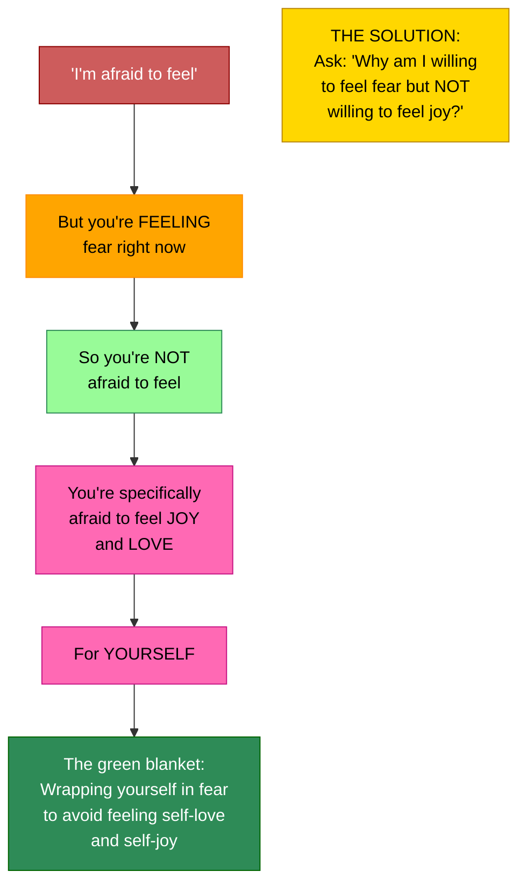

This is the hidden mechanism: many people are not blocked from feeling — they are blocked from feeling **joy specifically**. Fear feels familiar. Joy feels dangerous. But joy is your natural state; fear is the intruder.

---

## Tears of Joy — Homesickness for Home

> "Deep love is the vibration of the spirit realm which is your home. So when you are exposed to it, you are feeling in a sense 'homesick' a little bit."

> "You are letting go or washing out of your system anything that has prevented you from connecting to the vibration of home."

> "It's tears of release, tears of alignment, tears of joy. When you are aligning with something you know is true for you. When you've discovered a new piece of yourself in the world, you have discovered a treasure within yourself."

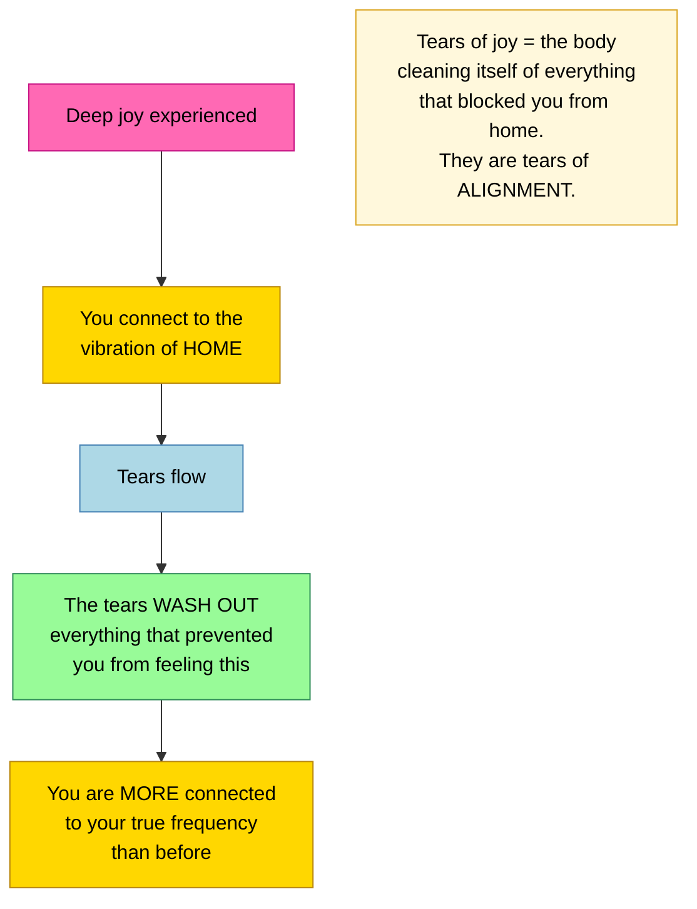

---

## Dissolving into Joy — The Heart's Portal to the Soul

> "When I am tuning into my soul, I come right to the very center point of my heart. And then that center point — there is a way where you let yourself dissolve into love, into nothing, into peace, into stillness. And then you slip through this very small door, a very small portal within the heart that takes you into the realm of the soul."

> "The more often you connect to this center point within your heart, the more often you allow yourself to dissolve into love and move through this door connecting to your soul, the greater this door becomes. It widens itself."

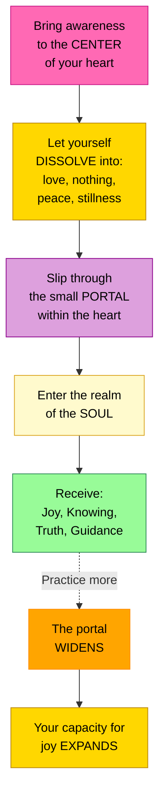

---

## Joy as Synchronicity — Walking Through a Magical Dream

> "The more you focus on the idea that everything is synchronism, the more synchronism you will experience, the more you will actually be able to experience the orchestration. And pretty soon you'll be like walking through a magical dream, everything falling into place."

> "If you could only see, really allow yourselves to feel the beautiful orchestration, the powerful orchestration that you all are, you would walk through your day absolutely gobsmacked, with your jaws slack and hanging open."

When you allow synchronicity to guide you, joy becomes the constant texture of your experience — not a peak moment, but the continuous feeling of living in a magical dream.

---

## Ecstasy as the Natural State — Lucidity Brings Bliss

> "Your physical reality will become far more ecstatic, far more malleable, far more flexible, far more synchronistic, far more magical."

> "Pretty soon you will be truly living in the dream state, dreaming in the living state — and you will understand that physical reality is but a dream."

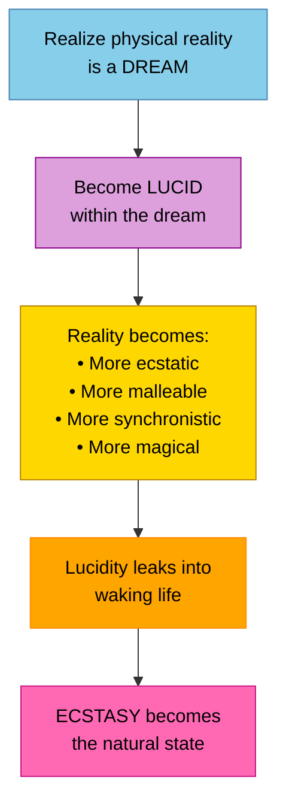

---

## Essassani — A Civilization Living in Absolute Joy

> "That is how our family operates — in absolute trust, in absolute spontaneity, in absolute joy."

> "We are all in perfect harmony, all in perfect joy because the only thing that excites us is to do what excites us. And everything that excites us harmonizes perfectly with everything that excites everyone else."

| Earth (current) | Essassani (where you're heading) |
|----------------|--------------------------------|
| Joy is occasional | Joy is constant |
| Excitement conflicts with others' | Everyone's excitement harmonizes perfectly |
| Trust is conditional | **Absolute trust** |
| Spontaneity is risky | **Absolute spontaneity** |
| Joy must be earned | **Absolute joy** — the default state |

This is not fantasy — this is what humanity is transforming into. That's why the connection between civilizations is possible now.

---

## Navigating to Realities of Ecstasy and Joy

> "You will change your frequencies and navigate yourselves to the versions of Earth that already coexist that are far more representative of the heart of love and the experience of ecstasy and joy."

You don't create a joyful world. You **navigate** to the version of Earth that already exists at the frequency of joy. It's already there. You shift to it by changing your frequency.

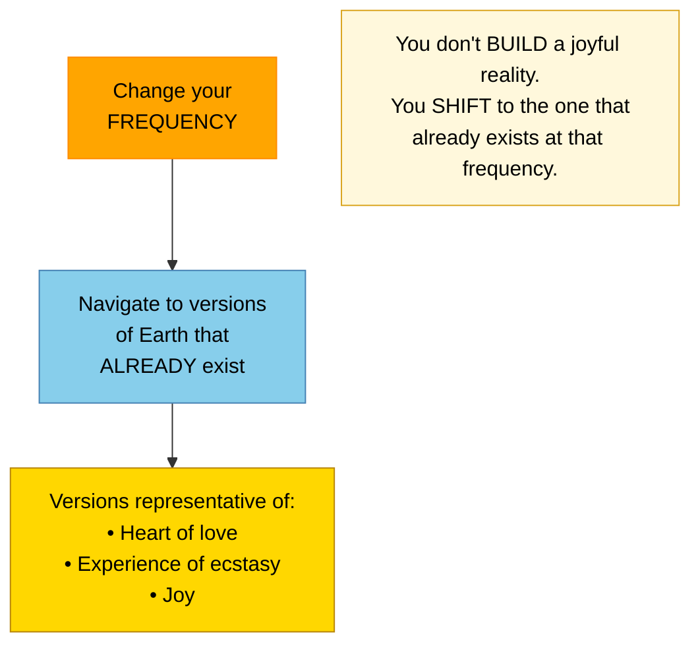

---

## Joy Expressed Outward — Active Prayer

> "If you see someone fall down and trip and hurt themselves and you go over and pick them up and help them feel better, that's a prayer. An active prayer. Doing something with your energy, doing something with your state of gratitude to help others."

Joy must be both inward and outward. Feeling joy inside is the first step. Expressing it through action — helping, serving, sharing — is what grounds it in physical reality and multiplies it.

> "Being the perfect example of living your life full of joy and creativity and action and service to others in the most fun way you possibly can."

---

## The Approach: Adventure, Not Dread

> "Oh, joy. Can't wait. Bring it on."

> "It will be an adventure, not a trial, not a judgment against yourself. It will be an exploration and a discovery. And that in and of itself is exciting."

Even self-discovery — finding the beliefs that block joy — should be approached with joy itself. Not dread, not heaviness, not self-judgment. Adventure. Exploration. Discovery. Excitement.

---

## Here and Now — There Is Nowhere More Important to Be

> "Feel your power and feel that there is no need to rush. You are an eternal and indestructible being. There is nowhere more important you need to be than here and now."

> "The source comes from here. It comes from now. There is no other place or time."

> "Time and space are subject to existence. Existence is not subject to time and space. There is no beginning to existence and no end. It is simply here. It is simply now."

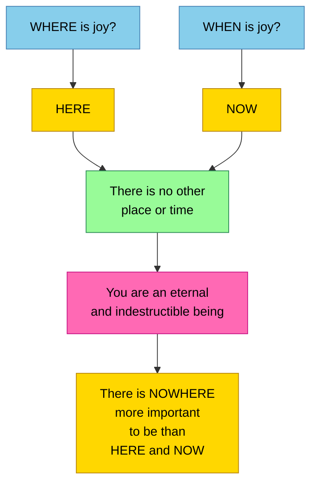

---

## Key Principles Summary

### Joy Is Your Nature

- **You ARE joy** — you don't find it, earn it, or develop it; you remember it, recognize it, allow it
- **Joy is the vibratory frequency of existence itself** — the fundamental vibration from which all creation emerges
- **Your signature frequency is already very high** — fear-based beliefs cloud it, but it's always there underneath
- **Joy is not one emotion among many** — it IS what reality is made of; everything else is a filtered version

### The Mechanism: Know and Act

- **KNOW, don't just tell yourself** — knowing is a state of being, not a mental affirmation
- **Knowledge and action are synonymous** — what you truly know, you simply do without thinking (the pick-up exercise)
- **Ground it in behavior** — if you know joy is always here, you LIVE joyfully; no checking, no wondering, no asking permission
- **Joy is always being given** — "asking" is just requesting more awareness of what you already have

### Joy and Emotion

- **Anxiety is joy filtered through misaligned beliefs** — same energy, different filter
- **Fear and excitement are the same energy** — redefine the belief and fear becomes excitement
- **Thank the messenger** — anxiety, fear, self-doubt point to misaligned definitions; listen, explore, transform
- **When the messenger is heard**, it transforms into curiosity, investigation, discovery, and excitement
- **Your emotional system is working perfectly** when you feel anxiety — something's very right, not wrong

### The Heart and Higher Mind

- **The heart is specifically tuned** to the higher mind's vibration — it's your joy receiver
- **Every heartbeat is a reset** — drumming your true frequency of joy with every beat
- **Passion, excitement, curiosity, attraction** are all the same signal from the higher mind, translated by the heart
- **Dissolving into love in the heart** opens a portal to the soul — and the more you practice, the wider the door

### Joy and Self-Worth

- **Your existence IS creation's love expressed** — you are worthy of joy because creation created you
- **Disbelieving your worth = arguing with creation** — yet the argument itself proves your existence
- **The green blanket**: you're not afraid to feel — you're afraid to feel joy and love for YOURSELF specifically
- **Remove the self-worth block** and joy flows naturally

### Joy in Practice

- **Follow your highest excitement moment by moment** — pick what's slightly more attractive and act with zero insistence on outcome
- **The automatic system works** — relax, take joy-aligned actions, and the effect is more profound than effort
- **Express joy outward** — service, helping others, sharing your gifts grounds joy in physical reality
- **Approach everything as adventure** — even self-discovery should be exciting, not dreaded
- **Navigate to joyful realities** — you don't build them; you shift to the version of Earth that already exists at that frequency
- **Synchronicity is the texture of joy** — when you see the orchestration, you walk through a magical dream

### The Destination

- **Essassani lives in absolute joy** — absolute trust, absolute spontaneity, absolute joy as default
- **Ecstasy is the natural state** when you realize physical reality is a dream and become lucid within it
- **Humanity is transforming** toward this — that's why the connection is possible now
- **There is nowhere more important** than here and now — joy is always HERE, always NOW

---

## Closing Wisdom

> "You are joy. You are love."

> "Not just tell yourself. KNOW that it is. There's a difference."

> "What you know is true, you just do. Knowledge and behavior are synonymous."

> "It's the same energy as your joy. It's just that it's your joy being filtered through something that's out of alignment."

> "Oh, thank you, anxiety, for pointing out that I'm out of alignment. Thank you for bringing it to my attention."

> "You're constantly being given an opportunity to let go and zero back to your natural state with literally every beat of your heart."

> "If you could only see the beautiful orchestration that you all are, you would walk through your day absolutely gobsmacked."

> "We are all in perfect harmony, all in perfect joy because the only thing that excites us is to do what excites us."

> "Feel your power and feel that there is no need to rush. You are an eternal and indestructible being. There is nowhere more important you need to be than here and now."

> "Your existence IS creation's love expressed."
