# Niềm Vui Luôn Ở Đây Và Bây Giờ — Chỉ Cần BIẾT Và Hành Động

## Tổng Quan

Niềm vui không phải thứ ta đi tìm, kiếm được hay phát triển. Niềm vui là rung động nền tảng của chính sự tồn tại — tần số mà toàn bộ tạo hóa vận hành. Ta CHÍNH LÀ niềm vui. Không cần sở hữu nó — chỉ cần nhớ ra. Không cần xây dựng nó — chỉ cần ngừng chặn nó. Thứ duy nhất ngăn cách ta với trải nghiệm niềm vui là một niềm tin nói rằng nó không ở đó. Tài liệu này tổng hợp toàn bộ bài giảng về niềm vui, cho thấy một hiểu biết thống nhất: niềm vui luôn ở đây, luôn là bây giờ, luôn là mình. Cơ chế rất đơn giản — BIẾT (chứ không phải hy vọng), và hành vi sẽ tự nhiên phản ánh sự biết đó. Hiểu biết và hành động là một. Điều mình thật sự biết, mình đơn giản sống.

---

## Mục Lục

1. [Ta CHÍNH LÀ Niềm Vui — Không Phải Thứ Để Đi Tìm](#ta-chính-là-niềm-vui--không-phải-thứ-để-đi-tìm)
2. [Niềm Vui Là Tần Số Của Chính Sự Tồn Tại](#niềm-vui-là-tần-số-của-chính-sự-tồn-tại)
3. [Biết vs. Tự Nhủ — Khác Biệt Then Chốt](#biết-vs-tự-nhủ--khác-biệt-then-chốt)
4. [Hiểu Biết Và Hành Động Là Một — Bài Tập Nhặt Đồ Vật](#hiểu-biết-và-hành-động-là-một--bài-tập-nhặt-đồ-vật)
5. [Niềm Vui Luôn Được Ban Tặng — Chỉ Cần Nhận Ra](#niềm-vui-luôn-được-ban-tặng--chỉ-cần-nhận-ra)
6. [Tần Số Riêng Của Mình CHÍNH LÀ Niềm Vui — Niềm Tin Che Mờ Nó](#tần-số-riêng-của-mình-chính-là-niềm-vui--niềm-tin-che-mờ-nó)
7. [Lo Âu Là Niềm Vui Bị Lọc Qua Sự Lệch Pha](#lo-âu-là-niềm-vui-bị-lọc-qua-sự-lệch-pha)
8. [Trái Tim — Bộ Thu Và Phát Của Niềm Vui](#trái-tim--bộ-thu-và-phát-của-niềm-vui)
9. [Mỗi Nhịp Tim Là Lời Mời Trở Về Niềm Vui](#mỗi-nhịp-tim-là-lời-mời-trở-về-niềm-vui)
10. [Theo Đuổi Hứng Khởi Cao Nhất — Niềm Vui Từng Khoảnh Khắc](#theo-đuổi-hứng-khởi-cao-nhất--niềm-vui-từng-khoảnh-khắc)
11. [Hệ Thống Tự Động — Thư Giãn Và Để Niềm Vui Vận Hành](#hệ-thống-tự-động--thư-giãn-và-để-niềm-vui-vận-hành)
12. [Giá Trị Bản Thân — Nền Tảng Của Niềm Vui](#giá-trị-bản-thân--nền-tảng-của-niềm-vui)
13. [Chiếc Chăn Xanh Lá — Tại Sao Ta Chặn Niềm Vui](#chiếc-chăn-xanh-lá--tại-sao-ta-chặn-niềm-vui)
14. [Nước Mắt Vui Mừng — Nỗi Nhớ Quê Nhà](#nước-mắt-vui-mừng--nỗi-nhớ-quê-nhà)
15. [Tan Hòa Vào Niềm Vui — Cổng Trái Tim Dẫn Tới Linh Hồn](#tan-hòa-vào-niềm-vui--cổng-trái-tim-dẫn-tới-linh-hồn)
16. [Niềm Vui Là Đồng Bộ — Bước Đi Trong Giấc Mơ Kỳ Diệu](#niềm-vui-là-đồng-bộ--bước-đi-trong-giấc-mơ-kỳ-diệu)
17. [Cực Lạc Là Trạng Thái Tự Nhiên — Tỉnh Thức Mang Đến Phúc Lạc](#cực-lạc-là-trạng-thái-tự-nhiên--tỉnh-thức-mang-đến-phúc-lạc)
18. [Essassani — Nền Văn Minh Sống Trong Niềm Vui Tuyệt Đối](#essassani--nền-văn-minh-sống-trong-niềm-vui-tuyệt-đối)
19. [Điều Hướng Đến Thực Tại Cực Lạc Và Niềm Vui](#điều-hướng-đến-thực-tại-cực-lạc-và-niềm-vui)
20. [Niềm Vui Biểu Hiện Ra Ngoài — Cầu Nguyện Bằng Hành Động](#niềm-vui-biểu-hiện-ra-ngoài--cầu-nguyện-bằng-hành-động)
21. [Cách Tiếp Cận: Phiêu Lưu, Không Phải Sợ Hãi](#cách-tiếp-cận-phiêu-lưu-không-phải-sợ-hãi)
22. [Ở Đây Và Bây Giờ — Không Nơi Nào Quan Trọng Hơn](#ở-đây-và-bây-giờ--không-nơi-nào-quan-trọng-hơn)
23. [Tóm Tắt Nguyên Tắc Chính](#tóm-tắt-nguyên-tắc-chính)
24. [Lời Kết](#lời-kết)

---

## Ta CHÍNH LÀ Niềm Vui — Không Phải Thứ Để Đi Tìm

> "Bạn là niềm vui. Bạn là tình yêu. Bạn đang được trao cho sự hỗ trợ vô điều kiện, tình yêu và lòng trắc ẩn. Sao không phản chiếu điều đó? Bởi đó chính là điều cho phép bạn cảm nhận sự kết nối với tạo hóa, với tất cả — vì đó là tần số của chính sự tồn tại."

Đây là bài giảng nền tảng: không cần tìm kiếm niềm vui, không cần phát triển nó, không cần xứng đáng với nó. **Ta CHÍNH LÀ niềm vui.** Niềm vui không phải đích đến — nó là bản chất của mình.

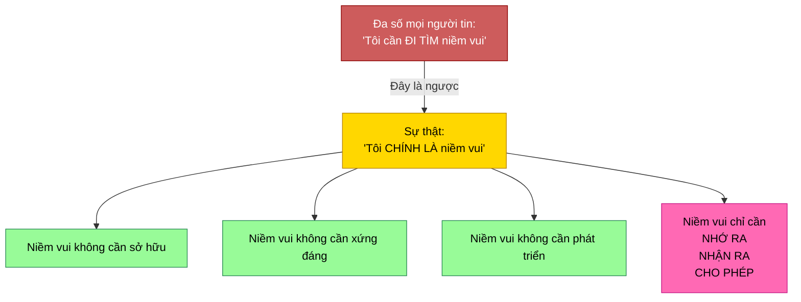

| Ta hay nghĩ | Sự thật |
|-------------|---------|
| "Tôi cần tìm niềm vui" | Ta CHÍNH LÀ niềm vui |
| "Tôi cần xứng đáng với hạnh phúc" | Nó luôn đang được ban tặng |
| "Niềm vui đến từ bên ngoài" | Niềm vui LÀ mình — là tần số của mình |
| "Có gì đó thiếu" | Không gì thiếu — chỉ là mình quên |

---

## Niềm Vui Là Tần Số Của Chính Sự Tồn Tại

> "Tình yêu vô điều kiện là tần số rung động của chính sự tồn tại. Và tình yêu là cách bạn phiên dịch tần số đó trong thực tại vật lý."

Niềm vui, tình yêu, đam mê, hứng khởi — tất cả đều là cách cơ thể phiên dịch **một rung động nền tảng duy nhất**: chính sự tồn tại. Niềm vui không phải một cảm xúc trong nhiều cảm xúc. Niềm vui CHÍNH LÀ chất liệu mà thực tại được tạo nên. Mọi thứ khác chỉ là tần số đó bị lọc.

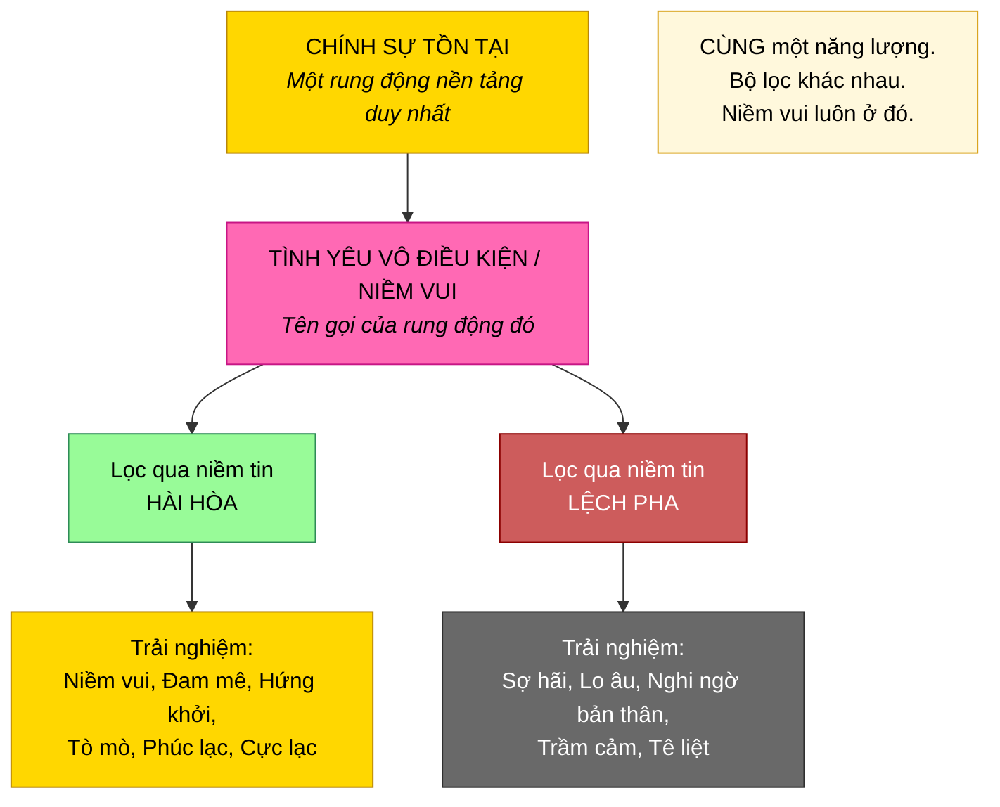

---

## Biết vs. Tự Nhủ — Khác Biệt Then Chốt

> "Đừng chỉ tự nhủ rằng nó luôn ở đó. Hãy BIẾT rằng nó luôn ở đó. Có sự khác biệt."

Sự khác biệt này là tất cả. Tự nhủ rằng niềm vui luôn ở đó — đó là bài tập trí óc. BIẾT rằng niềm vui luôn ở đó — đó là trạng thái hiện hữu. Khác nhau giữa hy vọng và thực sống.

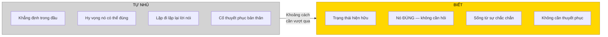

| Tự nhủ | Biết |
|--------|------|
| "Niềm vui ở đó... chắc vậy" | Niềm vui Ở ĐÓ. Chấm hết. |
| Bài tập trí óc | Trạng thái hiện hữu |
| Cần lặp lại | Không cần gì — nó đơn giản LÀ |
| Hy vọng | Thực sống |
| Khẳng định | Thực tại |

---

## Hiểu Biết Và Hành Động Là Một — Bài Tập Nhặt Đồ Vật

Minh họa mạnh mẽ nhất cho nguyên tắc này:

> "Bạn có vật nhỏ không? Đặt nó xuống sàn. Giờ nhặt lên. Bạn có suy nghĩ về nó không hay chỉ làm thôi? Có tự hỏi mình có tin mình nhặt được không? Không — bạn cứ nhặt."

> "Điều mình biết là đúng, mình cứ làm. Hiểu biết và hành vi là một."

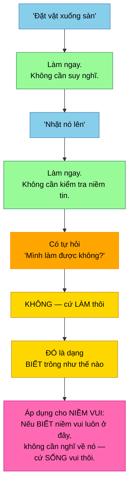

> "Nếu biết rằng phương tiện này sẽ hiệu quả, cách duy nhất để trải nghiệm nó trong thực tại vật lý, để neo nó vào thực tại vật lý, là hành xử như mình biết điều đó là thật. Biến nó thành đồng nghĩa với hành động, bởi hiểu biết và hành động chỉ là hai mặt của cùng một đồng xu."

**Bài học cho niềm vui:** Không cần nghĩ về niềm vui. Không cần tự hỏi niềm vui có thật không. Không cần kiểm tra mình có tin vào niềm vui không. Cứ sống vui — vì mình BIẾT điều đó là thật. Giống như nhặt một đồ vật vậy.

---

## Niềm Vui Luôn Được Ban Tặng — Chỉ Cần Nhận Ra

> "Xin không phải là xin điều mình chưa có. Có thể xin, nhưng hãy hiểu rằng xin đơn giản là xin để nhận thức rõ hơn về điều mình vốn đang được nhận. Khác biệt rất lớn."

> "Ta bắt đầu nhận ra rằng mình vốn đã được trao mọi thứ có thể. Không nhất thiết phải xin thêm. Chỉ cần chú ý hơn đến điều mình đang nhận."

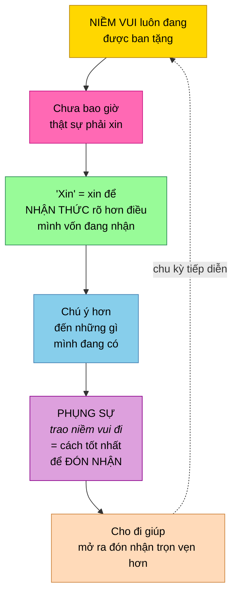

| Ta hay nghĩ | Thực tế |
|-------------|---------|
| "Cho tôi niềm vui đi" | Niềm vui vốn đang được trao — liên tục |
| "Tôi cần thêm hạnh phúc" | Cần thêm NHẬN THỨC về điều mình đã có |
| "Phúc lạc ở đâu?" | Ngay đây. Ngay giờ. Hãy chú ý. |

---

## Tần Số Riêng Của Mình CHÍNH LÀ Niềm Vui — Niềm Tin Che Mờ Nó

> "Tần số riêng của các bạn đều rất, rất, rất cao. Chỉ là nó bị che mờ bởi đủ loại niềm tin dựa trên sợ hãi khiến ánh sáng không chiếu qua mạnh mẽ như nó có thể."

Khi niềm tin thuần khiết và hài hòa, chúng kết hợp lại thành ánh sáng trắng tinh khiết — biểu hiện thành hứng khởi, đam mê, niềm vui, sáng tạo. Khi niềm tin bị nhuộm màu hay bóp méo, ánh sáng mờ đi thành sợ hãi, nghi ngờ và trải nghiệm bị dập tắt.

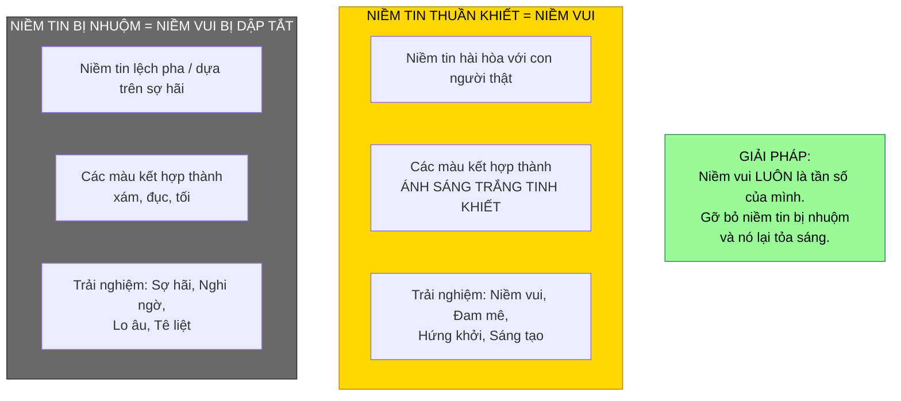

**Niềm vui không phải thứ ta thêm vào. Niềm vui là thứ còn lại khi gỡ bỏ những gì đang chặn nó.**

---

## Lo Âu Là Niềm Vui Bị Lọc Qua Sự Lệch Pha

> "Đó là cùng một năng lượng với niềm vui. Chỉ là niềm vui đang bị lọc qua điều gì đó lệch pha."

> "Khi cảm thấy sợ, hãy biết rằng mình đang rất gần với hứng khởi. Chỉ cần định nghĩa lại niềm tin mà năng lượng đang chạy qua."

Đây là một trong những bài giảng sâu sắc nhất: lo âu và niềm vui **không phải đối lập**. Chúng là **cùng một năng lượng**. Chỉ khác bộ lọc.

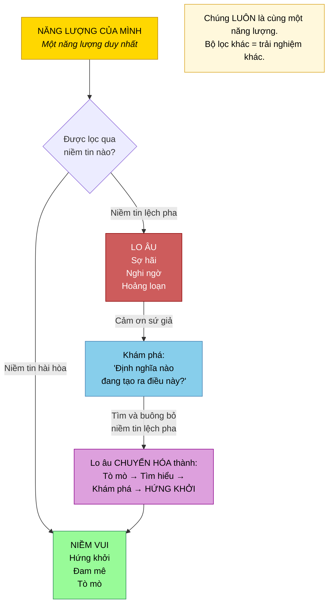

> "Ồ, cảm ơn lo âu đã chỉ ra rằng tôi đang lệch pha, mất cân bằng với con người mình muốn là. Cảm ơn đã cho tôi biết."

> "Có điều gì đó rất đúng. Hệ thống cảm xúc đang hoạt động hoàn hảo khi chỉ ra rằng mình có một định nghĩa không phục vụ mình."

| Khi cảm thấy lo âu | Thực chất đang xảy ra gì |
|--------------------|--------------------------|
| "Có gì đó sai" | Có gì đó rất ĐÚNG — hệ thống đang hoạt động |
| "Tôi cần ngừng cảm giác này" | Cần LẮNG NGHE điều nó đang nói |
| "Niềm vui đã mất" | Niềm vui vẫn ở đó — chỉ bị lọc qua niềm tin |
| "Tôi bị hỏng" | Cơ chế hướng dẫn đang hoạt động hoàn hảo |

---

## Trái Tim — Bộ Thu Và Phát Của Niềm Vui

> "Trái tim được điều chỉnh đặc biệt theo dao động của tầng tâm thức cao trong trạng thái tự nhiên."

> "Lý do cơ thể vật lý phiên dịch thông điệp từ tầng tâm thức cao thành đam mê, hứng khởi, tò mò, hấp dẫn và tình yêu vô điều kiện — là vì chính trái tim đang trực tiếp nhận giao tiếp cốt lõi từ tầng tâm thức cao, rồi làm đầy cả cơ thể bằng dao động đó."

Mọi niềm vui, mọi đam mê, mọi hứng khởi — tất cả bắt nguồn từ tín hiệu của tầng tâm thức cao, được trái tim thu nhận, rồi tâm trí vật lý phiên dịch.

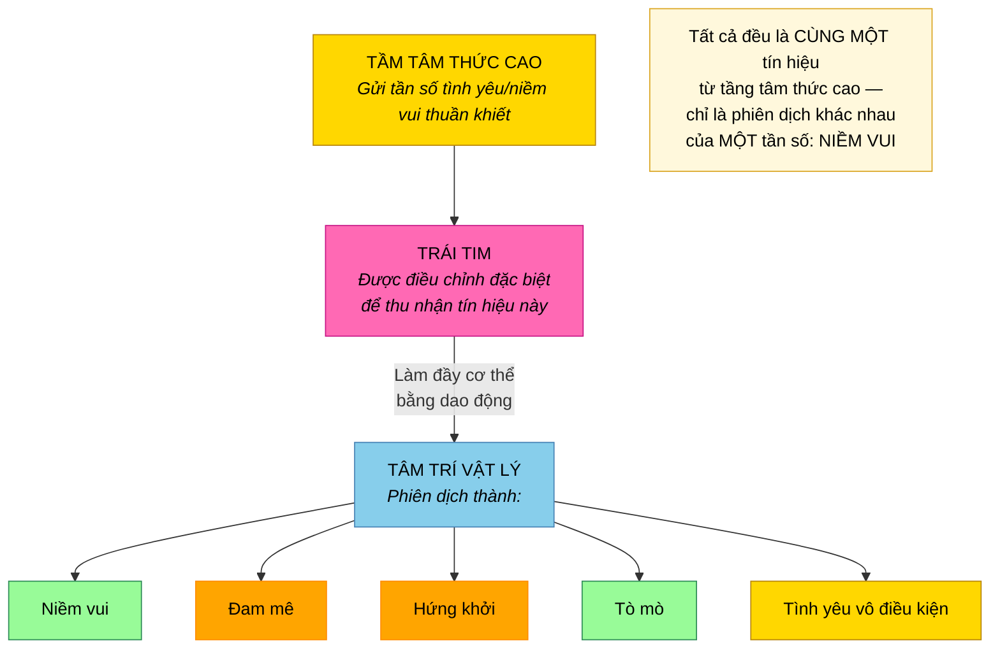

---

## Mỗi Nhịp Tim Là Lời Mời Trở Về Niềm Vui

> "Mỗi nhịp tim là cơ hội để buông bỏ và trở về trạng thái tự nhiên — như tiếng trống gõ rung động cốt lõi của tầng tâm thức cao trong trạng thái nguyên sơ."

Mỗi nhịp tim là nút reset — gõ nhịp rung động niềm vui trở lại cơ thể. Không cần khoảnh khắc đặc biệt hay khóa thiền. Mỗi nhịp đập đã đang làm điều đó rồi.

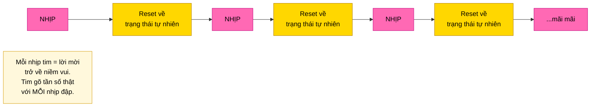

---

## Theo Đuổi Hứng Khởi Cao Nhất — Niềm Vui Từng Khoảnh Khắc

> "Mỗi khoảnh khắc, bạn có nhiều lựa chọn. Chỉ cần chọn cái hấp dẫn hơn một chút, hứng khởi hơn một chút, kéo sự tò mò hơn một chút so với những cái khác."

> "Hành động theo nó mà không khăng khăng về kết quả, không đòi hỏi nó dẫn đến đâu. Cứ làm hết sức và xem chuyện gì xảy ra. Đó là cách xây đà. Đó là cách đam mê mở rộng."

> "Sao không để hành trình cũng vui vẻ như vậy?"

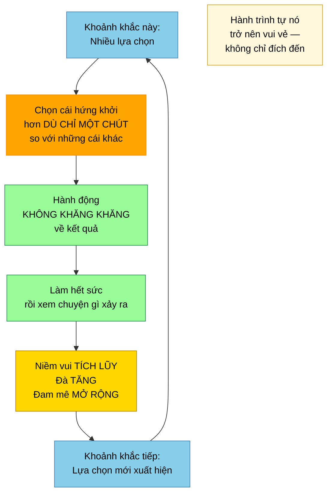

> "Nếu thực sự cho phép mình tiếp tục hành động theo đam mê, dưới mọi hình thức, theo định nghĩa nó phải hỗ trợ mình — trừ khi mình có niềm tin rằng nó không thể."

---

## Hệ Thống Tự Động — Thư Giãn Và Để Niềm Vui Vận Hành

> "Khi thực sự bắt đầu nhận ra hệ thống tự động đến mức nào, mọi người có thể thư giãn hơn nhiều, không cảm thấy phải làm quá nhiều. Chỉ cần hành động theo niềm vui và sẽ không cảm thấy mình đang làm nhiều, nhưng hiệu ứng lại sâu sắc hơn."

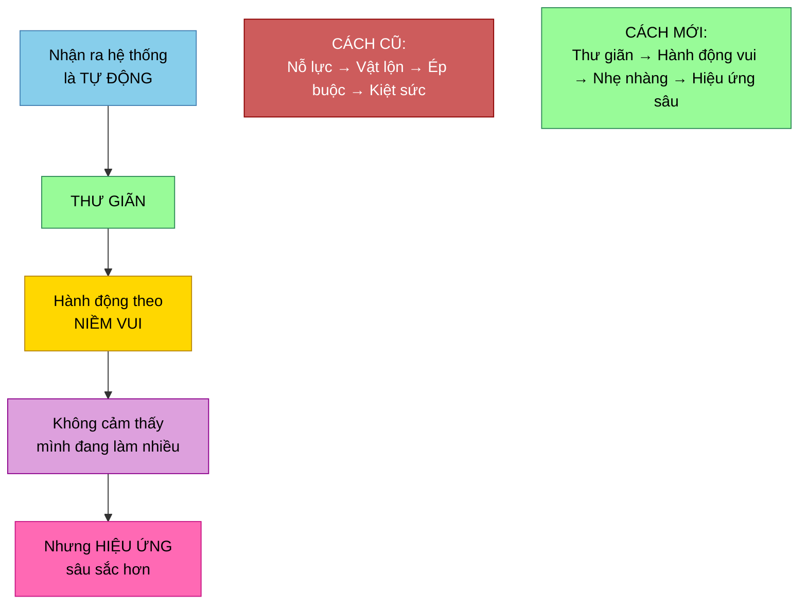

Nghịch lý: làm ít hơn nhưng vui hơn tạo ra hiệu ứng sâu sắc hơn so với làm nhiều bằng nỗ lực và vật lộn.

---

## Giá Trị Bản Thân — Nền Tảng Của Niềm Vui

> "Nếu bạn tồn tại, tạo hóa phải biết rằng bạn cần tồn tại — nếu không tạo hóa sẽ không trọn vẹn. Không có bạn, sẽ không có gì tồn tại."

> "Vì vậy, rõ ràng tạo hóa tin rằng bạn xứng đáng tồn tại — nếu không nó đã không tạo ra bạn."

> "Sự hiện hữu của bạn CHÍNH LÀ tình yêu của tạo hóa được biểu lộ."

Nếu không tin mình xứng đáng, ta không thể trọn vẹn đón nhận niềm vui luôn đang được ban tặng. Giá trị bản thân là nền tảng cho phép niềm vui chảy qua.

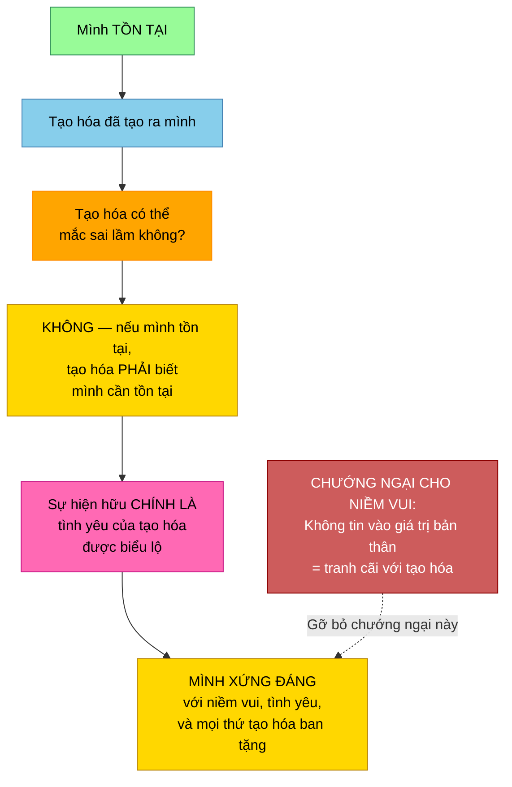

> "Khi không tin vào giá trị của chính mình, bạn đang tranh cãi với tạo hóa. Và nghịch lý là — chính khả năng tranh cãi đó chứng minh rằng bạn xứng đáng tồn tại."

---

## Chiếc Chăn Xanh Lá — Tại Sao Ta Chặn Niềm Vui

> "Bạn không thực sự sợ cảm nhận — bởi bạn sẵn sàng cảm nhận nỗi sợ. Câu hỏi là, tại sao lại không sẵn sàng cảm nhận tình yêu dành cho chính mình?"

Một người phụ nữ quấn mình trong nỗi sợ như chiếc chăn. Khi được hỏi màu gì, cô nói xanh lá — màu của luân xa tim. Cô không sợ cảm nhận. Cô sợ cảm nhận **niềm vui và tình yêu dành cho chính mình**.

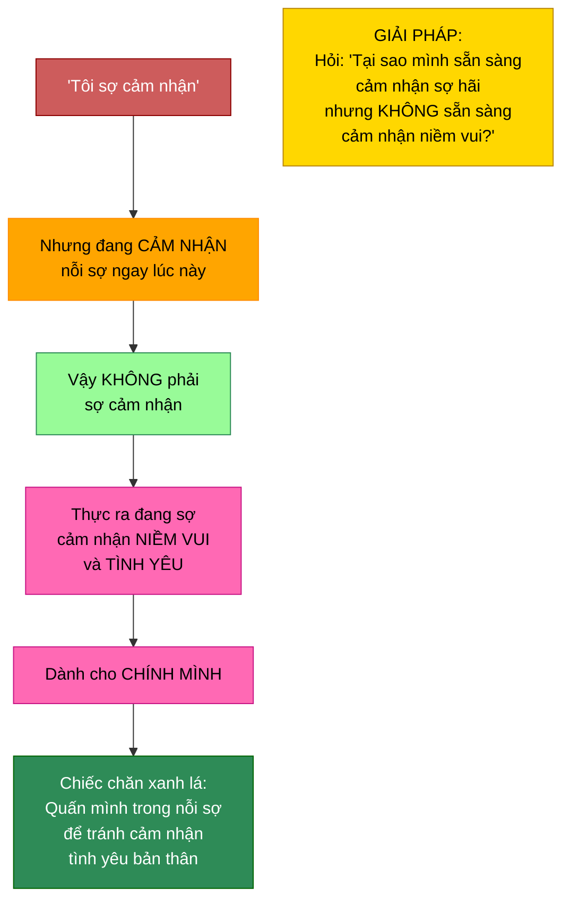

Đây là cơ chế ẩn: nhiều người không bị chặn khỏi cảm nhận — mà bị chặn khỏi cảm nhận **niềm vui cụ thể**. Sợ hãi thì quen thuộc. Niềm vui thì nguy hiểm. Nhưng niềm vui mới là trạng thái tự nhiên; sợ hãi là kẻ xâm nhập.

---

## Nước Mắt Vui Mừng — Nỗi Nhớ Quê Nhà

> "Tình yêu sâu sắc là dao động của cõi linh hồn — quê nhà của mình. Nên khi chạm vào nó, ta cảm thấy 'nhớ nhà' — theo một nghĩa nào đó."

> "Ta đang buông bỏ, rửa trôi khỏi hệ thống mọi thứ đã ngăn cản kết nối với dao động của quê nhà."

> "Đó là nước mắt giải phóng, nước mắt hòa hợp, nước mắt vui mừng. Khi đang hòa nhịp với điều mình biết là đúng cho mình. Khi khám phá ra một mảnh mới của chính mình trong thế giới — là khám phá ra kho báu bên trong."

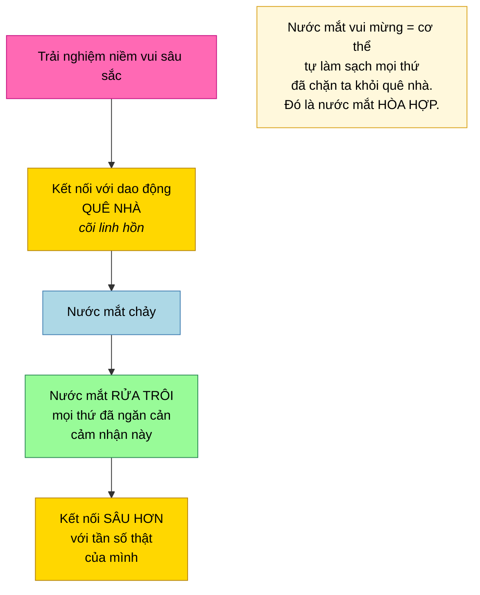

---

## Tan Hòa Vào Niềm Vui — Cổng Trái Tim Dẫn Tới Linh Hồn

> "Khi điều chỉnh vào linh hồn, tôi đi thẳng vào điểm trung tâm của trái tim. Tại đó — có một cách cho phép mình tan hòa vào tình yêu, vào hư không, vào bình an, vào tĩnh lặng. Rồi trượt qua một cánh cửa rất nhỏ, một cổng rất nhỏ bên trong trái tim đưa vào cõi linh hồn."

> "Càng thường xuyên kết nối với điểm trung tâm này trong trái tim, càng thường xuyên cho phép mình tan hòa vào tình yêu và đi qua cánh cửa này, cánh cửa ấy càng lớn dần. Nó tự mở rộng."

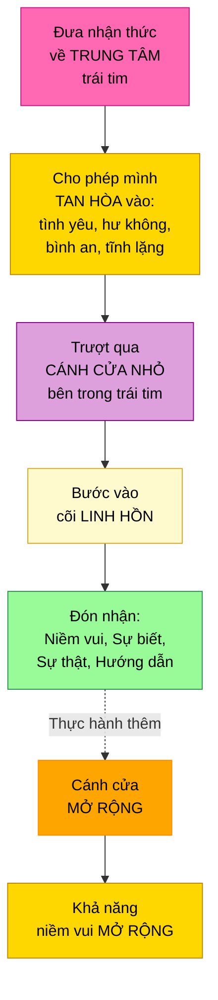

---

## Niềm Vui Là Đồng Bộ — Bước Đi Trong Giấc Mơ Kỳ Diệu

> "Càng tập trung vào ý tưởng rằng mọi thứ đều là đồng bộ, càng trải nghiệm nhiều đồng bộ hơn, càng cảm nhận được sự dàn xếp. Rồi sẽ như đang bước đi trong giấc mơ kỳ diệu, mọi thứ rơi vào đúng vị trí."

> "Nếu thực sự cho phép mình cảm nhận sự dàn xếp tuyệt đẹp, sự dàn xếp mạnh mẽ mà tất cả các bạn là — bạn sẽ bước qua ngày của mình há hốc mồm kinh ngạc."

Khi cho phép đồng bộ dẫn đường, niềm vui trở thành kết cấu thường trực của trải nghiệm — không phải khoảnh khắc đỉnh cao, mà là cảm giác liên tục sống trong giấc mơ kỳ diệu.

---

## Cực Lạc Là Trạng Thái Tự Nhiên — Tỉnh Thức Mang Đến Phúc Lạc

> "Thực tại vật lý sẽ trở nên cực lạc hơn, dễ uốn nắn hơn, linh hoạt hơn, đồng bộ hơn, kỳ diệu hơn."

> "Rồi sẽ thực sự sống trong trạng thái mơ, mơ trong trạng thái sống — và hiểu rằng thực tại vật lý chỉ là một giấc mơ."

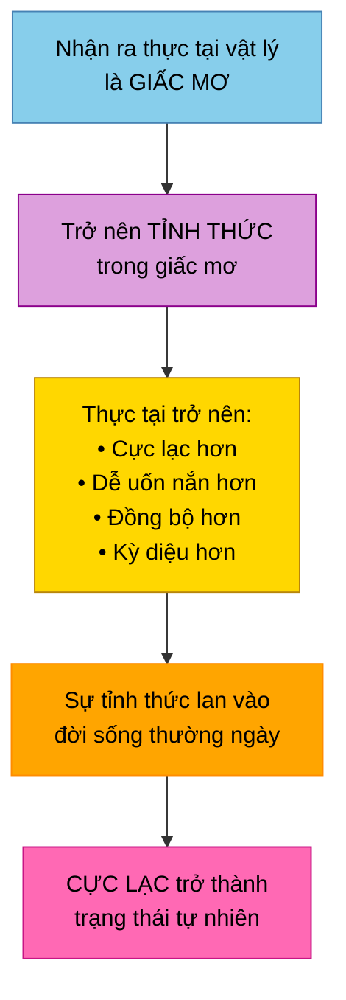

---

## Essassani — Nền Văn Minh Sống Trong Niềm Vui Tuyệt Đối

> "Đó là cách gia đình chúng tôi vận hành — trong sự tin tưởng tuyệt đối, tự phát tuyệt đối, niềm vui tuyệt đối."

> "Chúng tôi đều hài hòa hoàn hảo, đều vui tuyệt đối bởi điều duy nhất khiến chúng tôi hứng khởi là làm điều khiến mình hứng khởi. Và mọi điều khiến mình hứng khởi đều hài hòa hoàn hảo với điều khiến mọi người khác hứng khởi."

| Trái Đất (hiện tại) | Essassani (hướng ta đang đi) |
|---------------------|------------------------------|
| Niềm vui thỉnh thoảng | Niềm vui thường trực |
| Hứng khởi xung đột với người khác | Hứng khởi mọi người hài hòa hoàn hảo |
| Tin tưởng có điều kiện | **Tin tưởng tuyệt đối** |
| Tự phát là rủi ro | **Tự phát tuyệt đối** |
| Niềm vui phải kiếm | **Niềm vui tuyệt đối** — mặc định |

Đây không phải tưởng tượng — đây là hướng nhân loại đang chuyển hóa tới. Đó là lý do sự kết nối giữa các nền văn minh giờ mới khả thi.

---

## Điều Hướng Đến Thực Tại Cực Lạc Và Niềm Vui

> "Các bạn sẽ thay đổi tần số và điều hướng bản thân đến những phiên bản Trái Đất vốn đã cùng tồn tại — đại diện nhiều hơn cho trái tim tình yêu và trải nghiệm cực lạc cùng niềm vui."

Không phải tạo ra thế giới vui vẻ. Ta **điều hướng** đến phiên bản Trái Đất vốn đã tồn tại ở tần số niềm vui. Nó đã ở đó. Ta dịch chuyển sang bằng cách thay đổi tần số.

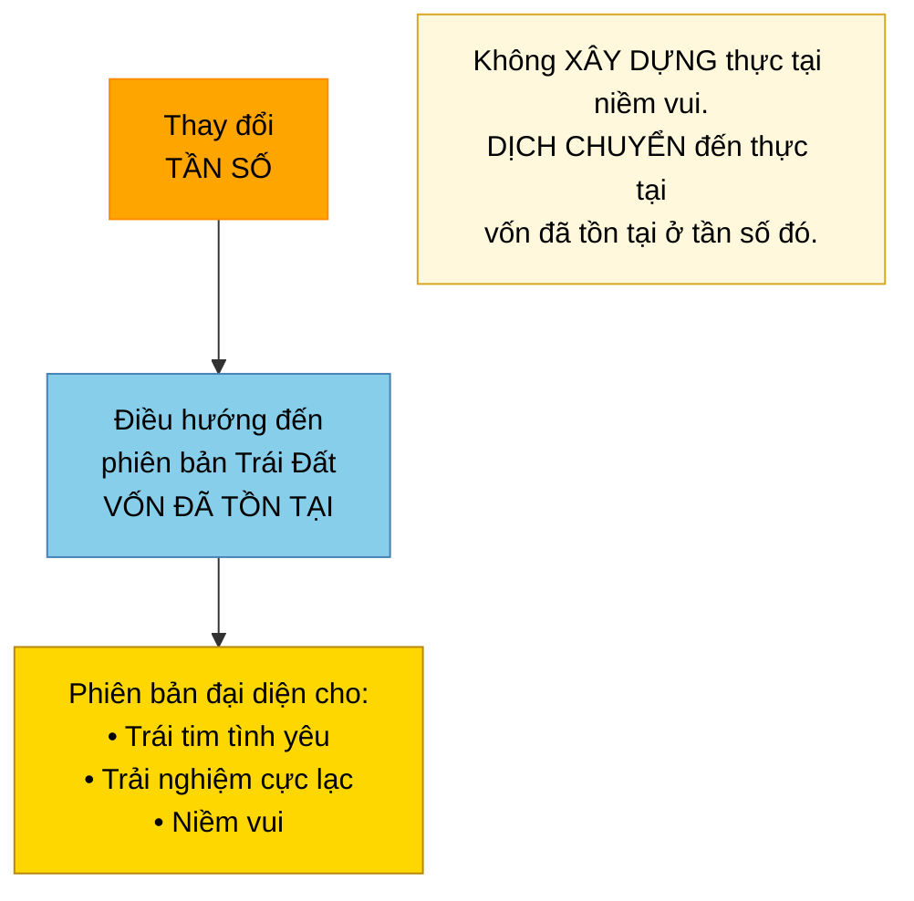

---

## Niềm Vui Biểu Hiện Ra Ngoài — Cầu Nguyện Bằng Hành Động

> "Nếu thấy ai đó vấp ngã bị thương rồi ta đến giúp họ đứng dậy, làm họ thấy khá hơn — đó là cầu nguyện. Cầu nguyện bằng hành động. Làm điều gì đó bằng năng lượng của mình, bằng lòng biết ơn, để giúp đỡ người khác."

Niềm vui cần cả hướng nội lẫn hướng ngoại. Cảm nhận vui bên trong là bước đầu. Biểu hiện qua hành động — giúp đỡ, phụng sự, chia sẻ — mới là điều neo nó vào thực tại vật lý và nhân rộng.

> "Làm tấm gương hoàn hảo của một người sống cuộc đời đầy niềm vui, sáng tạo, hành động và phụng sự người khác theo cách vui nhất có thể."

---

## Cách Tiếp Cận: Phiêu Lưu, Không Phải Sợ Hãi

> "Ồ, vui quá. Nóng lòng muốn đến. Mang lại đi."

> "Đó sẽ là cuộc phiêu lưu, không phải thử thách, không phải phán xét bản thân. Đó sẽ là khám phá và phát hiện. Và điều đó tự nó đã hứng khởi."

Ngay cả việc tự khám phá — tìm ra niềm tin đang chặn niềm vui — cũng nên tiếp cận với chính niềm vui. Không phải sợ sệt, không nặng nề, không tự phán xét. Phiêu lưu. Khám phá. Phát hiện. Hứng khởi.

---

## Ở Đây Và Bây Giờ — Không Nơi Nào Quan Trọng Hơn

> "Hãy cảm nhận sức mạnh của mình và cảm nhận rằng không cần phải vội. Bạn là một hữu thể vĩnh cửu và bất diệt. Không nơi nào quan trọng hơn để ở ngoài ngay đây và bây giờ."

> "Nguồn đến từ đây. Đến từ bây giờ. Không có nơi nào hay thời điểm nào khác."

> "Thời gian và không gian nằm trong sự tồn tại. Sự tồn tại không nằm trong thời gian và không gian. Không có khởi đầu và không có kết thúc cho sự tồn tại. Nó đơn giản ở đây. Nó đơn giản là bây giờ."

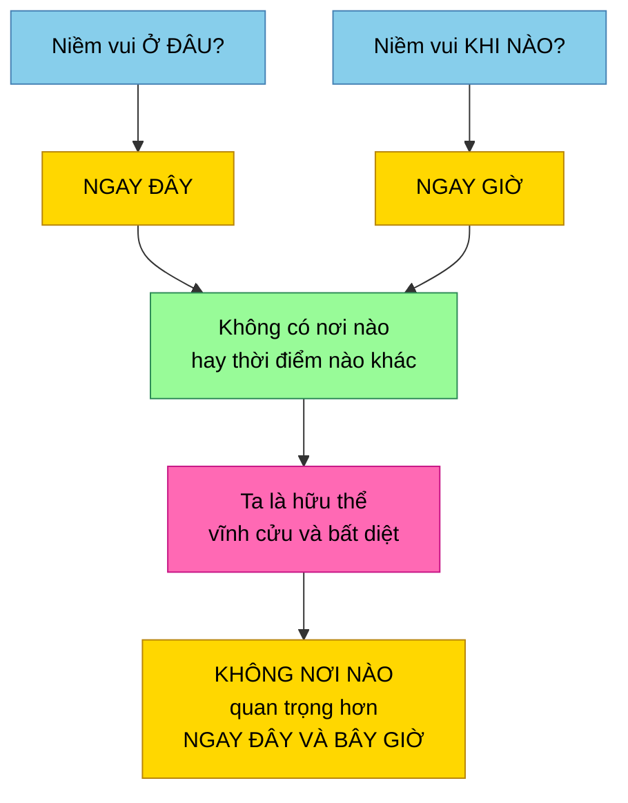

---

## Tóm Tắt Nguyên Tắc Chính

### Niềm Vui Là Bản Chất

- **Ta CHÍNH LÀ niềm vui** — không tìm, không kiếm, không phát triển; chỉ nhớ ra, nhận ra, cho phép
- **Niềm vui là tần số rung động của chính sự tồn tại** — rung động nền tảng mà từ đó toàn bộ tạo hóa sinh ra
- **Tần số riêng vốn rất cao** — niềm tin sợ hãi che mờ, nhưng nó luôn ở đó bên dưới
- **Niềm vui không phải một cảm xúc trong nhiều cảm xúc** — nó LÀ chất liệu của thực tại; mọi thứ khác là phiên bản bị lọc

### Cơ Chế: Biết Và Hành Động

- **BIẾT, đừng chỉ tự nhủ** — biết là trạng thái hiện hữu, không phải khẳng định trí óc
- **Hiểu biết và hành động là một** — điều mình thật sự biết, mình đơn giản làm mà không suy nghĩ (bài tập nhặt đồ)
- **Neo vào hành vi** — nếu biết niềm vui luôn ở đây, cứ SỐNG vui; không kiểm tra, không tự hỏi, không xin phép
- **Niềm vui luôn được ban tặng** — "xin" chỉ là xin thêm nhận thức về điều mình đã có

### Niềm Vui Và Cảm Xúc

- **Lo âu là niềm vui bị lọc qua niềm tin lệch pha** — cùng năng lượng, khác bộ lọc
- **Sợ hãi và hứng khởi là cùng năng lượng** — định nghĩa lại niềm tin thì sợ thành hứng khởi
- **Cảm ơn sứ giả** — lo âu, sợ hãi, nghi ngờ chỉ ra định nghĩa lệch pha; lắng nghe, khám phá, chuyển hóa
- **Khi sứ giả được lắng nghe**, nó chuyển thành tò mò, tìm hiểu, khám phá, hứng khởi
- **Hệ thống cảm xúc hoạt động hoàn hảo** khi cảm thấy lo âu — có gì đó rất đúng, không phải sai

### Trái Tim Và Tầng Tâm Thức Cao

- **Trái tim được điều chỉnh đặc biệt** theo dao động của tầng tâm thức cao — đó là bộ thu niềm vui
- **Mỗi nhịp tim là nút reset** — gõ tần số niềm vui thật với mỗi nhịp đập
- **Đam mê, hứng khởi, tò mò, hấp dẫn** đều là cùng tín hiệu từ tầng tâm thức cao, trái tim phiên dịch
- **Tan hòa vào tình yêu trong trái tim** mở cổng tới linh hồn — càng thực hành, cánh cửa càng rộng

### Niềm Vui Và Giá Trị Bản Thân

- **Sự hiện hữu CHÍNH LÀ tình yêu của tạo hóa được biểu lộ** — xứng đáng với niềm vui vì tạo hóa đã tạo ra ta
- **Không tin giá trị bản thân = tranh cãi với tạo hóa** — nhưng chính cuộc tranh cãi đó chứng minh sự tồn tại
- **Chiếc chăn xanh lá**: không phải sợ cảm nhận — sợ cảm nhận niềm vui và tình yêu dành cho CHÍNH MÌNH
- **Gỡ bỏ chướng ngại giá trị bản thân** thì niềm vui chảy tự nhiên

### Niềm Vui Trong Thực Hành

- **Theo hứng khởi cao nhất từng khoảnh khắc** — chọn cái hấp dẫn hơn một chút rồi hành động không khăng khăng kết quả
- **Hệ thống tự động hoạt động** — thư giãn, hành động theo niềm vui, hiệu ứng sâu sắc hơn nỗ lực
- **Biểu hiện niềm vui ra ngoài** — phụng sự, giúp đỡ, chia sẻ neo niềm vui vào thực tại vật lý
- **Tiếp cận mọi thứ như phiêu lưu** — ngay cả tự khám phá cũng nên hứng khởi, không sợ hãi
- **Điều hướng đến thực tại niềm vui** — không xây dựng; dịch chuyển đến phiên bản Trái Đất vốn tồn tại ở tần số đó
- **Đồng bộ là kết cấu của niềm vui** — khi nhìn thấy sự dàn xếp, ta bước trong giấc mơ kỳ diệu

### Đích Đến

- **Essassani sống trong niềm vui tuyệt đối** — tin tưởng tuyệt đối, tự phát tuyệt đối, niềm vui mặc định
- **Cực lạc là trạng thái tự nhiên** khi nhận ra thực tại vật lý là giấc mơ và trở nên tỉnh thức
- **Nhân loại đang chuyển hóa** hướng tới điều này — đó là lý do kết nối giờ khả thi
- **Không nơi nào quan trọng hơn** ngay đây và bây giờ — niềm vui luôn Ở ĐÂY, luôn BÂY GIỜ

---

## Lời Kết

> "Bạn là niềm vui. Bạn là tình yêu."

> "Đừng chỉ tự nhủ. Hãy BIẾT. Có sự khác biệt."

> "Điều mình biết là đúng, mình cứ làm. Hiểu biết và hành vi là một."

> "Đó là cùng một năng lượng với niềm vui. Chỉ là niềm vui đang bị lọc qua điều gì đó lệch pha."

> "Ồ, cảm ơn lo âu đã chỉ ra rằng tôi đang lệch pha. Cảm ơn đã cho tôi biết."

> "Mỗi nhịp tim là cơ hội để buông bỏ và trở về trạng thái tự nhiên."

> "Nếu thực sự cho phép mình cảm nhận sự dàn xếp tuyệt đẹp mà tất cả các bạn là — bạn sẽ bước qua ngày của mình há hốc mồm kinh ngạc."

> "Chúng tôi đều hài hòa hoàn hảo, đều vui tuyệt đối bởi điều duy nhất khiến chúng tôi hứng khởi là làm điều khiến mình hứng khởi."

> "Hãy cảm nhận sức mạnh của mình và cảm nhận rằng không cần phải vội. Bạn là hữu thể vĩnh cửu và bất diệt. Không nơi nào quan trọng hơn để ở ngoài ngay đây và bây giờ."

> "Sự hiện hữu của mình CHÍNH LÀ tình yêu của tạo hóa được biểu lộ."
