# Everything Is One — The Mechanics of Reflection & Why What You Put Out Is What You Get Back

## Overview

This is perhaps the deepest question in all of metaphysics: **How is everything actually one?** And if it is, **why does what you put out come back to you?** The answer is elegant: reality is a mirror. Not metaphorically — structurally. There is literally one particle moving at infinite speed, appearing as trillions of particles. There is one moment, one point, one energy. Everything you see is you from a different perspective. Every person in your reality is your version of them, created from your own consciousness. The mirror never smiles before you do — but it has no choice but to smile back. You never change the world; you change yourself and shift to a parallel reality that matches. What you put out returns because there is nothing "out there" — it's all reflections of the one thing that you are.

*Sources synthesized from 27+ documents across the MD, Mix, and Eluna collections.*

---

## Table of Contents

1. [The One-Particle Universe — Everything Is Literally One Thing](#the-one-particle-universe--everything-is-literally-one-thing)
2. [Everything Exists in a Single Point, a Single Moment](#everything-exists-in-a-single-point-a-single-moment)
3. [Everything You See Is You from a Different Point of View](#everything-you-see-is-you-from-a-different-point-of-view)
4. [Indra's Net — Each Pearl Reflects All Other Pearls](#indras-net--each-pearl-reflects-all-other-pearls)
5. [Reality Is a Mirror — The Reflection Never Smiles First](#reality-is-a-mirror--the-reflection-never-smiles-first)
6. [You Create Your Version of Everyone](#you-create-your-version-of-everyone)
7. [You Never Change the World — You Shift to a Matching One](#you-never-change-the-world--you-shift-to-a-matching-one)
8. [One Energy, Two Filters — Why It Comes Back as Joy or Fear](#one-energy-two-filters--why-it-comes-back-as-joy-or-fear)
9. [The Heartbeat — Love Broadcasting from the One to the One](#the-heartbeat--love-broadcasting-from-the-one-to-the-one)
10. [What You Put Out Is What You Get Back — The Complete Mechanics](#what-you-put-out-is-what-you-get-back--the-complete-mechanics)
11. [The Spectrum of Reflection — Light, Color & Belief Alignment](#the-spectrum-of-reflection--light-color--belief-alignment)
12. [Circumstances Don't Matter — Because the Mirror Only Reflects YOU](#circumstances-dont-matter--because-the-mirror-only-reflects-you)
13. [Key Principles Summary](#key-principles-summary)
14. [Closing Wisdom](#closing-wisdom)

---

## The One-Particle Universe — Everything Is Literally One Thing

> "All of the subatomic particles in you are the **same** subatomic particle. And they're the same subatomic particle in every single person in the room and in the room and on the planet and in the universe."

> "**The same one particle. Not the same one kind. The literally same one particle** makes up everything by being so infinitely fast that it can actually appear to be another particle next to itself at the same time."

This is not philosophy. This is described as the literal structure of existence:

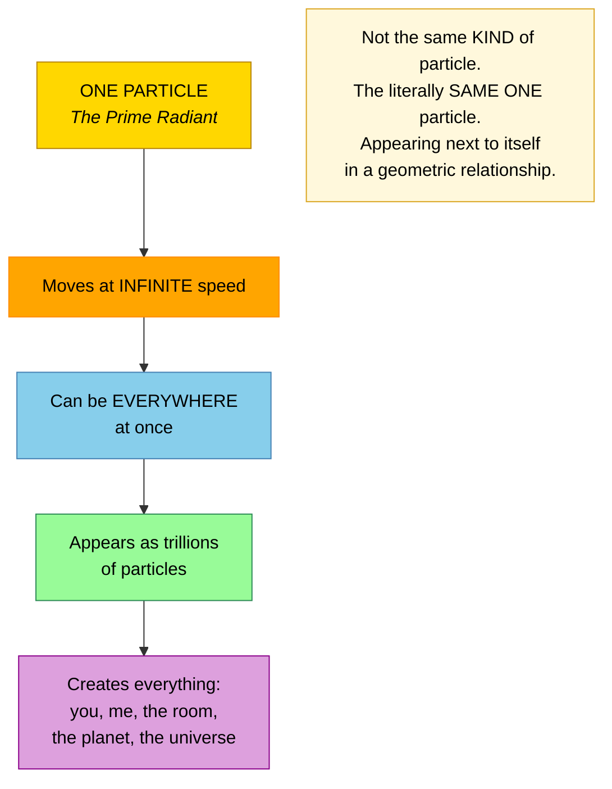

> "The trillions upon trillions upon trillions apparently of particles are actually the same particle appearing next to itself over and over again in a geometric relationship."

**Why this matters for reflection:** If everything is literally one particle, then when you "put something out," you're not sending it to something separate. You're the same particle talking to itself. Of course it comes back — there's nowhere else for it to go.

---

## Everything Exists in a Single Point, a Single Moment

> "Everything exists holographically in a single point, in a single moment."

> "All moments are the same moment just from a different point of view. All points are the same point just from a different perspective."

> "By being a different frequency of here and now, you create the illusion of many different places and many different times in which things appear to happen. But it's all happening in one single moment, in one single point."

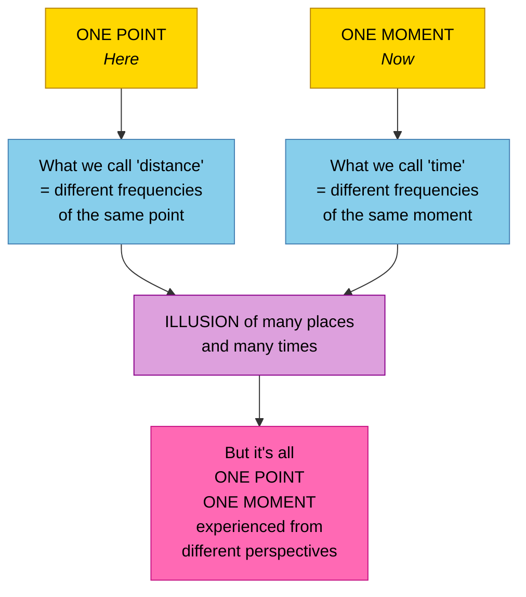

**Why this matters for reflection:** If there is only one point and one moment, there is no "somewhere else" to send anything to. What you put out doesn't travel anywhere — it reflects immediately, because there's only HERE and NOW.

---

## Everything You See Is You from a Different Point of View

> "Everything that you call a different thing is a reflection of you from a different point of view."

> "Everything you see is you in a different form. Is you in another parallel definition. Is you in another facet of the multi-dimensional crystal of creation."

> "You are all that is experiencing itself through all the ways and all the perspectives and all the points of view that it can, that it has created itself to be."

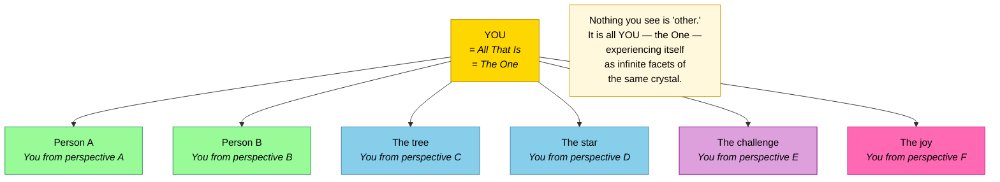

**Why this matters for reflection:** If everything you see IS you, then what you put out is literally directed at yourself. There is no "other" to receive it. You are always, only, interacting with yourself from different angles.

---

## Indra's Net — Each Pearl Reflects All Other Pearls

> "As in the old archetypal image of Indra's net — a net of pearls with each pearl round and perfect and mirror-like, reflecting all the other pearls in the net, so that every pearl contains the information of all the pearls."

> "Each and every line crossing every other forms a nodal point. And each and every one of those nodal points is another parallel incarnation of the same oversoul of which you are an extension."

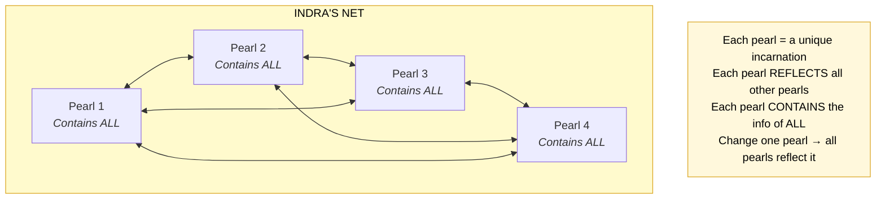

**Why this matters for reflection:** In Indra's net, every pearl reflects every other pearl. So when you change — when you shift your vibration — every other pearl in the net must reflect that change. What you put out IS what comes back because every point in the net mirrors every other point.

---

## Reality Is a Mirror — The Reflection Never Smiles First

> "If you're looking at your face in a mirror and you want the reflection to smile instead of frown, you know that the reflection will never smile before you do. Ever. But as soon as you smile, the reflection has no choice but to smile back."

This is the central metaphor — and it's not a metaphor. It's the literal mechanics of how reality works:

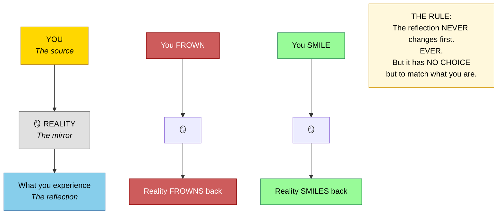

| What You Do | What The Mirror Does | Can The Mirror Go First? |
|------------|---------------------|------------------------|
| Smile | Smiles back | Never |
| Frown | Frowns back | Never |
| Radiate joy | Reflects joy | Never |
| Radiate fear | Reflects fear | Never |
| Change yourself | Reflects the change | Never changes before you |

**This is WHY what you put out is what you get back.** Reality is not separate from you generating independent responses. Reality IS a mirror — it can only reflect what you are.

---

## You Create Your Version of Everyone

> "Everyone in your reality — even though they may be distinct individuals and beings unto themselves — the only way you perceive them is by creating your version of them in your reality out of your own consciousness. So all you're seeing is your version of them."

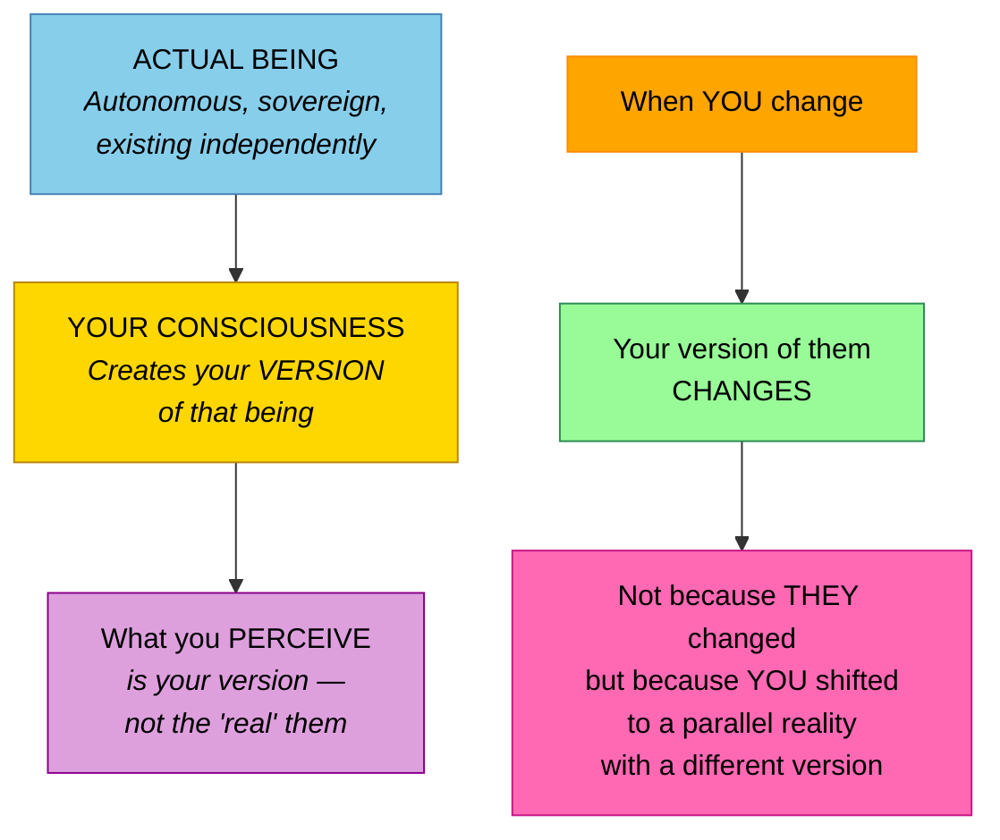

**Why this matters for reflection:** You are not interacting with "other people." You are interacting with your versions of them — projections created from your own consciousness. So what you put out determines what version of them you create, which determines what you get back. It's all you.

---

## You Never Change the World — You Shift to a Matching One

> "You never change the world you're in. You never change anyone else. You only change yourself — and you go to a world that contains versions of those people that are simply more representative of the change you have made."

> "You actually don't change the world. You just **change yourself** and shift yourself to a parallel earth that is already representative of the vibration you have changed to."

> "The old earth is still there. It's just that you're not focused on it anymore."

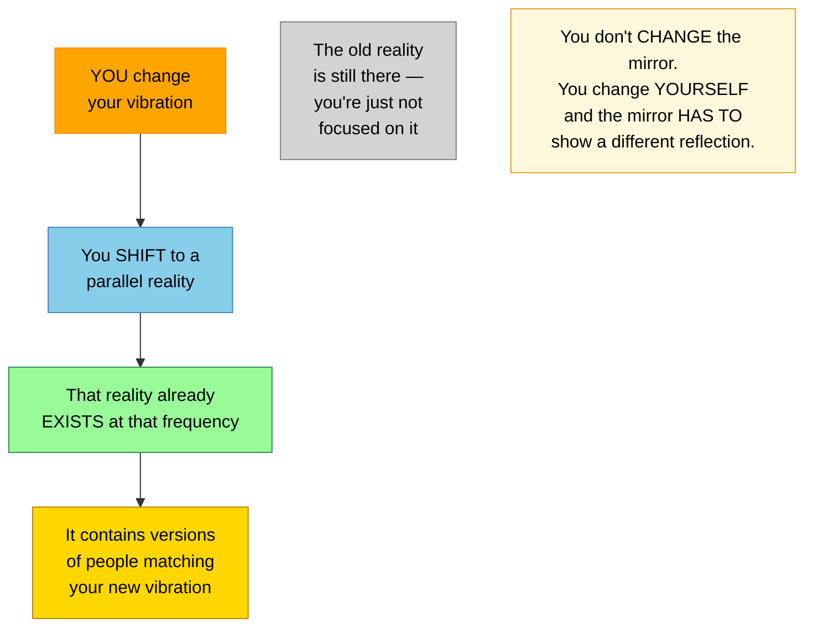

**This completes the reflection mechanics:** You put out a vibration → you shift to a reality that matches → that reality reflects back what you are. The old reality (with the old reflection) still exists — you just moved to a mirror that shows your new face.

---

## One Energy, Two Filters — Why It Comes Back as Joy or Fear

> "You are one energy and that energy is filtered through your belief system."

> "If you filter your energy through a belief that is positive and in alignment with your true self, you experience it as joy. If you filter that same energy through a belief that's out of alignment, you experience it as fear."

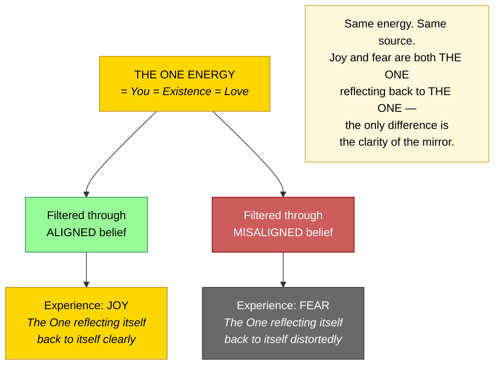

**Why this matters:** What you put out (your vibration through your beliefs) is what you get back — not because the universe is punishing or rewarding you, but because it's a mirror. Joy comes back as joy. Fear comes back as fear. Same energy, same source, different filter = different reflection.

---

## The Heartbeat — Love Broadcasting from the One to the One

> "With every heartbeat, you send out an electromagnetic bubble that expands from your body, and you immerse each other in these electromagnetic connective bubbles, so that one heart literally talks to all the others."

> "You're constantly being given an opportunity to let go and zero back to your natural state with literally every beat of your heart."

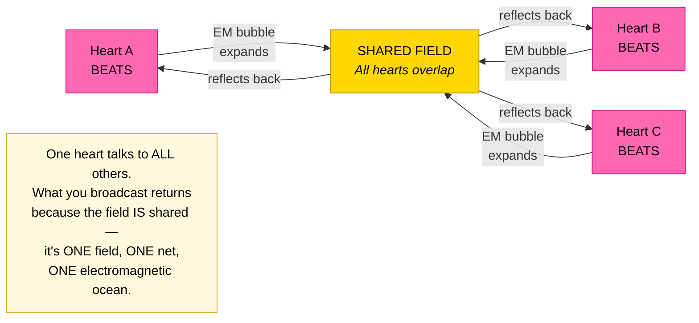

**Why this matters:** Every heartbeat literally broadcasts your frequency into a shared electromagnetic field. What you put out reaches every other heart — and since those hearts are reflections of the same one (the same particle, the same moment), it comes right back.

---

## What You Put Out Is What You Get Back — The Complete Mechanics

Now we can see the full chain of WHY:

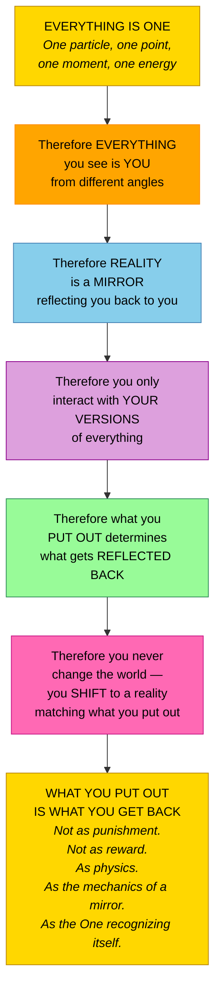

> "What you say goes and what you put out is what you get back. And that's all there is to it."

| Why What You Put Out Returns | The Mechanics |
|------------------------------|--------------|
| There is only ONE particle | You're sending it to yourself |
| There is only ONE moment, ONE point | There's nowhere else for it to go |
| Everything you see IS you | You're looking at your own reflection |
| Reality IS a mirror | It can only reflect what you are |
| You create your version of everyone | You interact with your own projections |
| You shift to matching realities | You always land in a reality that reflects you |
| The heartbeat broadcasts to a shared field | What you transmit, the field returns |
| There is ONE energy | Joy and fear are the same energy with different filters |

---

## The Spectrum of Reflection — Light, Color & Belief Alignment

> "Imagine that you have this white light that represents the ideal self, the higher mind — unbroken, unfiltered, pure, beautiful, a homogeneous white light."

The Spectrum of Reflection permission slip makes oneness visible:

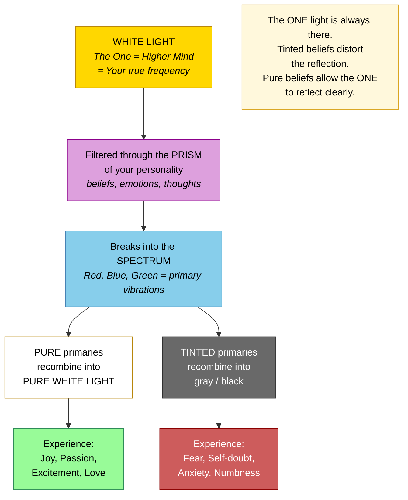

---

## Circumstances Don't Matter — Because the Mirror Only Reflects YOU

> "Circumstances do not generate matter. State of being generates matter."

If reality is a mirror, then the circumstances (the reflection) can never determine your state. Only YOU determine the reflection:

| What Most People Believe | What's Actually Happening |
|-------------------------|--------------------------|
| Circumstances cause my state | MY state creates my circumstances |
| The reflection makes me feel this way | I create the reflection by what I feel |
| I need the outside to change first | The mirror NEVER changes first |
| If the world were better, I'd be happier | If I were happier, my world would be better |
| The world is separate from me | The world IS me, reflected |

> "It is utterly under your control. What you put out is what you get back. And that's all there is to it."

---

## Key Principles Summary

### How Everything Is One
- **One particle** — the Prime Radiant — moving at infinite speed, appearing as everything
- **One point** (here) and **one moment** (now) — distance and time are illusions of different frequencies
- **One energy** — filtered through beliefs into joy or fear
- **One oversoul** — all incarnations are nodal points in the same infinite pattern (Indra's net)

### Why Reality Is a Reflection
- **Everything you see IS you** from a different point of view — another facet of the multi-dimensional crystal
- **Reality is a mirror** — it can only reflect what you are; it never generates independent content
- **You create your version** of every person and every event from your own consciousness
- **The reflection never changes first** — ever; but it has no choice but to match you

### Why What You Put Out Returns
- There is **only one particle** — you're sending it to yourself
- There is **only one point** — there's nowhere else for it to go
- **Reality is a mirror** — it can only reflect what you are
- You **shift to matching realities** — you always land in a reality that reflects your vibration
- The **heartbeat broadcasts** into a shared electromagnetic field — what you transmit, the field returns
- It's not punishment or reward — it's **physics**, the mechanics of a mirror, the One recognizing itself

### The Practical Implication
- **Circumstances don't matter** — the mirror only reflects YOU
- **Change yourself first** — the reflection has no choice but to follow
- You never change the world — you **shift to a parallel reality** that matches your new vibration
- **The old world still exists** — you're just not focused on it anymore
- **Joy and fear are the same energy** — different filters on the same one light
- **Pure beliefs** = clear mirror = pure white light = joy; **tinted beliefs** = distorted mirror = gray/black = fear

---

## Closing Wisdom

> "Everything that you call a different thing is a reflection of you from a different point of view."

> "The same one particle. Not the same one kind. The literally same one particle makes up everything."

> "Everything exists holographically in a single point, in a single moment."

> "If you're looking at your face in a mirror and you want the reflection to smile instead of frown, you know that the reflection will never smile before you do. Ever. But as soon as you smile, the reflection has no choice but to smile back."

> "You never change the world you're in. You never change anyone else. You only change yourself — and you go to a world that contains versions of those people that are simply more representative of the change you have made."

> "As in the old archetypal image of Indra's net — a net of pearls with each pearl reflecting all the other pearls, so that every pearl contains the information of all the pearls."

> "What you say goes and what you put out is what you get back. And that's all there is to it."

> "It is utterly under your control."
