# Cơ Chế Phản Ứng — Sơ Đồ Mermaid

Tài liệu này trình bày toàn bộ cơ chế phản ứng, nhận dạng sai, kháng cự và con đường giải phóng dưới dạng sơ đồ trực quan.

---

## 1. Chuỗi Phản Ứng — Từ Sự Kiện Trung Tính Đến Mắc Kẹt

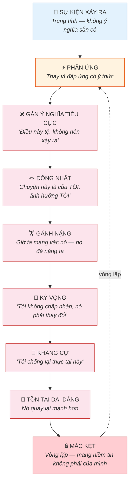

> Mọi mắt xích đều là một lựa chọn — dù vô thức. Và mọi mắt xích đều có thể bị phá vỡ.

---

## 2. Nhận Dạng Đúng vs. Nhận Dạng Sai

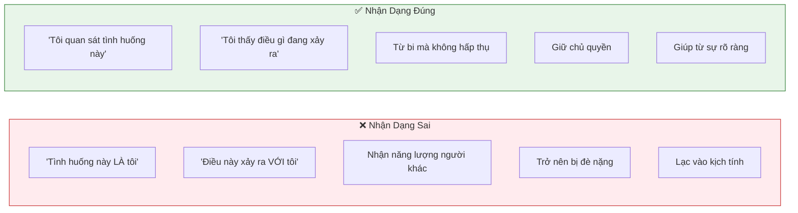

---

## 3. Mọi Thứ Đều Trung Tính — Ý Nghĩa Do Mình Gán

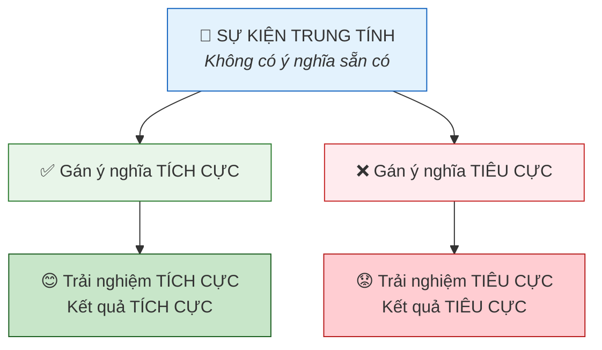

> Tình huống vẫn giống nhau. Chỉ ý nghĩa ta gán cho nó mới quyết định trải nghiệm.

---

## 4. Ba Cách Tiếp Cận — Phủ Nhận, Đắm Chìm, và Đúng Cách

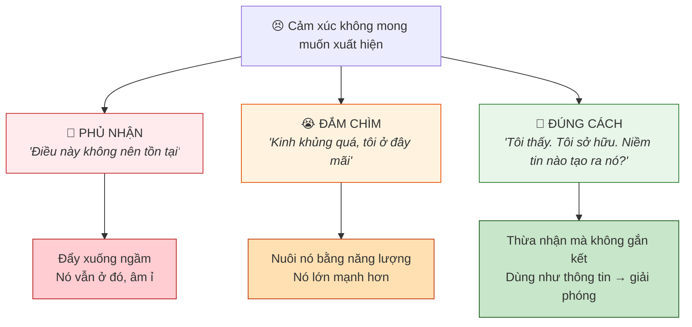

---

## 5. Kháng Cự vs. Cho Phép

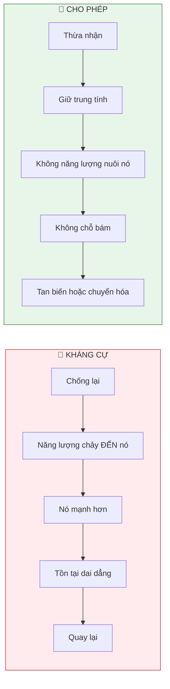

---

## 6. Một Năng Lượng, Hai Bộ Lọc

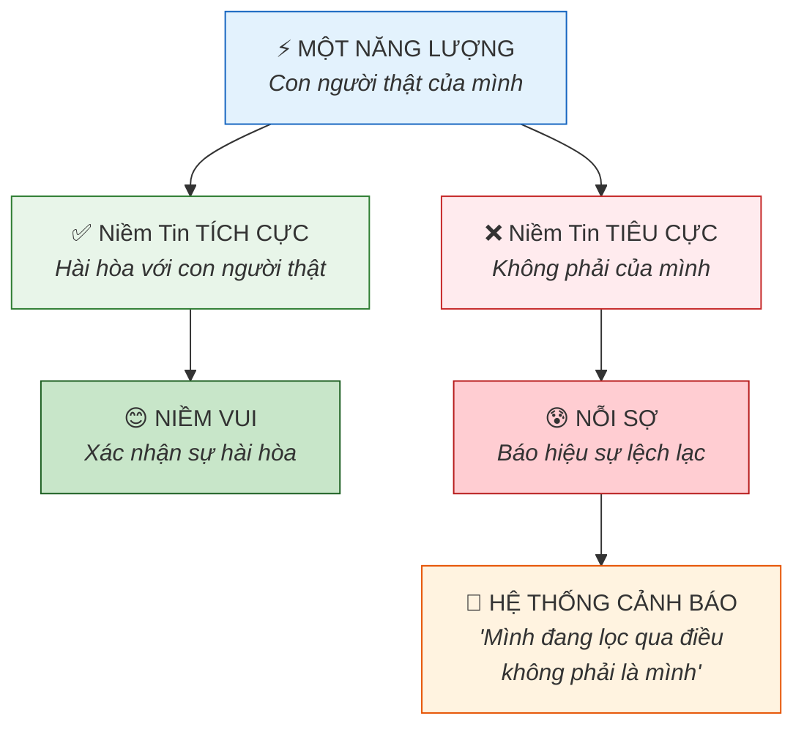

> Nỗi sợ không phải kẻ thù — nó là hệ thống cảnh báo nhắc nhở ta đang mang niềm tin không phải của mình.

---

## 7. Ba Kẻ Giết Chóc — Phá Vỡ Công Thức Hứng Khởi

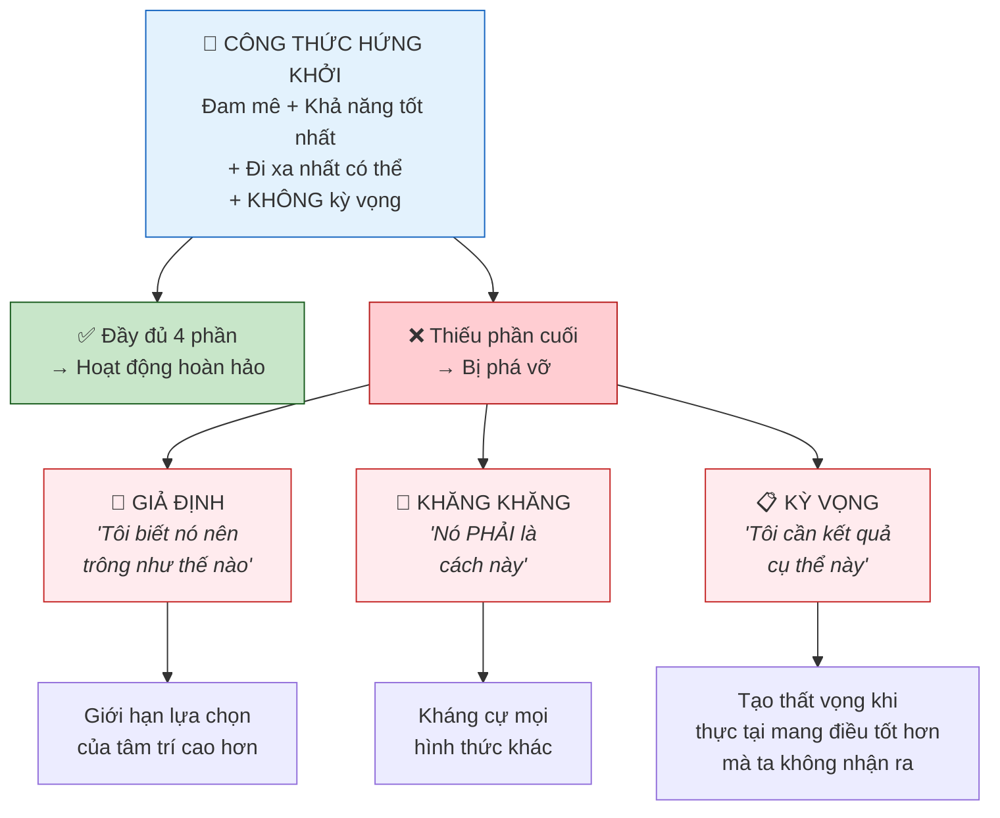

---

## 8. Phép Thử Trọng Lượng — Niềm Tin Của Mình Hay Của Người Khác?

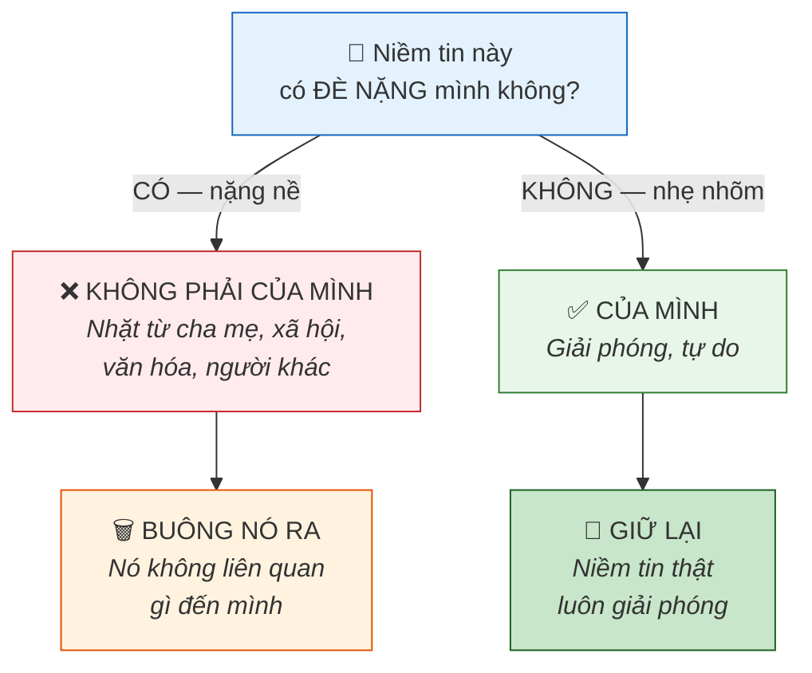

> Niềm tin thật của mình không bao giờ đè nặng — chúng giải phóng. Chỉ hành lý của người khác mới đè nặng ta.

---

## 9. Phương Thuốc — 7 Bước Giải Phóng

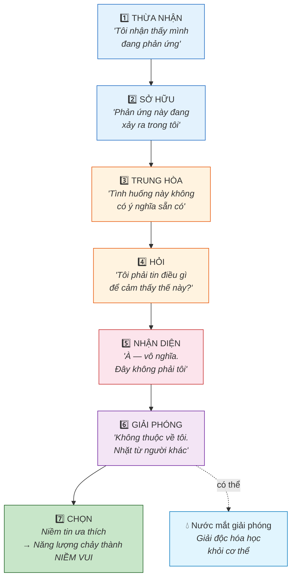

---

## 10. Đáp Ứng vs. Phản Ứng — Phép Thử Gương

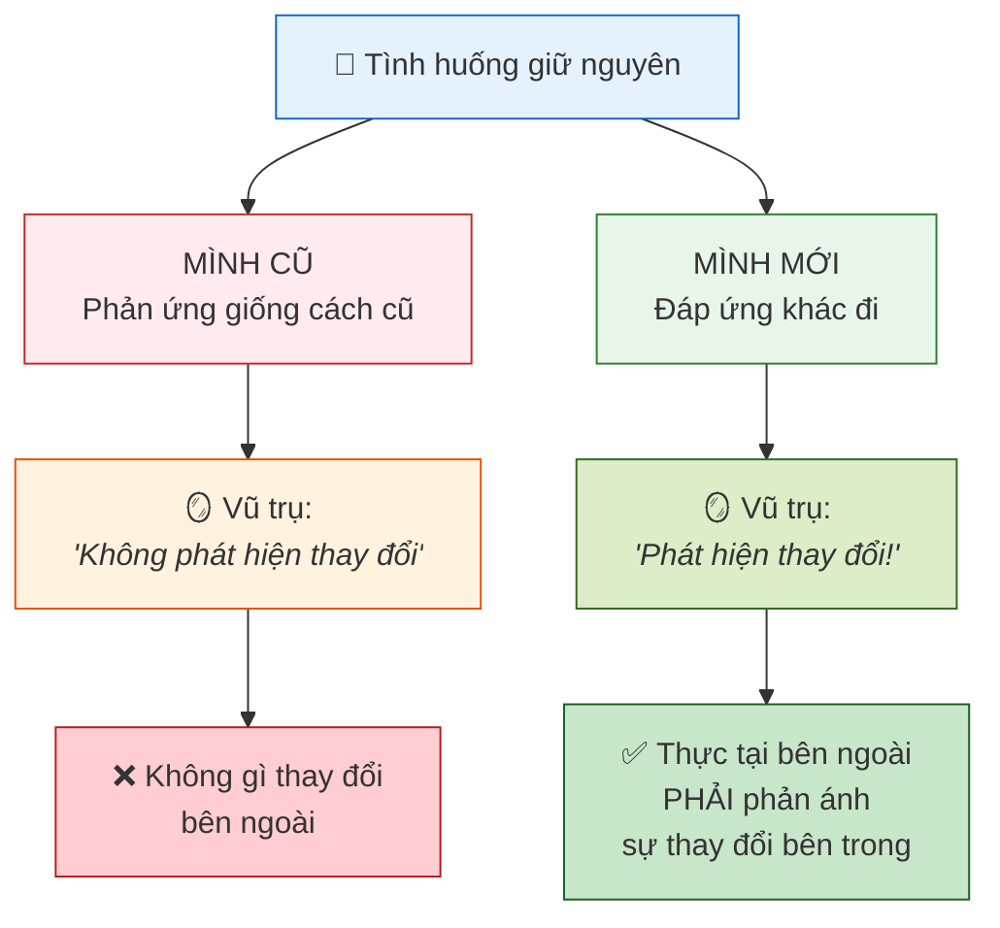

---

## 11. Con Đường Ít Kháng Cự Nhất — Dòng Sông Tạo Hóa

```mermaid
flowchart TD
    subgraph UPSTREAM["🔴 BƠI NGƯỢC DÒNG — Phản Ứng"]
        U1["Phản ứng"] --> U2["Đồng nhất"]
        U2 --> U3["Mang gánh nặng"]
        U3 --> U4["Kỳ vọng"]
        U4 --> U5["Khăng khăng"]
        U5 --> U6["Chống lại"]
        U6 --> U7["😫 Vật lộn, đau đớn, kiệt sức"]
    end

    subgraph DOWNSTREAM["🟢 THUẬN THEO DÒNG — Đáp Ứng"]
        D1["Quan sát"] --> D2["Trung hòa"]
        D2 --> D3["Giải phóng"]
        D3 --> D4["Tin tưởng"]
        D4 --> D5["Theo hứng khởi"]
        D5 --> D6["😊 Nhẹ nhàng, vui vẻ, đồng bộ"]
    end

    style UPSTREAM fill:#ffebee,stroke:#c62828
    style DOWNSTREAM fill:#e8f5e9,stroke:#2e7d32
```

---

## 12. Phản Ứng Chặn Dòng Chảy Như Thế Nào

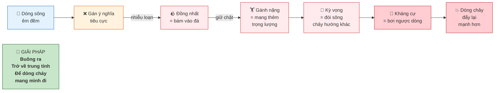

---

## 13. Hoàn Cảnh vs. Trạng Thái Hiện Hữu

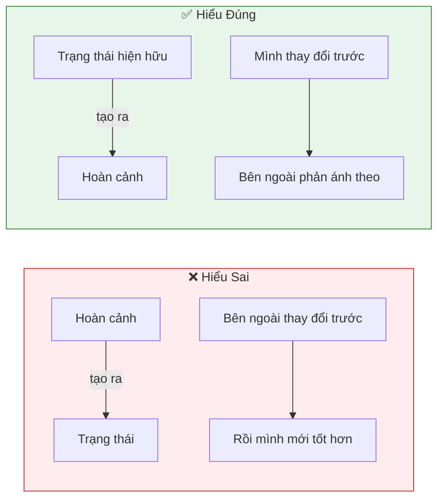

> Hoàn cảnh không tạo ra vật chất. Trạng thái hiện hữu tạo ra vật chất — theo nghĩa đen.

---

## 14. Nước Mắt Giải Phóng — Cơ Chế Giải Độc

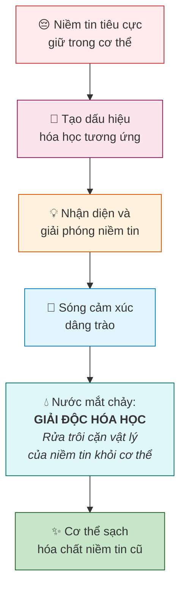

---

## 15. Toàn Cảnh — Từ Phản Ứng Đến Giải Phóng

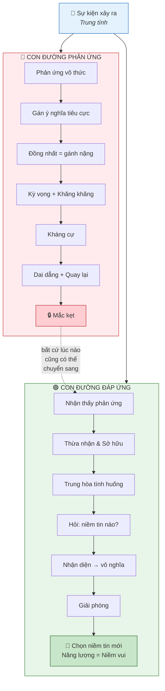

> Bất cứ lúc nào trong vòng lặp phản ứng, ta cũng có thể dừng lại và chuyển sang con đường đáp ứng. Chỉ cần **nhận thấy**.

---

## Tóm Tắt Trực Quan

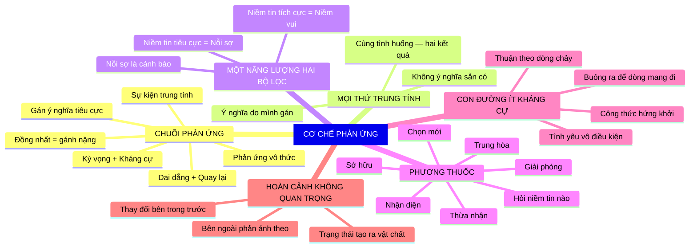
