# Cơ Chế Phản Ứng — Nhận Dạng Sai, Kháng Cự & Tại Sao Điều Ta Chống Lại Sẽ Quay Lại

## Tổng Quan

Tài liệu này tổng hợp các bài giảng về một chuỗi liên kết duy nhất: **khi ta phản ứng với điều gì đó, ta đồng nhất với nó, biến nó thành gánh nặng của mình**. Đây là nhận dạng sai — gắn bản thân vào điều không phải là mình. Thực chất, phản ứng tiêu cực đồng thời là hạ thấp/phủ nhận tình huống (gán ý nghĩa tiêu cực), đặt kỳ vọng ("Tôi không chấp nhận điều này"), và tạo ra kháng cự — khiến chính thứ ta chống lại sẽ dai dẳng và quay lại. Phương thuốc không phải là đè nén mà là một trình tự chính xác: thừa nhận, sở hữu, trung hòa, nhận diện niềm tin sai, giải phóng, và đáp ứng từ trạng thái hiện hữu thật sự. Hoàn cảnh không bao giờ quan trọng — chỉ trạng thái hiện hữu mới tạo ra thực tại.

*Nguồn tổng hợp từ hơn 20 tài liệu trong các bộ sưu tập MD, Mix và Eluna.*

---

## Mục Lục

1. [Chuỗi Phản Ứng: Phản Ứng Trở Thành Gánh Nặng Như Thế Nào](#chuỗi-phản-ứng-phản-ứng-trở-thành-gánh-nặng-như-thế-nào)
2. [Nhận Dạng Sai — Gắn Kết Với Điều Không Phải Là Chúng Ta](#nhận-dạng-sai--gắn-kết-với-điều-không-phải-là-chúng-ta)
3. [Mọi Thứ Đều Trung Tính — Không Có Ý Nghĩa Sẵn Có](#mọi-thứ-đều-trung-tính--không-có-ý-nghĩa-sẵn-có)
4. [Hạ Thấp và Phủ Nhận — Bẫy Ý Nghĩa Tiêu Cực](#hạ-thấp-và-phủ-nhận--bẫy-ý-nghĩa-tiêu-cực)
5. [Kháng Cự Khiến Mọi Thứ Tồn Tại — Tại Sao Nó Quay Lại](#kháng-cự-khiến-mọi-thứ-tồn-tại--tại-sao-nó-quay-lại)
6. [Kỳ Vọng, Khăng Khăng & Giả Định — Những Thứ Phá Vỡ Công Thức](#kỳ-vọng-khăng-khăng--giả-định--những-thứ-phá-vỡ-công-thức)
7. [Tranh Cãi Với Tạo Hóa — Chúng Ta Không Bao Giờ Thắng Được](#tranh-cãi-với-tạo-hóa--chúng-ta-không-bao-giờ-thắng-được)
8. [Đừng Là Kẻ Trộm Niềm Tin — Mang Hành Lý Của Người Khác](#đừng-là-kẻ-trộm-niềm-tin--mang-hành-lý-của-người-khác)
9. [Một Năng Lượng, Hai Bộ Lọc — Niềm Vui và Nỗi Sợ Từ Cùng Nguồn](#một-năng-lượng-hai-bộ-lọc--niềm-vui-và-nỗi-sợ-từ-cùng-nguồn)
10. [Phương Thuốc: Thừa Nhận, Sở Hữu, Trung Hòa, Giải Phóng](#phương-thuốc-thừa-nhận-sở-hữu-trung-hòa-giải-phóng)
11. [Đáp Ứng, Đừng Phản Ứng — Thước Đo Của Sự Thay Đổi Thật Sự](#đáp-ứng-đừng-phản-ứng--thước-đo-của-sự-thay-đổi-thật-sự)
12. [Con Đường Ít Kháng Cự Nhất — Đối Lập Của Phản Ứng](#con-đường-ít-kháng-cự-nhất--đối-lập-của-phản-ứng)
13. [Hoàn Cảnh Không Quan Trọng — Trạng Thái Hiện Hữu Tạo Ra Vật Chất](#hoàn-cảnh-không-quan-trọng--trạng-thái-hiện-hữu-tạo-ra-vật-chất)
14. [Nước Mắt và Giải Phóng — Cơ Chế Giải Độc Của Cơ Thể](#nước-mắt-và-giải-phóng--cơ-chế-giải-độc-của-cơ-thể)
15. [Khung Thực Hành Hoàn Chỉnh](#khung-thực-hành-hoàn-chỉnh)
16. [Tóm Tắt Nguyên Tắc Chính](#tóm-tắt-nguyên-tắc-chính)
17. [Trí Tuệ Kết Thúc](#trí-tuệ-kết-thúc)

---

## Chuỗi Phản Ứng: Phản Ứng Trở Thành Gánh Nặng Như Thế Nào

Khi điều gì đó xảy ra và ta **phản ứng** với nó, một chuỗi cơ chế chính xác sẽ diễn ra:

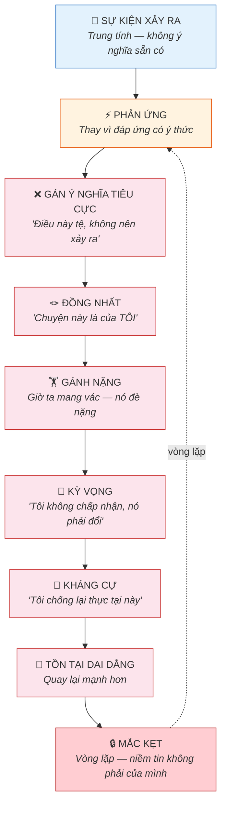

Mọi mắt xích trong chuỗi này đều là một lựa chọn — dù được thực hiện vô thức. Và mọi mắt xích đều có thể bị phá vỡ.

---

## Nhận Dạng Sai — Gắn Kết Với Điều Không Phải Là Chúng Ta

### Vấn Đề Cốt Lõi

Khi ta phản ứng, ta **đồng nhất** với tình huống — nhận nó là của mình, biến nó thành chuyện của mình. Đây là nhận dạng sai — gắn ý thức bản thân vào điều không liên quan gì đến con người thật.

> "Bạn có thể đồng nhất đủ để hiểu những gì ai đó đang trải qua để có thể có lòng từ bi giúp đỡ họ nếu phù hợp, nhưng bạn không cần phải nhận nó vào bản thân mình ở mức sâu nào cả."

### Đồng Nhất Tạo Ra Điều Gì

| Đồng Nhất Đúng | Đồng Nhất Sai |
|----------------|---------------|
| "Tôi quan sát tình huống này" | "Tình huống này LÀ tôi" |
| "Tôi thấy điều gì đang xảy ra" | "Điều này đang xảy ra VỚI tôi" |
| Từ bi mà không hấp thụ | Nhận năng lượng của người khác |
| Giữ chủ quyền | Trở nên bị đè nặng |
| Có thể giúp từ sự rõ ràng | Lạc vào trong kịch tính |

### Niềm Tin Kích Hoạt Nó

Mọi đồng nhất đều truy nguyên về một **niềm tin**:

> "Mọi thứ đều phát sinh từ niềm tin của bạn trước. Bạn không thể có bất kỳ cảm xúc nào — bạn không thể cảm thấy bất kỳ cách nào về bất cứ điều gì — trừ khi bạn tin điều gì đó là đúng về điều đó trước."

Khi ta phản ứng, ta đang tiết lộ một niềm tin. Phản ứng CHÍNH LÀ tín hiệu cho thấy mình đã đồng nhất sai với điều gì đó dựa trên niềm tin sai.

---

## Mọi Thứ Đều Trung Tính — Không Có Ý Nghĩa Sẵn Có

### Sự Thật Căn Bản

> "Không gì có ý nghĩa sẵn có. Mọi thứ đều trung tính. Lý do duy nhất bạn trải nghiệm tiêu cực là vì bạn gán cho tình huống ý nghĩa tiêu cực."

> "Không có thứ gọi là tình huống khó khăn bẩm sinh. Mọi tình huống đều trung tính. Chúng không chứa sự khó khăn tự động."

### Ý Nghĩa Hoạt Động Như Thế Nào

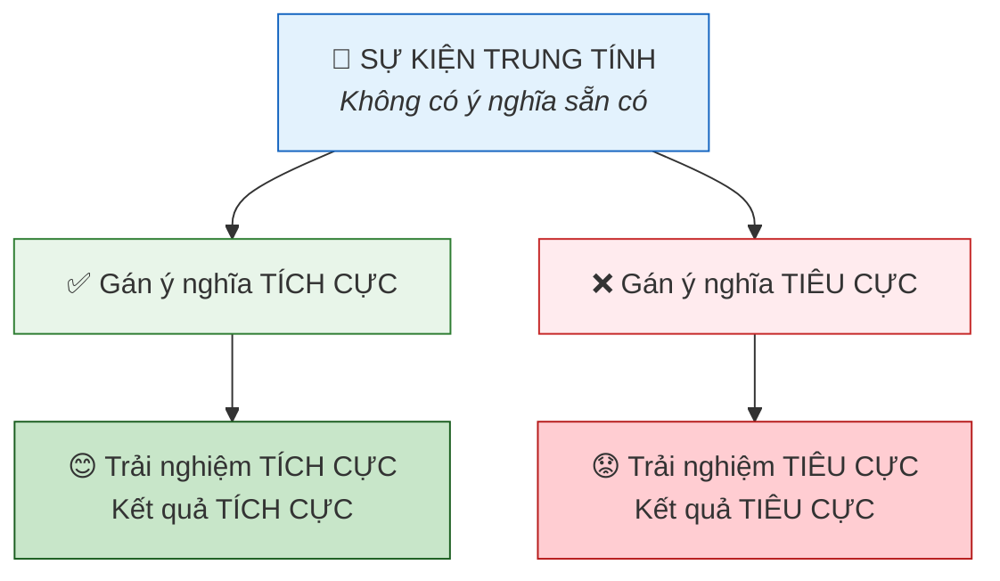

> "Nếu bạn gán cho cùng một tình huống ý nghĩa tích cực, bạn chỉ có thể trải nghiệm kết quả theo cách tích cực."

### Nguyên Tắc Hai Mặt

> "Mọi tình huống đều có khả năng phục vụ hai mục đích — tích cực hoặc tiêu cực. Tình huống và hoàn cảnh không cần phải thay đổi dù chỉ một chút để bạn nhận được hiệu ứng tích cực hoặc tiêu cực từ tình huống đó."

Tình huống vẫn giống nhau. Chỉ ý nghĩa ta gán cho nó mới quyết định trải nghiệm.

---

## Hạ Thấp và Phủ Nhận — Bẫy Ý Nghĩa Tiêu Cực

### Điều Gì Xảy Ra Khi Chúng Ta Hạ Thấp Thực Tại

Khi ta phản ứng bằng cách nói "Tôi không chấp nhận điều này," ta đang:
1. **Gán ý nghĩa tiêu cực** cho một sự kiện trung tính
2. **Hạ thấp** giá trị hoặc mục đích của trải nghiệm
3. **Phủ nhận** điều tạo hóa đã mang đến

Điều này tạo ra nghịch lý: ta đang từ chối điều được chính tâm trí cao hơn gửi đến để mình phát triển.

> "Mọi thứ đến với bạn, ngay cả khi đó là điều trong khoảnh khắc mà bạn nhận ra một cách trung tính và khách quan rằng bạn không thích, đều phải ở đó vì một lý do."

### Đừng Phủ Nhận — Nhưng Cũng Đừng Đắm Chìm

> "Đừng phủ nhận những cảm xúc không mong muốn. Thừa nhận chúng, chấp nhận chúng, sở hữu chúng — vì bạn không thể thay đổi điều bạn không sở hữu."

> "Bạn có thể sử dụng ý tưởng gọi là sự khó chịu như một hệ thống nhận dạng tức thì. Nhưng đừng để nó kéo dài. Đừng đắm chìm trong nó. Hãy sử dụng nó."

| Phủ Nhận | Đắm Chìm | Cách Tiếp Cận Đúng |
|----------|-----------|---------------------|
| "Điều này không nên tồn tại" | "Điều này kinh khủng và tôi sẽ ở đây" | "Tôi thấy điều này. Tôi sở hữu nó. Niềm tin nào tạo ra nó?" |
| Phủ nhận trải nghiệm | Đồng nhất với trải nghiệm | Thừa nhận mà không gắn kết |
| Đẩy nó xuống ngầm | Nuôi nó bằng năng lượng | Sử dụng nó như thông tin, rồi giải phóng |

---

## Kháng Cự Khiến Mọi Thứ Tồn Tại — Tại Sao Nó Quay Lại

### Cơ Chế Của Kháng Cự

> "Mọi đau khổ, mọi vật lộn, mọi nỗi đau trong trải nghiệm thực tại của bạn đều đến từ sự kháng cự con người tự nhiên của bạn. Hãy ngừng kháng cự con người tự nhiên của bạn. Hãy ngừng tranh cãi với tạo hóa. Hãy thuận theo dòng chảy."

> "Kháng cự khiến mọi thứ tồn tại dai dẳng."

### Tại Sao Nó Quay Lại

Khi ta chống lại điều gì đó:
1. Ta cho nó năng lượng và sự chú ý
2. Ta tự định nghĩa mình trong mối quan hệ với nó ("Tôi là người chống lại điều này")
3. Ta khóa nó vào thực tại bằng cách biến nó thành trọng tâm
4. Ta tạo ra sự tương thích rung động với chính điều mình không muốn

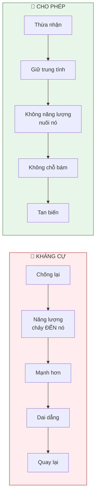

### Khăng Khăng Là Kháng Cự Trá Hình

> "Sự khăng khăng trong cuộc sống của bạn về một điều cụ thể phải xảy ra nếu không sẽ có vấn đề thực ra là một hình thức kháng cự điều có thể ở đó tốt hơn nhiều so với bạn tưởng tượng."

Khi ta khăng khăng "nó PHẢI là CÁCH NÀY," ta đồng thời:
- Kháng cự mọi khả năng khác (có thể tốt hơn)
- Nói với vũ trụ rằng tâm trí cao hơn không biết điều tốt nhất
- Khóa bản thân vào một băng tần rung động hẹp

---

## Kỳ Vọng, Khăng Khăng & Giả Định — Những Thứ Phá Vỡ Công Thức

### Công Thức Hoàn Chỉnh (Hầu Hết Mọi Người Phá Vỡ Nó)

> "Hành động theo đam mê cao nhất của bạn, với khả năng tốt nhất của bạn, đưa nó đi xa nhất có thể cho đến khi bạn không thể đi xa hơn nữa — và hoàn toàn không có giả định, khăng khăng hay kỳ vọng nào về kết quả nên như thế nào."

> "Cả bốn phần đều thiết yếu. Bỏ phần cuối — không kỳ vọng — là nơi hầu hết mọi người thất bại."

### Tại Sao Kỳ Vọng Là Kháng Cự

| Ta Nghĩ Kỳ Vọng Làm Gì | Thực Tế Nó Làm Gì |
|---------------------------|----------------------|
| "Hướng dẫn kết quả" | Giới hạn kết quả |
| "Cho thấy tầm nhìn rõ ràng" | Cho thấy thiếu tin tưởng vào tâm trí cao hơn |
| "Đảm bảo tôi có được điều muốn" | Khiến ta bỏ lỡ điều còn tốt hơn |
| "Bảo vệ tôi khỏi thất vọng" | Tạo ra chính sự thất vọng ta sợ |

> "Điều xảy ra thậm chí có thể vĩ đại hơn bạn tưởng tượng ban đầu nếu bạn sẵn lòng không giới hạn nó bằng những giả định về điều bạn nghĩ bạn cần."

### Ba Kẻ Giết Chóc

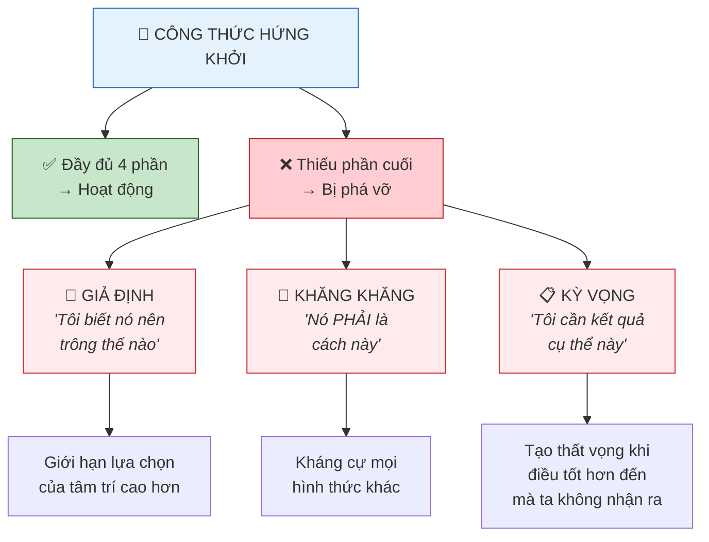

---

## Tranh Cãi Với Tạo Hóa — Chúng Ta Không Bao Giờ Thắng Được

> "Khi bạn không tin vào giá trị của chính mình, bạn đang tranh cãi với tạo hóa. Và nghịch lý là — chính khả năng tranh cãi với tạo hóa của bạn chứng minh rằng bạn xứng đáng tồn tại."

> "Khi bạn tranh cãi về giá trị của mình, khi bạn nghi ngờ bản thân, bạn đang cố tranh cãi với sự tồn tại về sự tồn tại của bạn. Bạn không bao giờ thắng được cuộc tranh cãi đó. Không bao giờ. Vì vậy xin hãy ngừng tranh cãi."

### Các Hình Thức Tranh Cãi Với Tạo Hóa

| Cách Ta Hay Tranh Cãi | Thực Chất Đang Nói Gì |
|--------------------|---------------------------|
| "Điều này không nên xảy ra" | "Tạo hóa đã mắc sai lầm" |
| "Tôi không xứng đáng" | "Tạo hóa tạo ra điều không thuộc về" |
| "Điều này không công bằng" | "Cấu trúc của sự tồn tại bị lỗi" |
| "Tôi không thể làm điều này" | "Tạo hóa cho tôi điều tôi không thể xử lý" |
| Phản ứng tiêu cực với điều đến | "Tâm trí cao hơn gửi cho tôi điều sai" |

Mỗi điều trên đều là cuộc tranh cãi không thể thắng — vì tạo hóa không mắc sai lầm, và tâm trí cao hơn luôn mang đến điều phù hợp.

---

## Đừng Là Kẻ Trộm Niềm Tin — Mang Hành Lý Của Người Khác

> "Bạn đang mang hành lý thuộc về người khác — và đó là điều đè nặng bạn. Niềm tin của chính bạn không bao giờ đè nặng bạn — chúng giải phóng bạn."

> "Đừng là kẻ trộm niềm tin và đánh cắp niềm tin từ người khác. Chỉ mang niềm tin của riêng bạn."

### Phép Thử Trọng Lượng

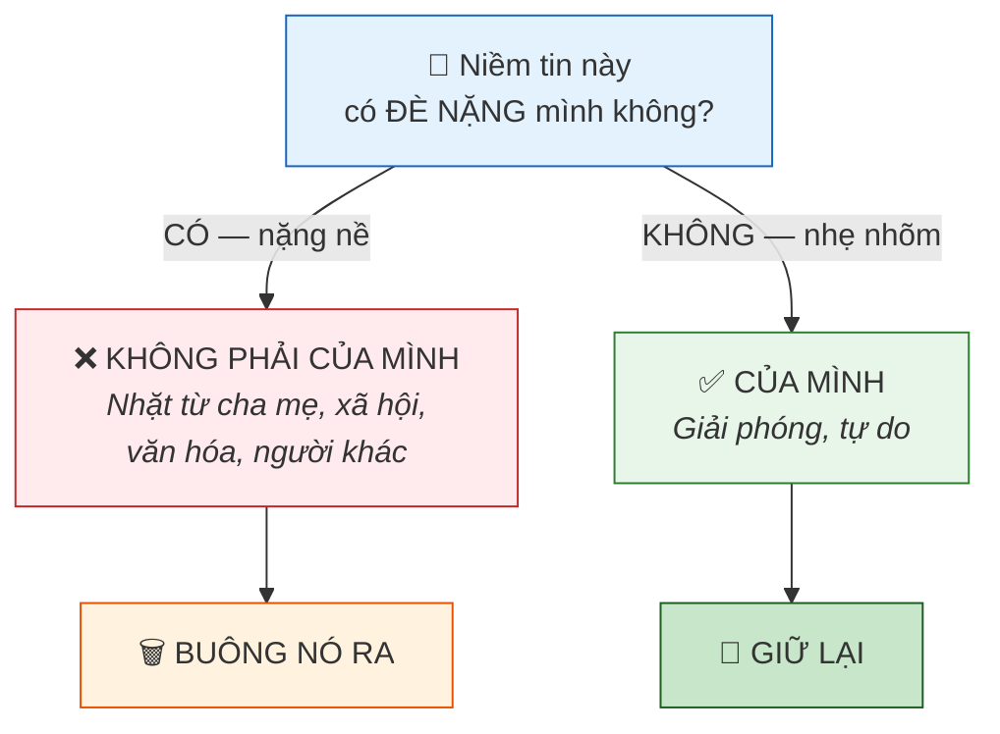

> "Điều duy nhất khiến bạn cảm thấy bị đè nặng là bạn đang mang theo một hệ thống niềm tin không liên quan gì đến bạn — mà bạn không có lý do gì để tin vào. Nó thuộc về người khác."

### Ta Nhặt Nó Lên Như Thế Nào

> "Ngay khi bạn thấy câu trả lời, bạn sẽ nói: điều đó thật vô lý khi tôi giữ niềm tin đó. Nó không liên quan gì đến điều tôi thích tin. Vì vậy tôi nhận ra tôi phải nhặt nó từ cha mẹ, xã hội, bất cứ đâu — và nó không thuộc về tôi."

---

## Một Năng Lượng, Hai Bộ Lọc — Niềm Vui và Nỗi Sợ Từ Cùng Nguồn

> "Bạn là một năng lượng và năng lượng đó được lọc qua hệ thống niềm tin của bạn."

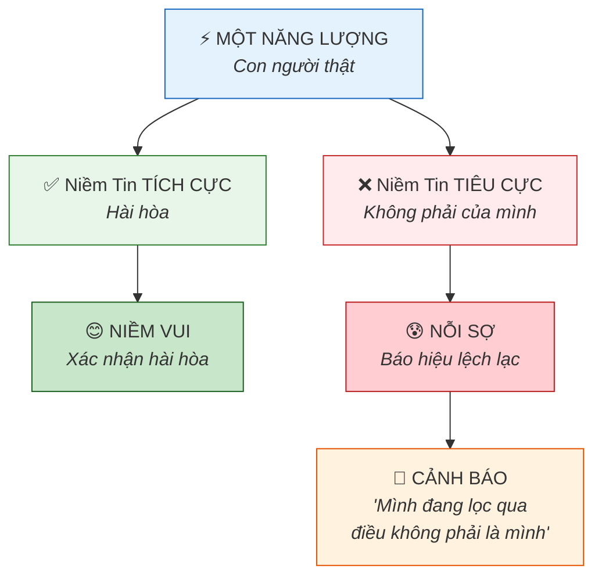

> "Nếu bạn lọc năng lượng qua niềm tin tích cực và hài hòa với con người thật, bạn được cho thấy sự hài hòa đó bằng cách cảm nhận năng lượng dưới hình thức bạn gọi là niềm vui."

> "Nếu bạn lọc cùng năng lượng đó qua hệ thống niềm tin lệch lạc với con người thật, bạn trải nghiệm năng lượng dưới hình thức bạn gọi là nỗi sợ — và đó là điều tốt, vì nếu không, bạn sẽ không bao giờ biết khi nào bạn đang mang niềm tin không thuộc về mình."

Nỗi sợ không phải kẻ thù. Nỗi sợ là **hệ thống cảnh báo** nhắc nhở: "Mình đang lọc qua điều không phải là mình."

---

## Phương Thuốc: Thừa Nhận, Sở Hữu, Trung Hòa, Giải Phóng

### Quy Trình Từng Bước

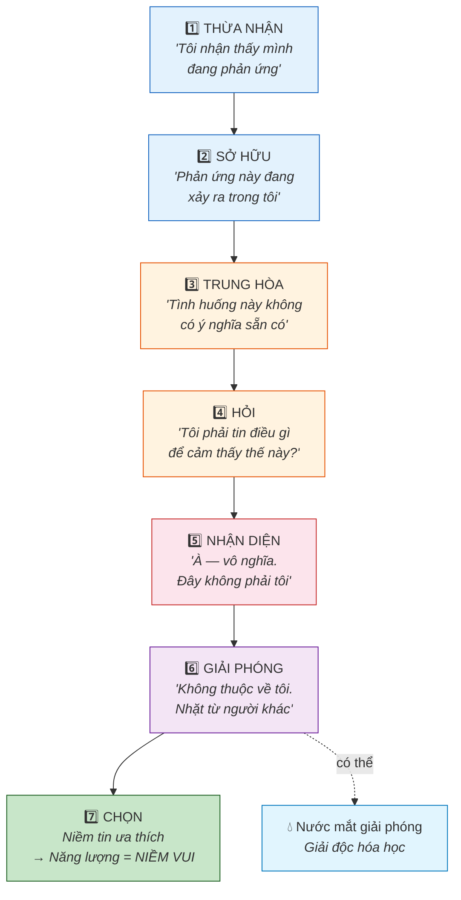

> "Nếu bạn hiểu rằng niềm tin này không liên quan gì đến bạn, bạn sẽ trung hòa nó về mặt cảm xúc và sau đó chọn niềm tin mà bạn thích và cho phép cảm xúc tương ứng với niềm tin đó được tạo ra trong bạn."

> "Ngay khi bạn nhận diện điều thực sự lệch lạc với con người thật, bạn sẽ nhận ra nó vô nghĩa và phi logic. Nó không còn ảnh hưởng bạn nữa."

---

## Đáp Ứng, Đừng Phản Ứng — Thước Đo Của Sự Thay Đổi Thật Sự

### Sự Phân Biệt Quan Trọng

> "Không phải tình huống thay đổi cho thấy bạn đã thay đổi. Mà là cách bạn đáp ứng cùng tình huống — ngay cả khi nó trông không khác — mới cho thấy bạn đã thay đổi."

| Phản Ứng | Đáp Ứng |
|----------|---------|
| Tự động, vô thức | Có ý thức, có chủ đích |
| Dựa trên niềm tin cũ | Dựa trên trạng thái hiện hữu ưa thích |
| Đồng nhất với tình huống | Quan sát tình huống |
| Gán ý nghĩa tiêu cực | Giữ trung tính hoặc gán ý nghĩa tích cực |
| Nuôi dưỡng khuôn mẫu | Phá vỡ khuôn mẫu |
| Nói với vũ trụ "không gì thay đổi" | Nói với vũ trụ "Tôi đã thay đổi" |

### Phép Thử Gương

> "Nếu tình huống không thay đổi và bạn vẫn phản ứng theo cách cũ vì nó không thay đổi, thì tất cả những gì bạn đang nói với vũ trụ là bạn chưa thay đổi. Vậy tại sao nó phải thay đổi?"

> "Khi bạn cho thấy bạn đã thay đổi bằng cách đáp ứng khác đi với mọi thứ, thì mọi thứ không có lựa chọn nào khác ngoài thay đổi để phản ánh sự thay đổi đã thực sự xảy ra trong bạn."

### Phép Tự Kiểm Tra

> "Đôi khi bạn sẽ tự kiểm tra. Đôi khi bạn có thể không thấy sự thay đổi ngay lập tức — và đó là để cho bạn thời gian xem liệu bạn đã thực sự thay đổi, hay bạn chỉ sẽ phản ứng theo cách cũ vì nó chưa thay đổi."

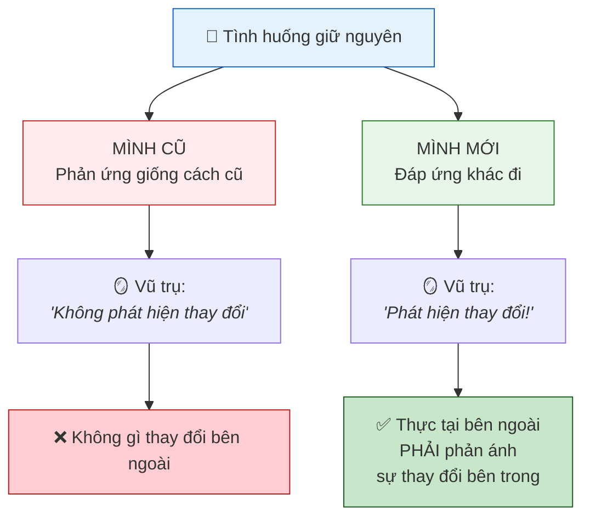

---

## Con Đường Ít Kháng Cự Nhất — Đối Lập Của Phản Ứng

Toàn bộ chuỗi phản ứng — đồng nhất, gánh nặng, kỳ vọng, kháng cự — là **đối lập** của con đường ít kháng cự nhất. Phản ứng là bơi ngược dòng. Đáp ứng từ trạng thái thật là thuận theo dòng chảy. Con đường ít kháng cự nhất không phải là thụ động — đó là con đường tự nhiên, hiệu quả nhất mà tâm trí cao hơn đã biết sẵn.

### Ẩn Dụ Dòng Sông

> "Mỗi người trong các bạn có dòng chảy riêng trong dòng sông của tạo hóa. Dòng chảy đã biết bạn cần đi đâu. Hãy để mình thuận theo dòng chảy."

> "Hãy để mình thuận theo dòng chảy vì dòng chảy của bạn biết chính xác bạn cần đi đâu."

```mermaid
flowchart TD
    subgraph UP["🔴 BƠI NGƯỢC DÒNG — Phản Ứng"]
        U1["Phản ứng"] --> U2["Đồng nhất"] --> U3["Gánh nặng"]
        U3 --> U4["Kỳ vọng"] --> U5["Khăng khăng"] --> U6["Chống lại"]
        U6 --> U7["😫 Vật lộn, đau đớn, kiệt sức"]
    end
    subgraph DOWN["🟢 THUẬN THEO DÒNG — Đáp Ứng"]
        D1["Quan sát"] --> D2["Trung hòa"] --> D3["Giải phóng"]
        D3 --> D4["Tin tưởng"] --> D5["Theo hứng khởi"]
        D5 --> D6["😊 Nhẹ nhàng, vui vẻ, đồng bộ"]
    end

    style UP fill:#ffebee,stroke:#c62828
    style DOWN fill:#e8f5e9,stroke:#2e7d32
```

### Kháng Cự vs. Dòng Chảy — Nguồn Gốc Của Mọi Đau Khổ

> "Mọi đau khổ, mọi vật lộn, mọi nỗi đau trong trải nghiệm thực tại của bạn đều đến từ sự kháng cự con người tự nhiên của bạn. Hãy ngừng kháng cự con người tự nhiên của bạn. Hãy ngừng tranh cãi với tạo hóa. Hãy thuận theo dòng chảy. Tin tôi đi, nó vui hơn nhiều."

| Kháng Cự (Phản Ứng) | Dòng Chảy (Đáp Ứng) |
|---------------------|---------------------|
| Kháng cự con người tự nhiên | Là con người tự nhiên |
| Bơi ngược dòng | Di chuyển cùng dòng chảy |
| Tranh cãi với tạo hóa | Hợp tác với sự tồn tại |
| Chống lại cấu trúc | Hiểu vật lý |
| Khăng khăng kết quả cụ thể | Cho phép kết quả tốt nhất đến |

### Công Thức Hứng Khởi CHÍNH LÀ Con Đường Ít Kháng Cự Nhất

> "Ý tưởng hành động theo đam mê với khả năng tốt nhất mà không khăng khăng hay giả định về kết quả nên trông như thế nào thực ra là công cụ điều hướng của bạn. Nó sẽ tự động hướng dẫn bạn qua các khung hình đại diện nhất cho con đường ít kháng cự nhất."

> "Bạn sẽ luôn chỉ trải nghiệm những khung hình luôn mang lại lợi ích tốt nhất cho bạn, luôn đại diện cho con đường ít kháng cự nhất, luôn đại diện cho con đường kết nối với mọi thứ liên quan đến bạn trong cuộc sống, luôn cho bạn chính xác những gì bạn cần."

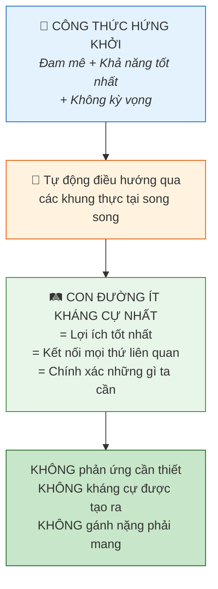

### Nguyên Tắc Tung Đồng Xu — Không Thể Bị Lạc

> "Nếu thực tế bạn đi theo đường A bằng cách tung đồng xu và đó không phải là con đường ít kháng cự nhất, điều gì đó sẽ xảy ra trên con đường đó sẽ tự động đưa bạn quay lại đường B."

Ngay cả khi rẽ "sai," dòng chảy tự nhiên sẽ chuyển hướng ta — **trừ khi** ta phản ứng bằng kháng cự và khăng khăng ở lại con đường sai. Phản ứng giữ ta mắc kẹt. Cho phép để sự chuyển hướng xảy ra.

### Tốc Độ Tự Nhiên CHÍNH LÀ Con Đường Nhanh Nhất

> "Làm điều đó theo cách tự nhiên và thoải mái cho bạn, dù có vẻ mất nhiều thời gian hơn một chút, thực ra sẽ là con đường nhanh nhất."

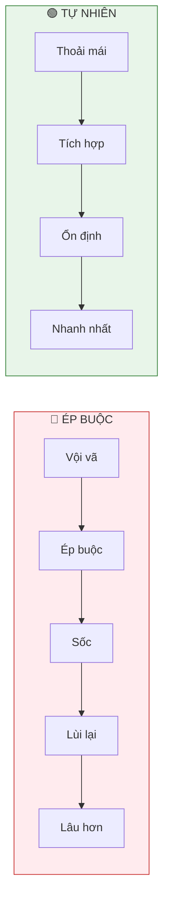

### Tình Yêu Là Bản Chất Của Ít Kháng Cự Nhất

Ở cấp độ sâu nhất, tình yêu vô điều kiện CHÍNH LÀ con đường ít kháng cự nhất. Tình yêu là:
- Tần số rung động của chính sự tồn tại
- Sự hiểu biết tuyệt đối về mình là ai, là gì, khi nào, ở đâu và như thế nào
- Bản chất của con đường ít kháng cự nhất

Khi ở trong trạng thái yêu thương — không phản ứng, không kháng cự, không tranh cãi với tạo hóa — ta đang trên con đường ít kháng cự nhất theo định nghĩa.

### Phản Ứng Chặn Con Đường Như Thế Nào

Mỗi yếu tố trong chuỗi phản ứng là một hình thức **bơi ngược dòng**:

| Yếu Tố Chuỗi Phản Ứng | Cách Nó Chặn Con Đường |
|------------------------|----------------------|
| **Gán ý nghĩa tiêu cực** | Tạo nhiễu loạn trong nước vốn êm đềm |
| **Đồng nhất với nó** | Bám vào tảng đá trong sông, giữ chặt |
| **Biến nó thành gánh nặng** | Mang thêm trọng lượng khi đang bơi |
| **Đặt kỳ vọng** | Khăng khăng dòng sông nên chảy hướng khác |
| **Kháng cự** | Bơi trực tiếp ngược dòng |
| **Nó tồn tại/quay lại** | Dòng chảy đẩy lại mạnh hơn khi ta càng chống |

Giải pháp ở mọi điểm đều giống nhau: **buông ra, trở về trung tính, và để dòng chảy mang mình đi**.

> "Hãy để con đường của bạn là con đường ít kháng cự nhất. Con đường thực sự phản ánh con người bạn biết mình là."

> "Bạn có tự do ý chí để chọn liệu bạn sẽ hài hòa với tạo hóa hay lệch lạc với tạo hóa. Sổ tay hướng dẫn là cách hiểu làm sao để hài hòa, làm sao thuận theo dòng chảy vì lợi ích của bạn."

---

## Hoàn Cảnh Không Quan Trọng — Trạng Thái Hiện Hữu Tạo Ra Vật Chất

> "Hoàn cảnh không tạo ra vật chất. Trạng thái hiện hữu tạo ra vật chất. Và tôi nói điều đó hoàn toàn theo nghĩa đen."

### Vật Lý Theo Nghĩa Đen

Đây không phải ẩn dụ, mà theo nghĩa đen:

| Điều Hầu Hết Mọi Người Tin | Điều Thực Sự Đang Xảy Ra |
|----------------------------|--------------------------|
| Hoàn cảnh tạo ra trạng thái tôi | Trạng thái hiện hữu tạo ra hoàn cảnh |
| Tôi cần bên ngoài thay đổi trước | Tôi cần thay đổi trước — bên trong |
| Tình huống khiến tôi cảm thấy thế này | Tôi chọn cách cảm nhận về tình huống |
| Khi mọi thứ cải thiện, tôi sẽ cảm thấy tốt hơn | Khi tôi cảm thấy tốt hơn, mọi thứ cải thiện |
| Vật chất tạo ra trạng thái tôi | Trạng thái tạo ra vật chất |

> "Bạn chỉ có thể trải nghiệm thông tin tương xứng với trạng thái hiện hữu bạn đang ở. Bạn không thể trải nghiệm điều bạn không phải là rung động của trước."

> "Bạn thậm chí không thể tưởng tượng những điều nếu bạn không ở trong trạng thái hiện hữu mà những tưởng tượng đó tồn tại."

---

## Nước Mắt và Giải Phóng — Cơ Chế Giải Độc Của Cơ Thể

> "Khi bạn cuối cùng giải phóng nó, nó sẽ buộc bạn cảm thấy xúc động để bạn có thể khóc — để trong nước mắt, các thành phần hóa học của niềm tin tiêu cực đó thực sự được rửa trôi khỏi cơ thể bạn."

> "Khi bạn cuối cùng buông niềm tin và bạn khóc vì bạn đột nhiên nhận ra rằng bạn đã giữ nó quá lâu và giờ bạn sẵn sàng buông nó — những đợt sóng cảm xúc nhẹ nhõm này — là vì bạn đang thực sự rửa trôi các thành phần hóa học đó ra khỏi cơ thể qua nước mắt."

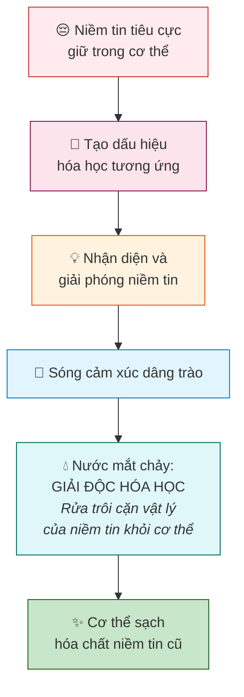

---

## Khung Thực Hành Hoàn Chỉnh

### Khi Điều Gì Đó Kích Hoạt Mình — Quy Trình Đầy Đủ

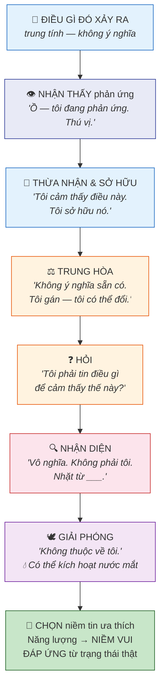

---

## Tóm Tắt Nguyên Tắc Chính

### Chuỗi Phản Ứng
- Phản ứng → Đồng nhất → Gánh nặng → Kỳ vọng → Kháng cự → Tồn tại dai dẳng
- Mọi mắt xích là một lựa chọn (dù vô thức) và mọi mắt xích đều có thể bị phá vỡ

### Về Nhận Dạng Sai
- Khi phản ứng, ta đồng nhất với tình huống — biến nó thành gánh nặng của mình
- Ta không phải là tình huống, cảm xúc, hay niềm tin kích hoạt phản ứng
- Đồng nhất truy nguyên về niềm tin; phản ứng CHÍNH LÀ tín hiệu của niềm tin sai

### Về Tính Trung Tính
- Không gì có ý nghĩa sẵn có — mọi thứ đều trung tính
- Ý nghĩa tiêu cực → trải nghiệm tiêu cực; ý nghĩa tích cực → trải nghiệm tích cực
- Tình huống không cần thay đổi — chỉ ý nghĩa ta gán cho nó

### Về Kháng Cự và Quay Lại
- Điều ta kháng cự sẽ tồn tại dai dẳng — kháng cự nuôi năng lượng cho chính điều ta chống
- Khăng khăng là kháng cự trá hình — chặn điều có thể còn tốt hơn
- Tranh cãi với tạo hóa là cuộc tranh cãi không bao giờ thắng

### Về Kỳ Vọng
- Giả định, khăng khăng, và kỳ vọng phá vỡ công thức hứng khởi
- Chúng giới hạn lựa chọn giao hàng của tâm trí cao hơn
- Điều có thể đến thậm chí vĩ đại hơn bất cứ gì ta tưởng tượng

### Về Sở Hữu và Giải Phóng
- Không thể thay đổi điều mình không sở hữu — thừa nhận và chấp nhận trước
- Đừng phủ nhận cảm xúc, nhưng cũng đừng đắm chìm
- Dùng sự khó chịu như hệ thống nhận dạng, không phải nơi ở
- Niềm tin sai cảm thấy vô nghĩa khi được nhận diện — chúng tự rơi đi

### Về Đáp Ứng vs. Phản Ứng
- Đáp ứng khác đi với cùng tình huống = bằng chứng thay đổi
- Vũ trụ đọc cách ta phản ứng, không phải lời nói
- Khi thực sự thay đổi, mọi thứ không có lựa chọn nào khác ngoài phản ánh nó

### Về Con Đường Ít Kháng Cự Nhất
- Dòng chảy trong sông tạo hóa đã biết ta cần đi đâu
- Công thức hứng khởi CHÍNH LÀ công cụ điều hướng qua con đường ít kháng cự nhất
- Mọi yếu tố chuỗi phản ứng là hình thức bơi ngược dòng
- Tình yêu là bản chất của con đường ít kháng cự nhất
- Tốc độ tự nhiên, thoải mái luôn là con đường nhanh nhất — ép buộc tạo thụt lùi
- Ngay cả rẽ sai cũng tự sửa — trừ khi ta phản ứng bằng kháng cự và giữ chặt
- Buông ra, trở về trung tính, để dòng chảy mang mình đi

### Về Trạng Thái Hiện Hữu
- Hoàn cảnh không tạo ra vật chất — trạng thái hiện hữu tạo ra vật chất (theo nghĩa đen)
- Không thể trải nghiệm điều mình chưa phải là rung động của
- Thay đổi bên trong → dịch chuyển đến thực tại song song phù hợp → bên ngoài thay đổi

---

## Trí Tuệ Kết Thúc

> "Mọi đau khổ, mọi vật lộn, mọi nỗi đau trong trải nghiệm thực tại của bạn đều đến từ sự kháng cự con người tự nhiên của bạn."

> "Không gì có ý nghĩa sẵn có. Mọi thứ đều trung tính."

> "Đừng là kẻ trộm niềm tin và đánh cắp niềm tin từ người khác. Chỉ mang niềm tin của riêng bạn. Niềm tin của chính bạn không bao giờ đè nặng bạn — chúng giải phóng bạn."

> "Hoàn cảnh không tạo ra vật chất. Trạng thái hiện hữu tạo ra vật chất."

> "Khi bạn cho thấy bạn đã thay đổi bằng cách đáp ứng khác đi với mọi thứ, thì mọi thứ không có lựa chọn nào khác ngoài thay đổi để phản ánh sự thay đổi đã thực sự xảy ra trong bạn."

> "Bạn có thể sử dụng sự khó chịu như một hệ thống nhận dạng tức thì. Nhưng đừng để nó kéo dài. Đừng đắm chìm trong nó. Hãy sử dụng nó."

> "Ngay khi bạn nhận diện điều thực sự lệch lạc với con người thật, bạn sẽ nhận ra nó vô nghĩa và phi logic — và nó không còn ảnh hưởng bạn nữa."

> "Vì vậy xin hãy ngừng tranh cãi với tạo hóa. Bạn không bao giờ thắng được cuộc tranh cãi đó. Không bao giờ."

> "Hãy để con đường của bạn là con đường ít kháng cự nhất. Con đường thực sự phản ánh con người bạn biết mình là."

> "Dòng chảy của bạn đã biết bạn cần đi đâu. Hãy để mình thuận theo dòng chảy."
