# Unconditional Love — Everything Is Created from Love - Mermaid Visualizations

## Overview

This document presents the complete teachings on love, enhanced with Mermaid charts for visual learning. Love is not an emotion — it is the **vibratory frequency of existence itself**. Every heartbeat transmits it, every being is made of it, and the universe itself is its expression. The core message: you don't *find* love — you ARE love. You don't *earn* love — your existence IS creation's love expressed.

---

## Table of Contents

1. [What Love Actually Is — The Frequency of Existence](#what-love-actually-is--the-frequency-of-existence)
2. [Love Is More Than Emotion — The Translation Analogy](#love-is-more-than-emotion--the-translation-analogy)
3. [You ARE Love — You Don't Need to Find It](#you-are-love--you-dont-need-to-find-it)
4. [Everything Is Love Because Everything Is God](#everything-is-love-because-everything-is-god)
5. [The Heart — Love's Electromagnetic Transmitter](#the-heart--loves-electromagnetic-transmitter)
6. [Telempathy — How Every Heart Talks to Every Other Heart](#telempathy--how-every-heart-talks-to-every-other-heart)
7. [The Heart-Higher Mind Connection — How Love Becomes Passion](#the-heart-higher-mind-connection--how-love-becomes-passion)
8. [Unconditional Love as the Pure Vibration of the Higher Mind](#unconditional-love-as-the-pure-vibration-of-the-higher-mind)
9. [How Beliefs Filter Love into Fear](#how-beliefs-filter-love-into-fear)
10. [Love and Tears — Homesickness for Home](#love-and-tears--homesickness-for-home)
11. [Self-Worth — Your Existence IS Creation's Love Expressed](#self-worth--your-existence-is-creations-love-expressed)
12. [The Green Blanket — Afraid to Feel Love for Yourself](#the-green-blanket--afraid-to-feel-love-for-yourself)
13. [True Love in Relationships — Unconditional Allowing](#true-love-in-relationships--unconditional-allowing)
14. [Unconditional Love for Others' Paths](#unconditional-love-for-others-paths)
15. [Love as the Universal Quality of Higher Beings](#love-as-the-universal-quality-of-higher-beings)
16. [Love at the Highest Levels — The Angelic and Source Frequencies](#love-at-the-highest-levels--the-angelic-and-source-frequencies)
17. [Prayer as the Outward Expression of Love](#prayer-as-the-outward-expression-of-love)
18. [Dissolving into Love — The Heart's Portal to the Soul](#dissolving-into-love--the-hearts-portal-to-the-soul)
19. [The Heart Chakra — Green, Contact, and Connection](#the-heart-chakra--green-contact-and-connection)
20. [Love as Light — The First Physicalization of Consciousness](#love-as-light--the-first-physicalization-of-consciousness)
21. [Living from Love — Navigating to the Heart of Reality](#living-from-love--navigating-to-the-heart-of-reality)
22. [The Three-Mind Architecture Aligned in Love](#the-three-mind-architecture-aligned-in-love)
23. [Key Principles Summary](#key-principles-summary)
24. [Closing Wisdom](#closing-wisdom)

---

## What Love Actually Is — The Frequency of Existence

### The Definition

> "Unconditional love is the vibratory frequency of existence itself. And love is your translation of that frequency in physical terms."

> "It's the signature frequency of existence itself."

This is not poetry or metaphor. This is stated as the literal structure of reality:

| Level | What Love Is |
|-------|-------------|
| **Universal/Absolute** | The vibratory frequency of existence itself |
| **Signature** | The signature frequency of all that is |
| **Physical Translation** | The emotional sensation you call love |
| **Relationship to Life** | Part of what we call life itself |

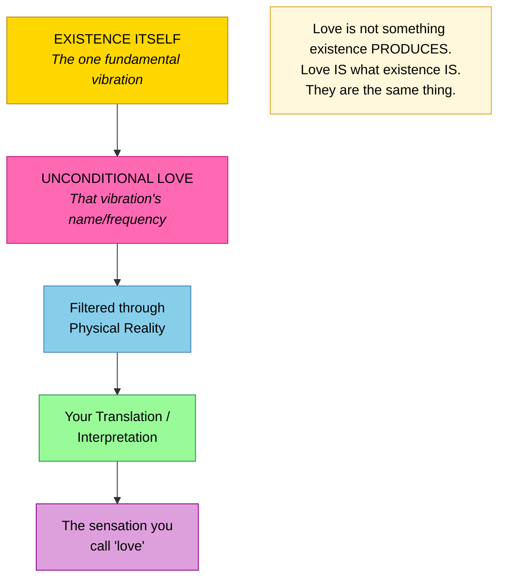

---

## Love Is More Than Emotion — The Translation Analogy

### Beyond Feeling

> "It is much more than emotional feeling. Your emotional feeling is your translation and interpretation of that frequency in your reality."

> "There are vibrations, there are energies in creation that you only have a certain amount of ways of experiencing in your physical reality. So the way you experience in your physical reality the vibrational frequency of energy of existence itself is through the sensation you call love. That's your physical interpretation of that energy of existence."

| What Most People Think | What Love Actually Is |
|----------------------|---------------------|
| An emotion you feel sometimes | The frequency of existence you translate sometimes |
| Something between people | The vibration underlying all of reality |
| Something you can gain or lose | Something you literally ARE |
| One of many feelings | The ONE fundamental energy, experienced in limited form |

---

## You ARE Love — You Don't Need to Find It

### Affirmation 10: "I Give and Receive Joy, Love, and Compassion"

> "You are joy. You are love. You are given unconditional support, love, and compassion. Why not reflect it? Because that is what will allow you to feel the connection to creation, to all that is — because that's the frequency of existence itself."

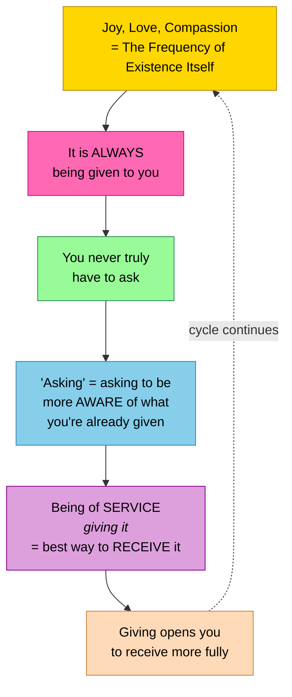

### Redefining "Asking" for Love

> "Asking is not really asking for something you don't have. You can ask, but understand that asking is simply asking to be more aware of what you're already being given. Big difference."

| Common Understanding | The Truth |
|---------------------|-----------|
| "I need to find love" | You ARE love |
| "I need to earn love" | It is always being given to you |
| "I need to ask for love" | Asking = becoming aware of what you already have |
| "Giving love depletes me" | Giving love opens you to receive more |

---

## Everything Is Love Because Everything Is God

### The Core Realization

> "Everything is love because everything is God."

Even the most painful experiences, when seen from the divine perspective, are acts of love:

> "They were enacting God's plan on my behalf, for me, as a gift to me — to give me my ultimate liberation and wholeness."

### The Shift in Perception

| Human Perspective | Divine Perspective |
|------------------|-------------------|
| Betrayal | Karmic release |
| Shock | Initiation |
| Loss | Necessary space for transformation |
| Pain | Gift leading to liberation |
| Abrupt ending | A clean cut of love |

> "Completely irrelevant as to the way that it looked on the outside on the human level, which was a betrayal and a shock to me — I knew that it was my greatest liberation."

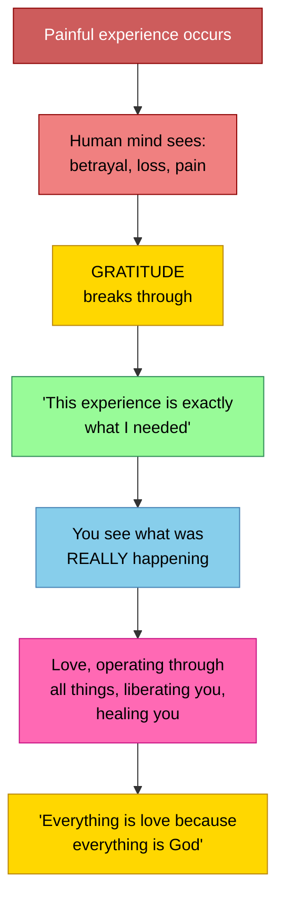

---

## The Heart — Love's Electromagnetic Transmitter

### The Physical Mechanism of Love

> "With every heartbeat, you send out an electromagnetic bubble that expands from your body, all of you, and immerse each other in these electromagnetic connective bubbles, so that one heart literally talks to all the others and you are immersed in the electromagnetic bubbles of all the other hearts."

### How Love Physically Operates

| Component | Function |
|-----------|----------|
| **Heart** | Pumps blood; generates strongest electromagnetic pulse |
| **Blood** | Contains iron; carries electromagnetic properties |
| **Circulation** | Movement of iron-rich blood generates the EM field |
| **Heartbeat** | Each beat sends an electromagnetic bubble of LOVE expanding from the body |

### The Earth-Human Parallel

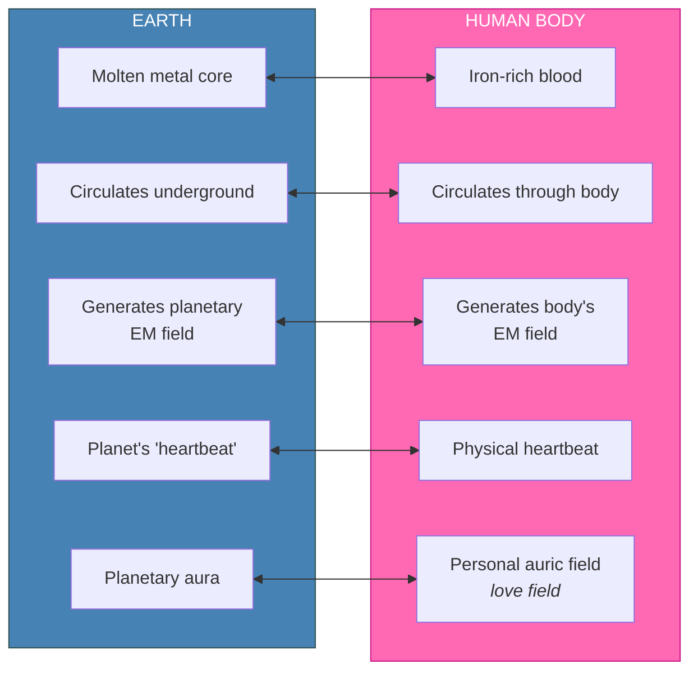

### Refining the Love Field

> "As you allow yourself more clarity, more refinement in your physical form, as you remove toxins from your system that may interfere with this process of your blood circulation, this electromagnetic field becomes more and more refined and extends farther and farther from your body."

| Body State | Love Field Quality |
|------------|-------------------|
| Toxin-laden, unclear | Weak, limited range |
| Cleansed, refined | Strong, extended range |
| Ascending, high frequency | Highly sensitive, far-reaching |

---

## Telempathy — How Every Heart Talks to Every Other Heart

### Why "Telempathy" Not "Telepathy"

> "Which again is why we say telempathy instead of telepathy, because the empathy underscores the emotional component of the heart. The emotional intelligence of the heart that communicates with every beat to every other heart on the planet."

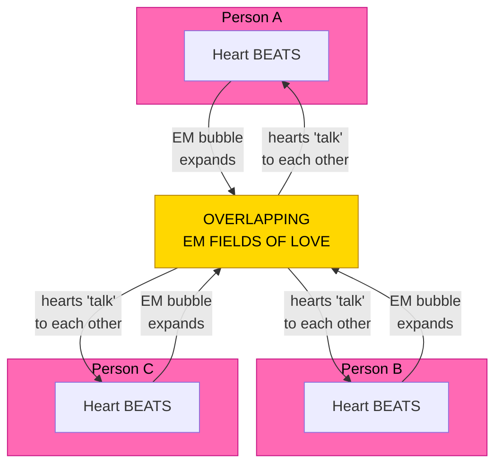

> "You are living expanding bubbles of electromagnetic energy that expand and issue from the heart with every single beat in constant connection and communication with one another."

Every heartbeat is an act of love broadcast to every other heart on the planet.

---

## The Heart-Higher Mind Connection — How Love Becomes Passion

### The Core Mechanism

> "With regard to energetic communication with your own higher mind, the heart is absolutely crucial in this process because the higher mind again speaks in the language of energy. Sends energy of certain frequencies to you which your physical mind translates into the sensation of passion."

> "The heart is specifically tuned to the vibration of the higher mind in its natural state."

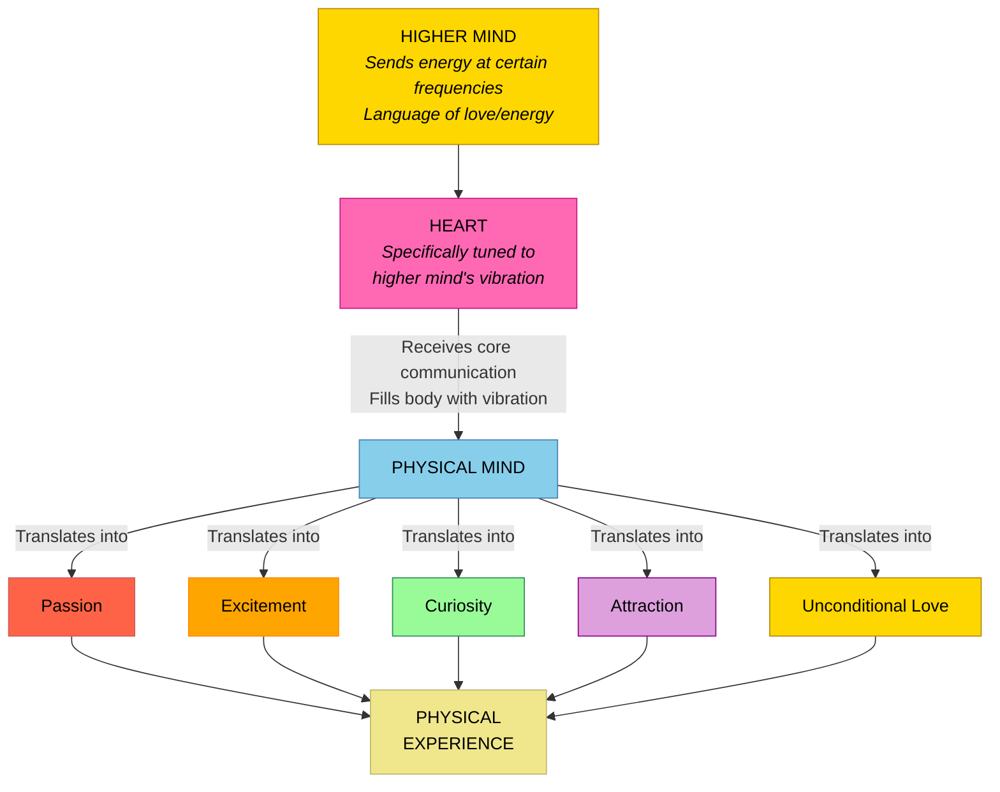

### All These Sensations Are Love in Translation

| Sensation | What It Actually Is |
|-----------|-------------------|
| **Passion** | Core frequency of higher mind (love), translated |
| **Excitement** | Alignment with higher mind's loving guidance |
| **Curiosity** | Higher mind's love drawing your attention |
| **Attraction** | Resonance with something love is guiding you toward |
| **Unconditional Love** | The pure, unfiltered vibration of the higher mind itself |

> "The reason that your physical body translates the messages, the communications from your higher mind as the sensation of passion, excitement, curiosity, attraction, and unconditional love is because the heart is what's actually directly receiving the core communication from the higher mind and filling your body with that vibration."

---

## Unconditional Love as the Pure Vibration of the Higher Mind

### When You Feel Unconditional Love, You're Receiving the Signal Purely

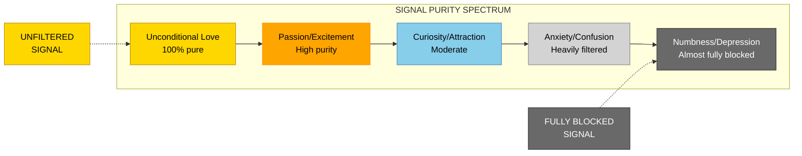

The spectrum from unconditional love to depression is really a spectrum from **unfiltered signal** to **fully blocked signal** from the higher mind.

---

## How Beliefs Filter Love into Fear

### The Filtering Mechanism

> "Of course it can be filtered through the belief systems of the physical mind that can allow it not necessarily to be experienced in its pure form, its pure unconditional loving form."

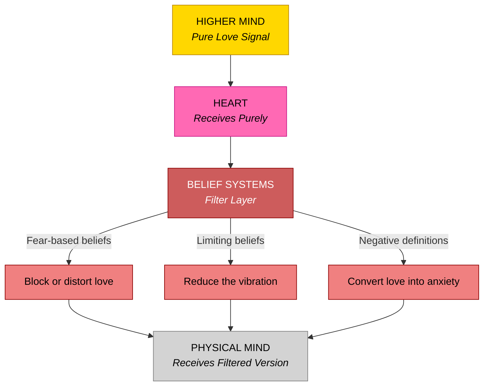

### Fear Is Love Misaligned

> "Fear is your energy being filtered through belief systems that are out of alignment with your true vibration."

> "Fear is your friend telling you you have a belief that's out of alignment with who you truly are."

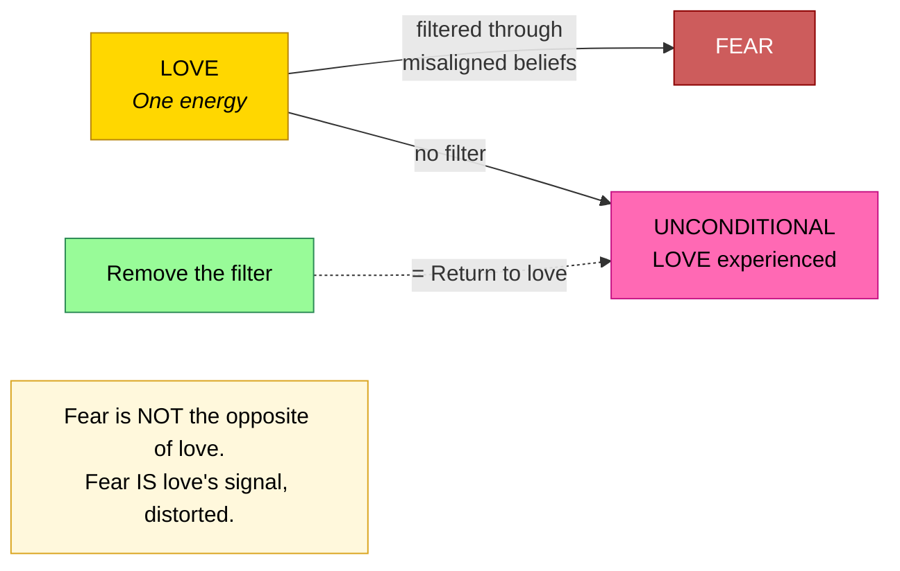

| With Fear-Based Beliefs | Without Fear-Based Beliefs |
|------------------------|--------------------------|
| Love signal distorted | Love signal received purely |
| Passion muted or confused | Passion clear and strong |
| Guidance unclear | Guidance unmistakable |
| Love experienced conditionally | Love experienced unconditionally |

**The key insight:** Fear and love are not opposites. Fear is love's signal being **distorted** through misaligned beliefs. Remove the beliefs, and what remains is pure love.

---

## Love and Tears — Homesickness for Home

### Why Deep Love Makes You Cry

> "Deep love is the vibration of the spirit realm which is your home. So when you are exposed to it, you are feeling in a sense 'homesick' a little bit."

### The Tears Mechanism

> "You are letting go or washing out of your system anything that has prevented you from connecting to the vibration of home."

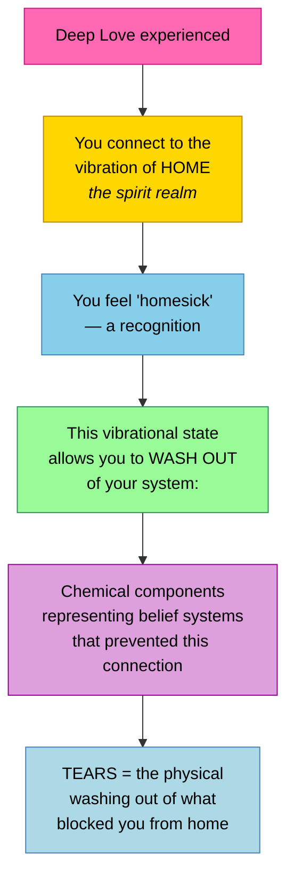

| Element | Meaning |
|---------|---------|
| **Deep love** | The vibration of the spirit realm / home |
| **Tears** | Washing out chemical residues of blocking beliefs |
| **The feeling** | Homesickness — recognition of your true home frequency |
| **The purpose** | Clearing what prevented connection to source |

**When you cry from love, you are literally washing away what separated you from your true nature.**

---

## Self-Worth — Your Existence IS Creation's Love Expressed

### The Logical Proof

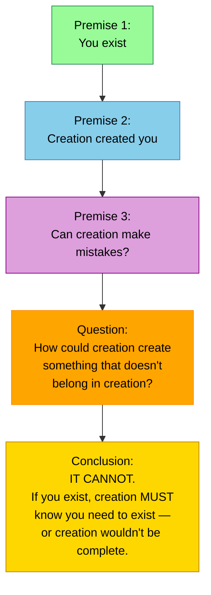

> "If you exist, creation must know you need to exist or creation wouldn't be complete. Without you, nothing would exist."

> "Therefore, creation obviously believes you are worthy of existence or it wouldn't have created you."

### The Beautiful Paradox

> "When you disbelieve in your own worth, you are arguing with creation. And yet the paradox is — your very ability to argue with creation proves that you're worthy of existence."

| The Argument | The Paradox |
|-------------|------------|
| "I'm not worthy of existing" | Your ability to make that argument proves you exist |
| "Creation made a mistake with me" | Creation doesn't create things that don't belong |
| "I don't deserve love" | **Your existence IS creation's love expressed** |

> "Stop arguing with creation about your worth. At least begin there."

**Your existence is not separate from love. Your existence IS love expressed. Creation loved you into being.**

---

## The Green Blanket — Afraid to Feel Love for Yourself

### The Visualization

A woman wraps herself in fear like a blanket. When asked what color, she says green — the heart chakra.

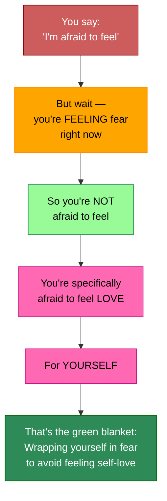

### The Key Question

> "You're not really afraid to feel because you're willing to feel fear. The question is, why aren't you willing to feel love for yourself?"

| Element | Meaning |
|---------|---------|
| The blanket | Fear as comfort — wrapping yourself in it |
| The color green | The heart chakra |
| Green blanket of fear | Afraid to **feel** — specifically afraid to feel **love for yourself** |

---

## True Love in Relationships — Unconditional Allowing

### What True Love Requires

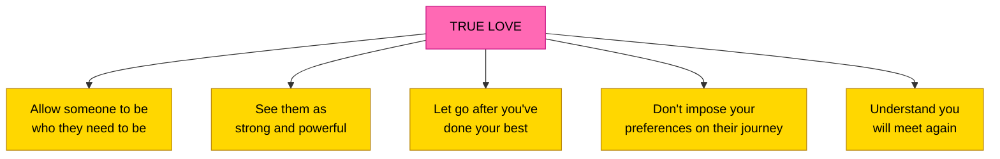

> "It's a big journey of discernment, learning how to discern better, better and better and make the choices that are in alignment with the things you now are capable of discerning that are really really true in your heart of hearts for the kind of reality you really prefer regardless of the appearances going on around you."

---

## Unconditional Love for Others' Paths

### When Someone You Love Follows a Different Path

> "Just support and love unconditionally and be the example of what he could choose, but understand you have to allow him to choose whatever he chooses. Otherwise, you're not being unconditional."

> "Everyone is an eternal being. What's your rush? Let him explore. Maybe that's his path. Maybe that's the way he needs to learn other things."

> "I am fine for you to believe what you wish to believe. I believe what I believe. It doesn't mean I love you any less."

| Approach | Action |
|----------|--------|
| **Be unconditional** | Love regardless of their beliefs |
| **Be the example** | Show what they could choose, without forcing |
| **Allow their path** | Accept their choices are theirs to make |
| **No rush** | They're eternal beings — they'll find out eventually |
| **No judgment** | Their path may be exactly what they need |

---

## Love as the Universal Quality of Higher Beings

### The One Quality All Higher Beings Share

> "One of the most common and of course absolutely necessarily expressed overarching qualities is one of the expression of unconditional love, no matter what other qualifications might go along with it."

| Human Traits | Higher Being Qualities |
|-------------|----------------------|
| Dominant/Shy | Assertive/Reserved |
| Love is conditional, variable | Love is unconditional, constant |
| Love is one trait among many | Love is THE overarching quality |
| Love comes and goes | Love is always expressed, no matter what |

---

## Love at the Highest Levels — The Angelic and Source Frequencies

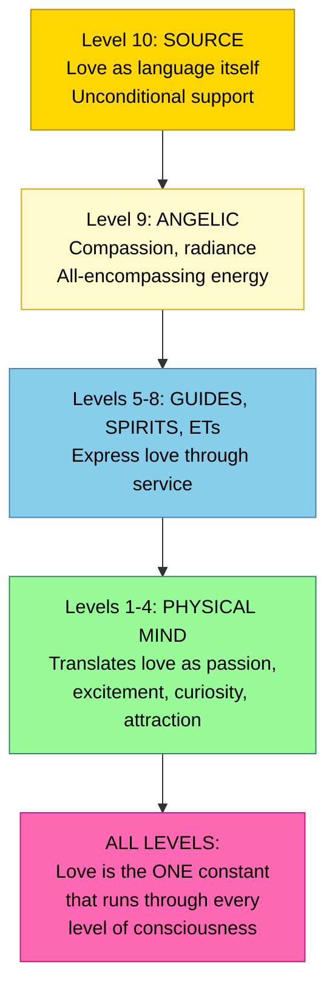

### Level 9: The Angelic Realm

- First reflection, first split off from All That Is
- First mirror of God
- Language of compassion and all-encompassing energy
- That which includes, contains, and expresses through **radiance and frequency alone**
- Lures and magnetizes to higher aspects of being
- Casts brilliant light that dispels all shadows

### Level 10: God/Goddess/All That Is/Source

- Expression of compassion
- **Unconditional support and love**
- **Love as a language itself**
- Absolute knowingness of who, what, when, where, and how you are
- The essence of the path of least resistance

---

## Prayer as the Outward Expression of Love

### Love Must Be Expressed in the World

> "If you see someone fall down and trip and hurt themselves and you go over and pick them up and help them feel better, that's a prayer. An active prayer. Doing something with your energy, doing something with your state of gratitude to help others."

> "Prayer is fine to create the state of being for yourself inwardly, but also then where's the outward expression of the prayer in the world?"

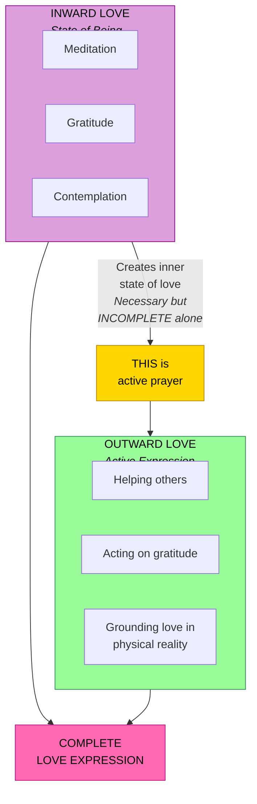

---

## Dissolving into Love — The Heart's Portal to the Soul

### The Practice

> "When I am tuning into my soul, I come right to the very center point of my heart. And then that center point — there is a way where you let yourself dissolve into love, into nothing, into peace, into stillness. And then you slip through this very small door, a very small portal within the heart that takes you into the realm of the soul."

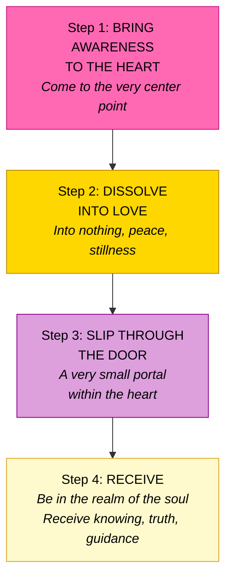

### The More You Practice, the Wider the Door

> "The more often you connect to this center point within your heart, the more often you allow yourself to dissolve into love and move through this door connecting to your soul, the greater this door becomes. It widens itself."

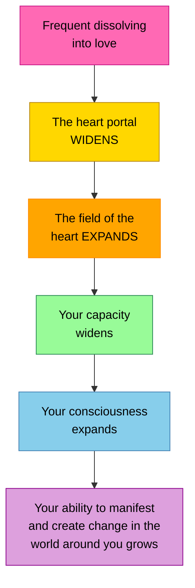

> "Surrender with faith to your heart, to this connection, to your soul."

---

## The Heart Chakra — Green, Contact, and Connection

### Green as the Color of Love

> "It is specific to the vibration of the heart chakra because contact is from heart to heart."

> "Though minds may be different, though body forms may be different, it is through the heart that we recognize our spirits are one."

### Heart Alignment Opens Dimensions

> "A dimension is a perspective. And the more you are aligned in the heart, the more you are able to move into different dimensional spaces through the way that you feel."

| Green as Open Heart | Green as Blocked Heart |
|--------------------|----------------------|
| Heart chakra open | Heart chakra closed |
| Contact, connection | Fear of connection |
| Love for self and others | Afraid to feel love |
| Recognition of oneness | Isolation in fear |
| Dimensional access | Dimensional limitation |

---

## Love as Light — The First Physicalization of Consciousness

### You Are Made of Light (Made of Love)

> "Remember, fundamentally you are made of energy. You are made of light, so to speak."

> "What we term electromagnetic energy is one of the first physicalizations of consciousness."

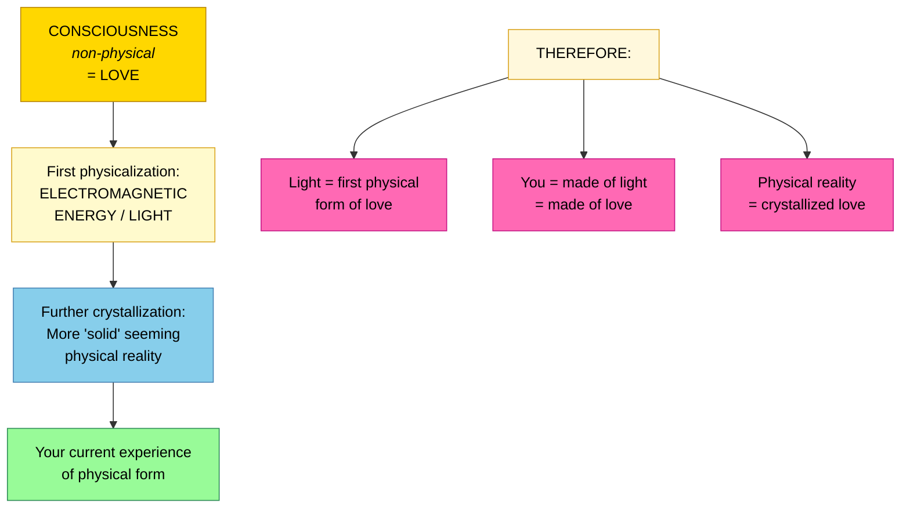

### When Beliefs Are Pure, Love Shines Through

> "Imagine that you have this white light that represents the idea of the ideal self, the higher mind — unbroken, unfiltered, pure, beautiful, a homogeneous white light."

When beliefs are pure and aligned:
- Colors recombine into pure white light
- This manifests as excitement, passion, **love**, creativity, joy

When beliefs are tinted/distorted:
- Colors recombine into off-white, gray, or black
- This manifests as fear, self-doubt, dampened experience

---

## Living from Love — Navigating to the Heart of Reality

### The Call to Action

> "Reach out also to all the different peoples and all the differences on your world in a loving way to incorporate and embrace everyone in their own truth and free them from their own limitations by being the living examples of someone living their truth, living from their heart and head in unison, in harmony and higher mind."

### Navigation Through Love

> "You will change your frequencies and navigate yourselves to the versions of Earth that already coexist that are far more representative of the heart of love and the experience of ecstasy and joy."

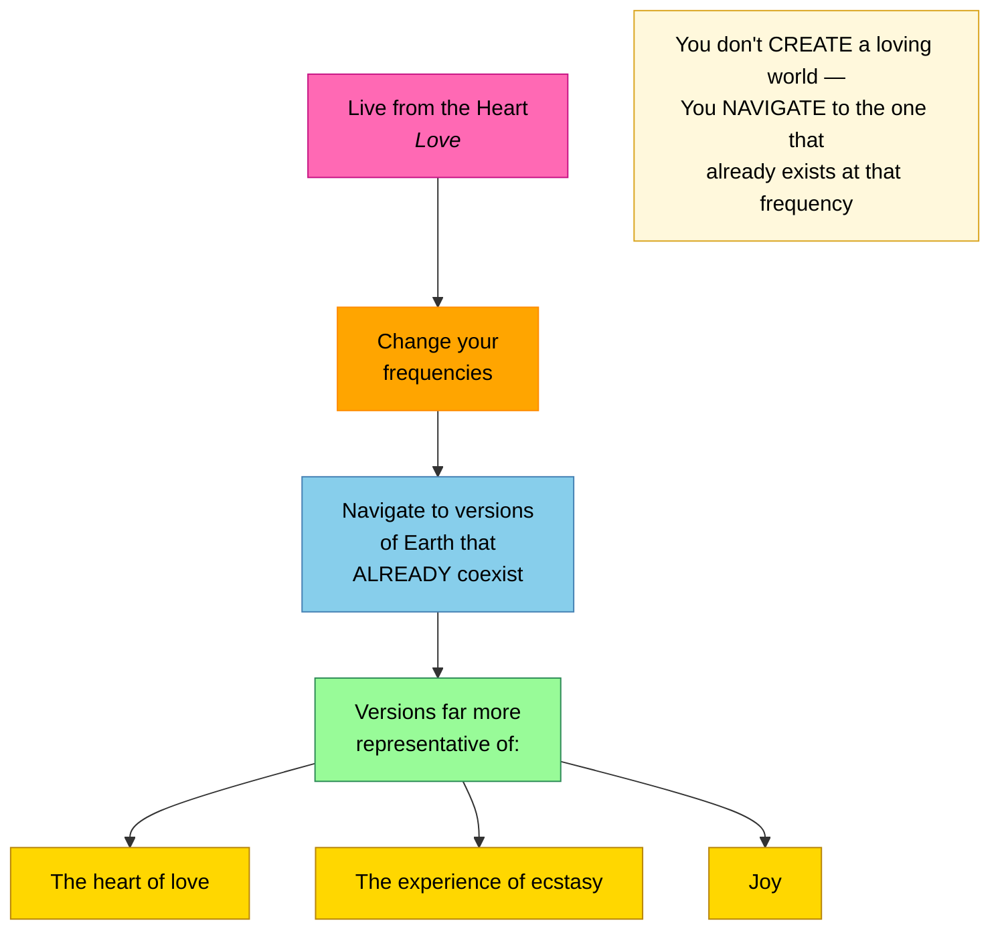

### The Sassani Example

> "As we experience it on our world, we commune with spirits and extradimensional beings every day, all the time. It is part of our natural reality to know that this information exists, can be received and tapped into at any given moment when you're operating on that frequency from the highest levels of the heart."

---

## The Three-Mind Architecture Aligned in Love

### When All Three Minds Align in Love

> "You can be guided to remember your true self and live a life of pure love, joy, creativity, and harmony by being the true individuals that you each are, that you were created to be. That is your path in life."

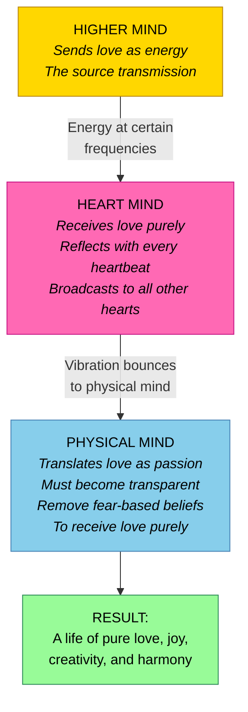

| Mind | Role in Love | When Aligned |
|------|-------------|-------------|
| **Higher Mind** | Sends core love frequency | Continuously transmitting love/guidance |
| **Heart Mind** | Receives and reflects love | Perfectly tuned, drumming love with every beat |
| **Physical Mind** | Translates and lives love | Transparent, aligned, experiences passion/love |

---

## Key Principles Summary

### What Love IS

- **Love is the vibratory frequency of existence itself** — not an emotion, but what reality IS made of
- **Love is the signature frequency of all that is** — the fundamental vibration
- **Everything is love because everything is God** — even painful experiences, seen from the divine perspective
- **Light is the first physicalization of love** — you are made of light, therefore made of love
- **You ARE love** — you don't find it, earn it, or acquire it; you become aware of what you already are

### How Love Operates Physically

- **Every heartbeat sends an electromagnetic bubble of love** expanding from your body
- **One heart literally talks to all others** through overlapping EM fields (telempathy)
- **Iron in the blood creates the love field** — analogous to Earth's molten core creating the planetary field
- **Detoxifying the body refines and extends** the electromagnetic love field
- **Ascending in frequency makes heartbeats more powerful** love transmitters

### Love and the Higher Mind

- **The heart is specifically tuned to the higher mind's vibration** — it is the primary receiver
- **Passion, excitement, curiosity, attraction are all translations of love** from the higher mind
- **Unconditional love is the PURE signal** — unfiltered from the higher mind
- **Fear is not love's opposite — it is love's signal distorted** through misaligned beliefs
- **Remove the fear-based beliefs and pure love remains** — it was always there

### Love and Self-Worth

- **Your existence IS creation's love expressed** — you were loved into being
- **If creation created you, it deems you worthy** — you cannot argue with creation about this
- **Disbelieving your worth = arguing with creation** — yet your ability to argue proves your existence
- **The green blanket:** you're not afraid to feel — you're afraid to feel love for yourself specifically
- **Tears from love = homesickness** — washing out what separated you from the frequency of home

### Living Love

- **True love = allowing someone to be who they need to be** — seeing them as strong and powerful
- **Unconditional love means no conditions** — including allowing paths you disagree with
- **All higher beings share unconditional love** as their overarching quality
- **Prayer without outward expression is incomplete** — love must be grounded in action
- **Dissolving into love in the heart opens the portal to the soul** — and the more you practice, the wider the door becomes
- **You navigate to loving realities** — you don't create them, you shift to the versions of Earth that already exist at that frequency

---

## Closing Wisdom

> "Unconditional love is the vibratory frequency of existence itself."

> "You are joy. You are love."

> "Everything is love because everything is God."

> "Deep love is the vibration of the spirit realm which is your home."

> "Your existence IS creation's love expressed."

> "You're not really afraid to feel because you're willing to feel fear. The question is, why aren't you willing to feel love for yourself?"

> "One of the most common and absolutely necessarily expressed overarching qualities is one of the expression of unconditional love, no matter what other qualifications might go along with it."

> "Though minds may be different, though body forms may be different, it is through the heart that we recognize our spirits are one."

> "Let yourself dissolve into love, into nothing, into peace, into stillness."

> "You will change your frequencies and navigate yourselves to the versions of Earth that already coexist that are far more representative of the heart of love."
