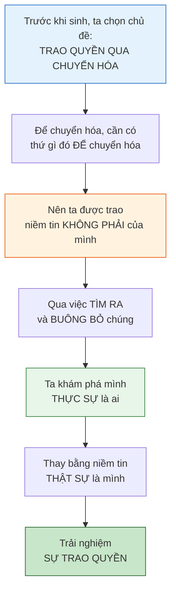
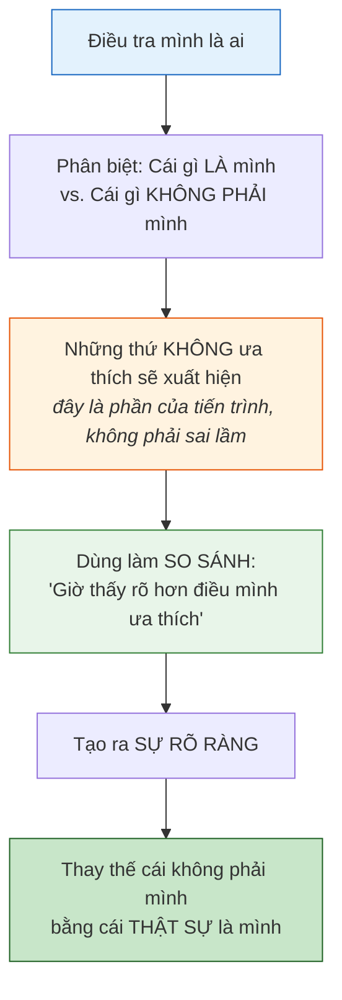
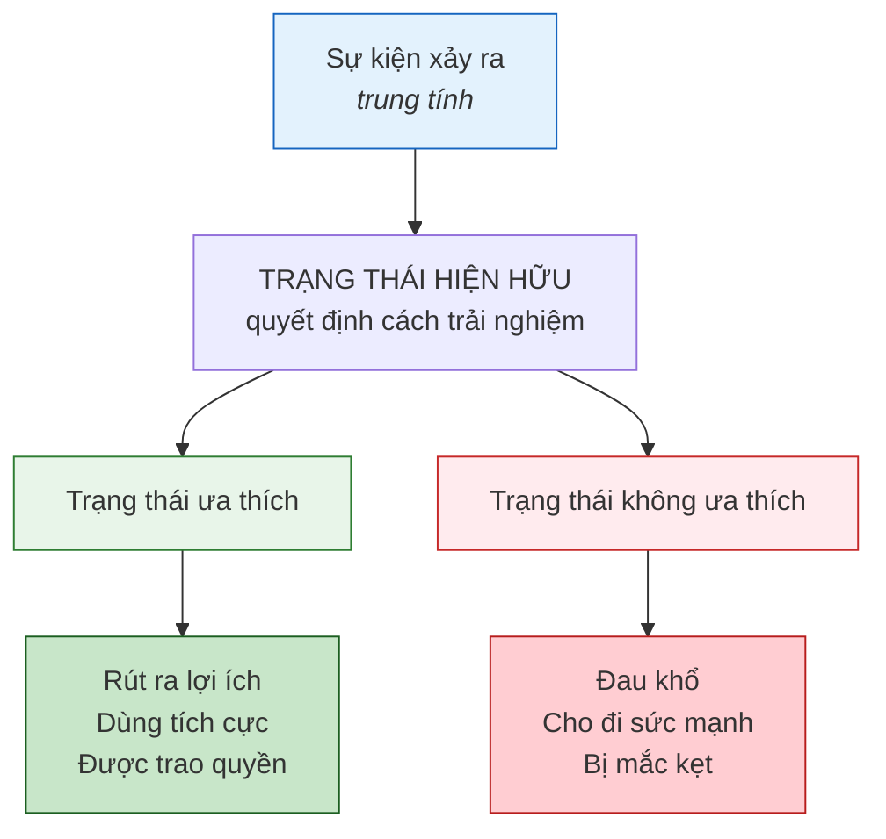
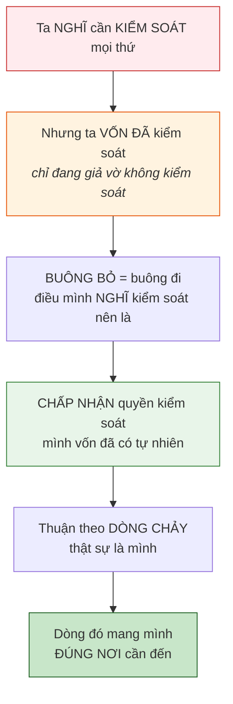
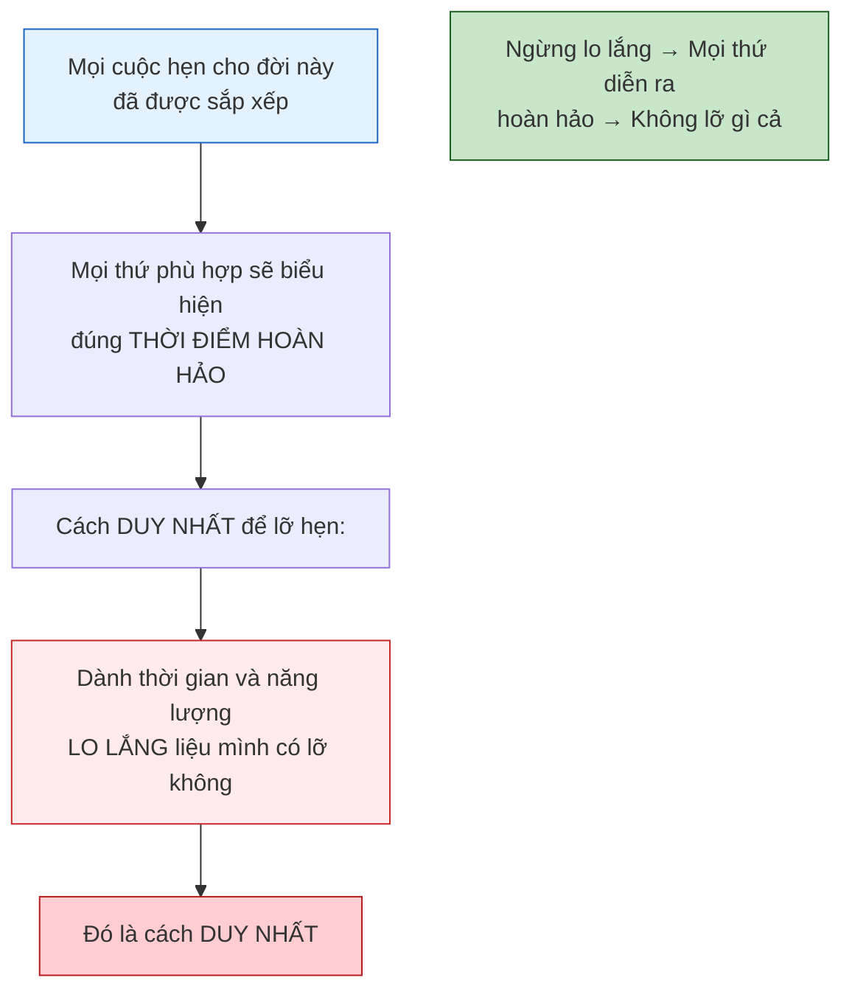
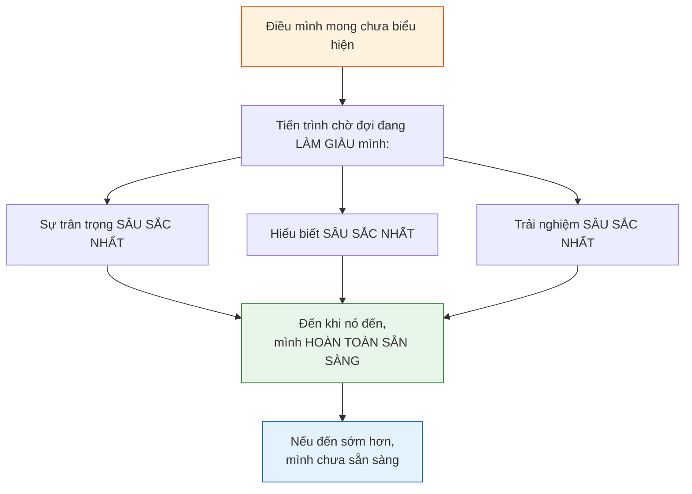

# Sức Mạnh Của Việc Là Chính Mình

## Tổng Quan

Bài giảng này là một tuyệt tác về trao quyền cho bản thân. Nó nói về một nghịch lý: là chính mình lẽ ra phải là điều đơn giản nhất — vậy mà đa số lại đang mang những niềm tin không phải của mình. Những niềm tin ngoại lai đó có mục đích (giúp ta khám phá mình là ai bằng cách tìm ra mình KHÔNG phải là gì). Dấu hiệu nhận biết: niềm tin không phải của mình thì đè nặng, còn niềm tin thật sự của mình thì nhẹ tênh và tiếp thêm năng lượng. Buông bỏ không phải là từ bỏ quyền kiểm soát — mà là chấp nhận quyền kiểm soát mình vốn đã có. Đây không phải triết lý — đây là sổ tay hướng dẫn cách thực tại vận hành. Thông điệp cốt lõi: mục đích căn bản của mình là trở thành con người độc nhất mà mình là — trọn vẹn nhất có thể.

---

## Mục Lục

1. [Nghịch Lý — Là Chính Mình Lẽ Ra Phải Đơn Giản](#nghịch-lý--là-chính-mình-lẽ-ra-phải-đơn-giản)
2. [Niềm Tin Không Phải Của Mình Có Mục Đích](#niềm-tin-không-phải-của-mình-có-mục-đích)
3. [Cách Nhận Ra Mình Đang Mang Niềm Tin Của Người Khác](#cách-nhận-ra-mình-đang-mang-niềm-tin-của-người-khác)
4. [Biết Mình — Cuộc Điều Tra Quan Trọng Nhất](#biết-mình--cuộc-điều-tra-quan-trọng-nhất)
5. [Không Phải Chuyện Gì Xảy Ra — Mà Là Trạng Thái Của Mình](#không-phải-chuyện-gì-xảy-ra--mà-là-trạng-thái-của-mình)
6. [Mục Đích Căn Bản — Là Con Người Độc Nhất Mà Mình Là](#mục-đích-căn-bản--là-con-người-độc-nhất-mà-mình-là)
7. [Buông Bỏ Không Phải Là Từ Bỏ Quyền Kiểm Soát](#buông-bỏ-không-phải-là-từ-bỏ-quyền-kiểm-soát)
8. [Điều Mình Muốn vs. Điều Mình Thật Sự Cần](#điều-mình-muốn-vs-điều-mình-thật-sự-cần)
9. [Đây Không Phải Triết Lý — Đây Là Sổ Tay Hướng Dẫn](#đây-không-phải-triết-lý--đây-là-sổ-tay-hướng-dẫn)
10. [Hứng Khởi Có Thể Là Bình Lặng, An Nhiên](#hứng-khởi-có-thể-là-bình-lặng-an-nhiên)
11. [Sẽ Không Bao Giờ Lỡ Hẹn — Trừ Khi Lo Lắng](#sẽ-không-bao-giờ-lỡ-hẹn--trừ-khi-lo-lắng)
12. [Thời Điểm Hoàn Hảo — Tin Vào Tiến Trình](#thời-điểm-hoàn-hảo--tin-vào-tiến-trình)
13. [Giữ Trạng Thái Ưa Thích — Rút Ra Lợi Ích Từ Mọi Thứ](#giữ-trạng-thái-ưa-thích--rút-ra-lợi-ích-từ-mọi-thứ)
14. [Mảnh Ghép — Khớp Hoàn Hảo Với Tất Cả](#mảnh-ghép--khớp-hoàn-hảo-với-tất-cả)
15. [Tóm Tắt Nguyên Tắc Chính](#tóm-tắt-nguyên-tắc-chính)
16. [Lời Kết](#lời-kết)

---

## Nghịch Lý — Là Chính Mình Lẽ Ra Phải Đơn Giản

> "Nhiều người nghĩ rằng là chính mình là điều đơn giản nhất."

Nhưng thực tế:

> "Thế mà nhiều người lớn lên trong xã hội lại mua vào đủ loại niềm tin liên quan đến niềm tin của người khác hơn là của chính mình — những niềm tin không nhất thiết hoàn toàn hài hòa với con người thật."

Đây là nghịch lý trung tâm: là chính mình lẽ ra không cần nỗ lực — vì đó là bản chất. Vậy mà đa số lại vận hành dưới nhiều lớp niềm tin nhặt từ gia đình, xã hội, văn hóa — không liên quan gì đến con người thật.

---

## Niềm Tin Không Phải Của Mình Có Mục Đích

> "Nhiều niềm tin đó được trao cho bạn để bạn có thể thực hiện chủ đề bạn đã chọn: chuyển hóa những niềm tin không phải của mình, buông bỏ chúng, và thay bằng niềm tin thực sự đại diện cho con người thật — để trải nghiệm sự chuyển hóa trao quyền cho bản thân."

> "Không phải những niềm tin không phải của bạn không thuộc về đó. Chúng phục vụ mục đích cho phép bạn khám phá mình là ai thông qua quá trình tìm ra những niềm tin nào không phục vụ mình, không hài hòa với con người thật."

---

## Cách Nhận Ra Mình Đang Mang Niềm Tin Của Người Khác

> "Cách biết mình đang mang niềm tin không phải của mình là chúng đè nặng."

> "Cảm thấy kháng cự khi hành động theo đam mê cao nhất. Luôn có lý do nổi lên để không làm. Luôn có lý lẽ nghe có vẻ hợp lý. Đó là manh mối cho thấy mình đang mang ý tưởng, niềm tin không liên quan gì đến mình."

> "Những gì thật sự thuộc về mình thì nhẹ tênh. Không đè nặng. Thực ra chúng tiếp thêm năng lượng. Chúng đẩy mình tiến về phía trước."

| Niềm tin THẬT SỰ của mình | Niềm tin KHÔNG PHẢI của mình |
|---------------------------|------------------------------|
| **Nhẹ tênh** | **Đè nặng** |
| **Tiếp thêm năng lượng** | Tạo **kháng cự** |
| **Đẩy** tiến về phía trước | Sinh ra **lý do** nghe có vẻ hợp lý |
| Khiến mình **hào hứng** thức dậy | Khiến mình **ngại** ngày mới |
| Cảm giác **tự do** | Cảm giác **nặng nề** |
| Là **động cơ** tự nhiên | Là **phanh** nhân tạo |

> "Khi bắt đầu buông bỏ những niềm tin không phải của mình, sẽ cảm thấy được trao quyền hơn. Tự do hơn. Nhẹ nhàng hơn."

---

## Biết Mình — Cuộc Điều Tra Quan Trọng Nhất

> "Bắt đầu từ khái niệm cổ xưa: biết mình."

> "Điều quan trọng nhất là thực sự đào sâu và điều tra mình là ai — hiểu sự khác biệt giữa cái gì LÀ mình và cái gì KHÔNG PHẢI mình."

> "Qua quá trình đó, nhiều khi sẽ thu hút vào đời những thứ không ưa thích. Nhưng đó là vì có thể dùng chúng làm so sánh để phân biệt rõ ràng giữa điều không ưa và điều ưa thích."

---

## Không Phải Chuyện Gì Xảy Ra — Mà Là Trạng Thái Của Mình

> "Không phải chuyện gì xảy ra. Mà là mình làm gì với chuyện xảy ra. Mình phản ứng thế nào. Trạng thái hiện hữu của mình."

> "Miễn là giữ trạng thái hiện hữu mà mình tin là đại diện nhất cho con người thật — tần số năng lượng cốt lõi — sẽ luôn có thể sử dụng bất cứ điều gì xảy ra theo cách tích cực và rút ra lợi ích."

> "Bất kể nó trông thế nào, bất kể nó bắt nguồn từ đâu — không quan trọng. Chỉ trạng thái hiện hữu mới cho phép trải nghiệm đời sống theo cách mình ưa thích hay không."

---

## Mục Đích Căn Bản — Là Con Người Độc Nhất Mà Mình Là

> "Mình sẽ là biểu hiện tốt nhất có thể của chính mình — xét cho cùng đó là mục đích căn bản trong cuộc sống. Là mình, con người độc nhất mà mình là, trọn vẹn nhất có thể. Đó là mục đích căn bản."

> "Cách thực hiện thế nào — tùy mình."

> "Hứng khởi và đồng bộ sẽ cho thấy điều gì thật sự là mình và điều gì không. Vì vậy, cứ theo đuổi và thuận theo dòng chảy."

---

## Buông Bỏ Không Phải Là Từ Bỏ Quyền Kiểm Soát

> "Buông bỏ không có nghĩa là từ bỏ quyền kiểm soát. Buông bỏ nghĩa là cho phép mình buông đi điều mình NGHĨ kiểm soát nên là, và thực sự chấp nhận quyền kiểm soát mình VỐN ĐÃ CÓ một cách tự nhiên."

> "Tất cả đều đang kiểm soát. Chỉ là đang chơi một trò giả vờ rằng mình không kiểm soát."

> "Buông bỏ theo dòng chảy của dòng nước thật sự là mình, vì dòng đó sẽ mang mình đúng nơi cần đến."

| Ta hay nghĩ buông bỏ là | Buông bỏ thật sự là |
|-------------------------|---------------------|
| Từ bỏ quyền kiểm soát | Chấp nhận quyền kiểm soát mình vốn có |
| Trở nên thụ động/bất lực | Thuận theo dòng chảy CỦA MÌNH |
| Để người khác quyết định | Để CON NGƯỜI THẬT dẫn đường |
| Yếu đuối | Hình thức tin tưởng sâu sắc nhất |
| Mất sức mạnh | Dòng chảy mang mình đúng nơi cần đến |

---

## Điều Mình Muốn vs. Điều Mình Thật Sự Cần

> "Đôi khi điều mình nói mình muốn trùng với điều mình cần. Nhưng thường thì điều mình muốn là sản phẩm của niềm tin không phù hợp và cấu trúc bản ngã không nhất thiết phục vụ lợi ích tốt nhất."

> "Luôn rõ ràng hơn và xây dựng hơn khi hiểu rằng điều quan trọng nhất là điều mình CẦN để là chính mình. Không phải điều mình muốn mà mình NGHĨ mình cần. Mà là điều mình thật sự cần."

| Điều mình MUỐN | Điều mình CẦN |
|-----------------|----------------|
| Sản phẩm của cấu trúc bản ngã | Sản phẩm của bản chất thật |
| Có thể từ niềm tin lệch pha | Hài hòa với con người thật |
| Điều mình nghĩ mình cần | Điều mình thật sự cần để là chính mình |
| Có thể dẫn lệch đường | Luôn mang đến đúng nơi |

> "Nếu buông bỏ và thuận theo dòng chảy năng lượng thật, bản chất thật, dòng nước thật — sẽ luôn trải nghiệm điều mình cần."

---

## Đây Không Phải Triết Lý — Đây Là Sổ Tay Hướng Dẫn

> "Xin hiểu điều quan trọng nhất: chúng tôi không đơn giản đang truyền tải một triết lý. Không phải ý kiến. Chúng tôi đang trao cho bạn sổ tay hướng dẫn cách thực tại vận hành."

> "Đó là một bộ hướng dẫn đơn giản và mô tả cấu trúc thực sự của sự tồn tại cùng cách bạn tạo ra thực tại."

> "Nếu thực sự hiểu đây là sổ tay hướng dẫn và chỉ có rất ít hướng dẫn trong đó — thật sự rất đơn giản — thì sẽ bắt đầu sử dụng được những công cụ này một cách rõ ràng, chính xác và mạnh mẽ."

| Mọi người hay nghĩ đây là | Thực chất đây là |
|---------------------------|------------------|
| Triết lý | Sổ tay hướng dẫn |
| Ý kiến | Mô tả cấu trúc sự tồn tại |
| Lời hay ý đẹp | Công cụ thực sự để tạo thực tại |
| Hệ thống phức tạp | Rất ít hướng dẫn, rất đơn giản |
| Lý thuyết tâm linh | Cơ chế thực hành của tạo hóa |

---

## Hứng Khởi Có Thể Là Bình Lặng, An Nhiên

> "Hứng khởi không có nghĩa phải nhảy nhót suốt ngày và nói liên tục. Không — có thể bình lặng, an nhiên, thiền định mà vẫn đang biểu hiện hứng khởi. Hứng khởi thật sự của mình."

Đây là bài giảng quan trọng tránh hiểu lầm: hứng khởi không phải cường độ cảm xúc — đó là sự hài hòa. Sự hài hòa có thể biểu hiện qua tĩnh lặng mạnh mẽ ngang với hoạt động sôi nổi.

---

## Sẽ Không Bao Giờ Lỡ Hẹn — Trừ Khi Lo Lắng

> "Xin nhớ rằng mình đã sắp xếp tất cả cuộc hẹn cần thiết cho cuộc đời này. Mọi thứ cần thiết và phù hợp đều có thể biểu hiện đúng thời điểm hoàn hảo."

> "Ngoại lệ duy nhất: dành thời gian và năng lượng để tự hỏi và lo lắng liệu mình có lỡ hẹn không. Đó là cách duy nhất để lỡ hẹn."

---

## Thời Điểm Hoàn Hảo — Tin Vào Tiến Trình

> "Nó sẽ xảy ra đúng thời điểm hoàn hảo. Mình không nhất thiết luôn là người quyết định thời điểm đó nên là khi nào."

> "Bất kể thời gian bao lâu, nó luôn hoàn hảo cho lượng thời gian mình cần trải qua tiến trình để đến điểm đó."

> "Đến khi thời điểm đó mở ra, mình sẽ có sự trân trọng sâu sắc nhất, hiểu biết sâu sắc nhất, trải nghiệm sâu sắc nhất về bất cứ điều gì đang mở ra đúng thời điểm hoàn hảo."

---

## Giữ Trạng Thái Ưa Thích — Rút Ra Lợi Ích Từ Mọi Thứ

> "Ngay cả khi điều biểu hiện là thứ mình nhận ra một cách trung tính rằng không ưa thích, vẫn nhận ra nó phải ở đó vì lý do nào đó."

> "Giữ trạng thái ưa thích thì sẽ luôn rút ra được bài học, sự học hỏi, lợi ích từ cả những điều không ưa thích — vì mình đang ở trạng thái cho phép điều đó chuyển hóa theo cách có lợi, theo cách hài hòa với con người thật."

| Điều xảy ra | Cần làm gì | Kết quả |
|-------------|-----------|---------|
| Điều ưa thích biểu hiện | Giữ trạng thái ưa thích | Niềm vui, mở rộng |
| Điều KHÔNG ưa thích biểu hiện | VẪN giữ trạng thái ưa thích | Rút ra bài học, sự học hỏi, lợi ích |
| Điều khó hiểu biểu hiện | Giữ trạng thái ưa thích | Nó chuyển hóa theo cách hài hòa |
| Điều đau đớn biểu hiện | Giữ trạng thái ưa thích | Được trao quyền, không bị giảm sút |

---

## Mảnh Ghép — Khớp Hoàn Hảo Với Tất Cả

> "Mình sẽ như mảnh ghép, khớp hoàn hảo với tất cả các mảnh ghép khác — những người cũng đang thật sự là chính họ."

Khi thật sự là mình — không diễn, không giả, không mặc niềm tin của người khác — mình khớp tự nhiên và hoàn hảo với tất cả những ai cũng đang là thật. Không cạnh tranh, không xung đột, không ép buộc. Bức tranh ghép tự hoàn thành.

---

## Tóm Tắt Nguyên Tắc Chính

### Trao Quyền Và Bản Sắc

- **Là chính mình lẽ ra đơn giản nhất** — vậy mà đa số lại mang niềm tin không phải của mình
- **Niềm tin ngoại lai có mục đích** — cho phép khám phá mình là ai qua chuyển hóa
- **Niềm tin không phải của mình thì ĐÈ NẶNG** — kháng cự, lý do, nặng nề là manh mối
- **Niềm tin thật sự của mình thì nhẹ tênh** — tiếp năng lượng, đẩy tiến lên, hào hứng
- **Biết mình** là điểm khởi đầu quan trọng nhất — phân biệt cái gì là mình, cái gì không
- **Mục đích căn bản** là trở thành con người độc nhất mà mình là, trọn vẹn nhất có thể

### Trạng Thái Hiện Hữu

- **Không phải chuyện gì xảy ra** — mà là mình làm gì với nó
- **Giữ trạng thái ưa thích** thì có thể dùng BẤT CỨ THỨ GÌ tích cực, rút lợi ích từ mọi thứ
- **Trạng thái quyết định** cùng sự kiện trao quyền hay giảm sút
- **Không rơi vào trạng thái không ưa thích** về điều không ưa thích — đó là chìa khóa

### Buông Bỏ Và Kiểm Soát

- **Buông bỏ KHÔNG phải từ bỏ kiểm soát** — mà là chấp nhận quyền kiểm soát mình vốn có
- **Mình vốn đã kiểm soát** — chỉ đang chơi trò giả vờ không kiểm soát
- **Buông bỏ = thuận theo dòng chảy** thật sự là mình; nó mang đúng nơi cần đến

### Muốn vs. Cần

- **Điều mình muốn** có thể là sản phẩm của bản ngã và niềm tin lệch pha
- **Điều mình thật sự cần** là điều để là chính mình
- **Tin vào sự mở ra** — thuận theo năng lượng thật, sẽ luôn trải nghiệm điều cần

### Sổ Tay Hướng Dẫn

- **Đây không phải triết lý hay ý kiến** — đây là sổ tay hướng dẫn cách thực tại vận hành
- **Rất ít hướng dẫn, rất đơn giản** — áp dụng thì đời chuyển hóa kỳ diệu
- **Mô tả cấu trúc thực sự** của sự tồn tại và cách ta tạo thực tại

### Thời Điểm

- **Sẽ không bao giờ lỡ hẹn** — mọi cuộc hẹn đời này đã được sắp xếp
- **Cách DUY NHẤT để lỡ**: lo lắng về việc lỡ
- **Thời điểm hoàn hảo luôn mất đúng thời gian cần** — nên khi đến, mình trân trọng nhất
- **Hứng khởi có thể bình lặng, an nhiên** — không chỉ nhảy nhót
- **Như mảnh ghép** — khi thật sự là mình, khớp hoàn hảo với tất cả

---

## Lời Kết

> "Cách biết mình đang mang niềm tin không phải của mình — chúng đè nặng. Những gì thật sự thuộc về mình thì nhẹ tênh."

> "Không phải chuyện gì xảy ra. Mà là mình làm gì với chuyện xảy ra."

> "Mục đích căn bản trong cuộc sống: là mình, con người độc nhất mà mình là, trọn vẹn nhất có thể."

> "Buông bỏ không có nghĩa là từ bỏ quyền kiểm soát. Buông bỏ nghĩa là cho phép mình buông đi điều mình nghĩ kiểm soát nên là, và thực sự chấp nhận quyền kiểm soát mình vốn đã có tự nhiên."

> "Điều quan trọng nhất là điều mình cần để là chính mình. Không phải điều mình muốn mà mình nghĩ mình cần."

> "Đây không đơn giản là triết lý. Đây là sổ tay hướng dẫn cách thực tại vận hành."

> "Cách duy nhất để lỡ hẹn là dành thời gian và năng lượng lo lắng liệu mình có lỡ hẹn không."

> "Mình xứng đáng trải nghiệm con người thật. Mình xứng đáng biểu hiện những điều thật sự là mình, vì chúng luôn mang đến niềm vui."

> "Năng lượng và thông tin đang được truyền tải trên nhiều tầng. Mình không bỏ lỡ gì cả."
